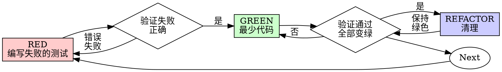

# 测试驱动开发 (TDD)

## 概述

先写测试用例。观察它失败。编写最少的代码使其通过。

**核心原则：** 如果你没有观察到测试用例失败，你就不知道它是否测试了正确的内容。

**违反规则的字面意义就是违反规则的精神。**

## 何时使用

用于行为变更，其中可重复的测试用例可以展示需求或重现错误。首先检查仓库的测试运行器和现有覆盖率。对于复制、生成输出或低影响的配置，使用适当的聚焦验证，而不是制造单元测试。

## 保留现有工作

在可行的情况下，在修复之前编写失败的回归测试，并验证它确实因为预期的原因而失败。如果实现已经存在，保留它并添加特征化/回归测试。不要删除用户的工作，重置分支或重写工作代码以重建理想的先写测试用例历史。诚实地说明测试是否先于修复。

## 红-绿-重构



### 红 - 编写失败的测试

编写一个最少的测试用例，展示应该发生什么。

<良好>
```typescript
test('在第三次尝试时成功', async () => {
  let attempts = 0;
  const operation = async () => {
    attempts++;
    if (attempts < 3) throw new Error('失败');
    return '成功';
  };

  const result = await retryOperation(operation);

  expect(result).toBe('成功');
  expect(attempts).toBe(3);
});
```
清晰的名称，测试真实的行为，一件事情
</良好>

<不良>
```typescript
test('重试工作', async () => {
  const mock = jest.fn()
    .mockRejectedValueOnce(new Error())
    .mockRejectedValueOnce(new Error())
    .mockResolvedValueOnce('成功');
  await retryOperation(mock);
  expect(mock).toHaveBeenCalledTimes(3);
});
```
模糊的名称，测试模拟而不是代码
</不良>

**要求：**
- 一个行为
- 清晰的名称
- 真实的代码（除非不可避免使用模拟）

### 验证红 - 观察它失败

**必须执行。永远不要跳过。**

```bash
npm test path/to/test.test.ts
```

确认：
- 测试失败（不是错误）
- 失败信息是预期的
- 失败是因为功能缺失（不是拼写错误）

**测试通过？** 确定它是否已经特征化了所需的行为。对于回归测试，使用先前的版本或隔离的受控变更来证明它检测到缺陷；不要仅仅为了强迫红色而修改正确的断言。

**测试错误？** 修复错误，重新运行直到它正确失败。

### 绿 - 最少代码

编写最简单的代码通过测试。

<良好>
```typescript
async function retryOperation<T>(fn: () => Promise<T>): Promise<T> {
  for (let i = 0; i < 3; i++) {
    try {
      return await fn();
    } catch (e) {
      if (i === 2) throw e;
    }
  }
  throw new Error('无法到达');
}
```
刚好通过
</良好>

<不良>
```typescript
async function retryOperation<T>(
  fn: () => Promise<T>,
  options?: {
    maxRetries?: number;
    backoff?: 'linear' | 'exponential';
    onRetry?: (attempt: number) => void;
  }
): Promise<T> {
  // YAGNI
}
```
过度设计
</不良>

不要添加功能，重构其他代码，或“改进”超出测试范围。

### 验证绿 - 观察它通过

**必须执行。**

```bash
npm test path/to/test.test.ts
```

确认：
- 测试通过
- 其他测试仍然通过
- 输出纯净（没有错误，警告）

**测试失败？** 修复代码，不是测试。

**其他测试失败？** 现在修复。

### 重构 - 清理

只有在绿色之后：
- 移除重复
- 改进名称
- 提取辅助函数

保持测试为绿色。不要添加行为。

### 重复

下一个失败的测试用于下一个功能。

## 良好测试

| 质量 | 良好 | 不良 |
|------|------|------|
| **最少** | 一件事。名称中包含“and”？拆分它。 | `test('验证电子邮件和域名和空白')` |
| **清晰** | 名称描述行为 | `test('test1')` |
| **展示意图** | 展示所需的API | 遮蔽代码应该做什么 |

## 顺序为何重要

一个失败的测试可以在实现之前暴露对需求的误解。一个在修复之后编写的测试仍然有价值，但它的对原始缺陷的敏感性需要证据。时间或覆盖率百分比都不能证明断言是有意义的。

如果失败是由缺失的导入、不可用的服务或不良的固定装置引起的，在解释结果之前修复该设置。在实用的情况下使用真实边界；当模拟隔离外部依赖时保留测试合同是有用的。

## 示例：错误修复

**错误：** 接受空电子邮件

**红**
```typescript
test('拒绝空电子邮件', async () => {
  const result = await submitForm({ email: '' });
  expect(result.error).toBe('电子邮件必需');
});
```

**验证红**
```bash
$ npm test
FAIL: 期望 '电子邮件必需', 实际为 undefined
```

**绿**
```typescript
function submitForm(data: FormData) {
  if (!data.email?.trim()) {
    return { error: '电子邮件必需' };
  }
  // ...
}
```

**验证绿**
```bash
$ npm test
PASS
```

**重构**
如果需要，提取多个字段的验证。

## 验证清单

在标记工作完成之前：

- [ ] 改变了行为和相应的失败路径有适当的测试
- [ ] 回归敏感性得到证明；测试的时间报告是诚实的
- [ ] 每个测试都因为预期的原因失败（功能缺失，不是拼写错误）
- [ ] 编写最少的代码通过每个测试
- [ ] 所有测试通过
- [ ] 输出纯净（没有错误，警告）
- [ ] 测试使用真实代码（模拟只有在不可避免时使用）
- [ ] 边缘情况和错误被覆盖

记录任何未满足的检查及其后果。不要擦除工作或声称未观察到的失败来完成清单。

## 当卡住时

| 问题 | 解决方案 |
|------|----------|
| 不知道如何测试 | 编写期望的API。首先编写断言。询问你的人类合作伙伴。 |
| 测试太复杂 | 设计太复杂。简化接口。 |
| 必须模拟所有内容 | 代码耦合太强。使用依赖注入。 |
| 测试设置很大 | 提取辅助函数。仍然复杂？简化设计。 |

## 集成调试

发现错误？编写失败的测试重现它。遵循TDD循环。测试证明修复并防止回归。

优先使用可重现的回归进行错误修复；当测试不能合理地执行失败时，使用另一个明确的验证器。

## 测试反模式

在添加模拟或测试工具时，阅读 @testing-anti-patterns.md 以避免常见陷阱：
- 测试模拟行为而不是真实行为
- 向生产类添加测试-only方法
- 模拟而不理解依赖关系

## 输入和预期结果

你需要用户可见的需求、当前实现、一个已知的运行器和受控的固定装置。在空电子邮件示例中，失败必须是“缺失验证”，而不是网络中断。预期：回归测试在缺陷行为上失败并在最小的修复后通过，同时现有的有效提交仍然工作。

## 限制

- 通过的单元测试不能证明浏览器、打包运行时或提供者集成行为。
- 重试示例假设重试安全的操作；生产重试需要明确的幂等性、取消和可重试错误策略。
- 先写测试的顺序不能防止不正确的需求或过度模拟。检查断言和真实边界。
- 保留无关的更改并使用项目的现有测试命令，而不是假设每个 `npm test` 接受相同的参数。
