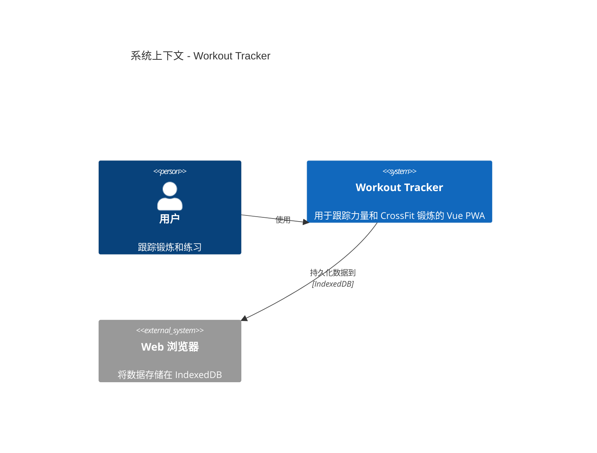
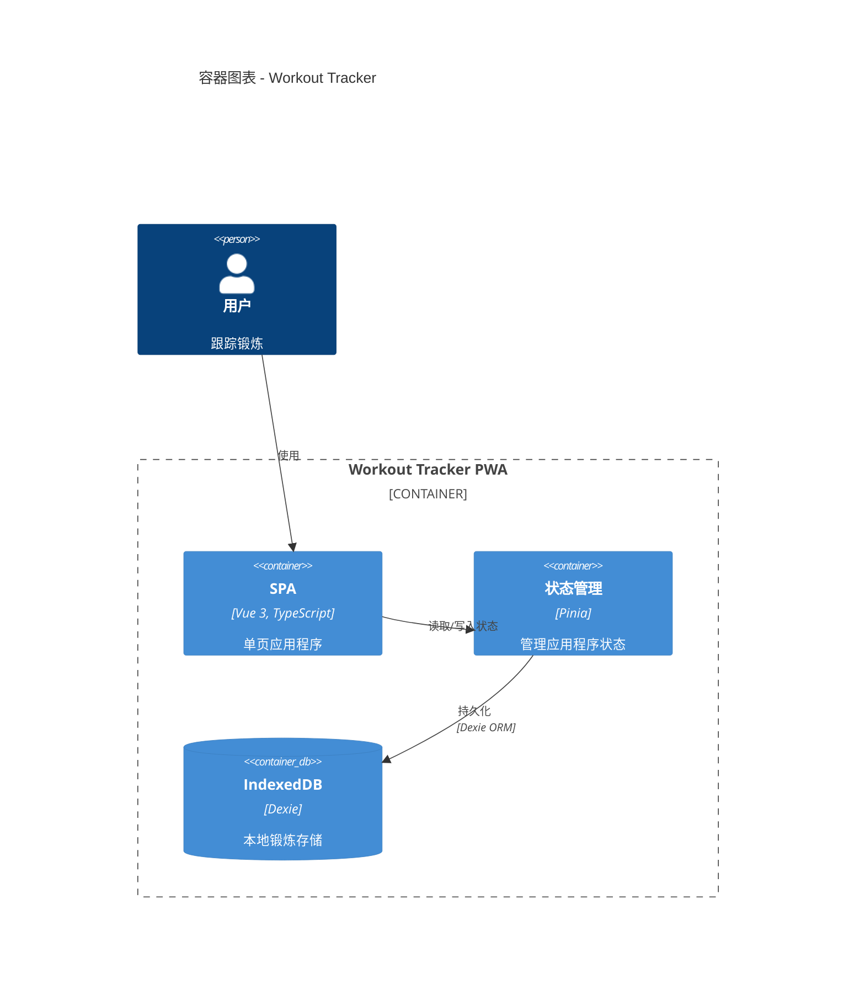
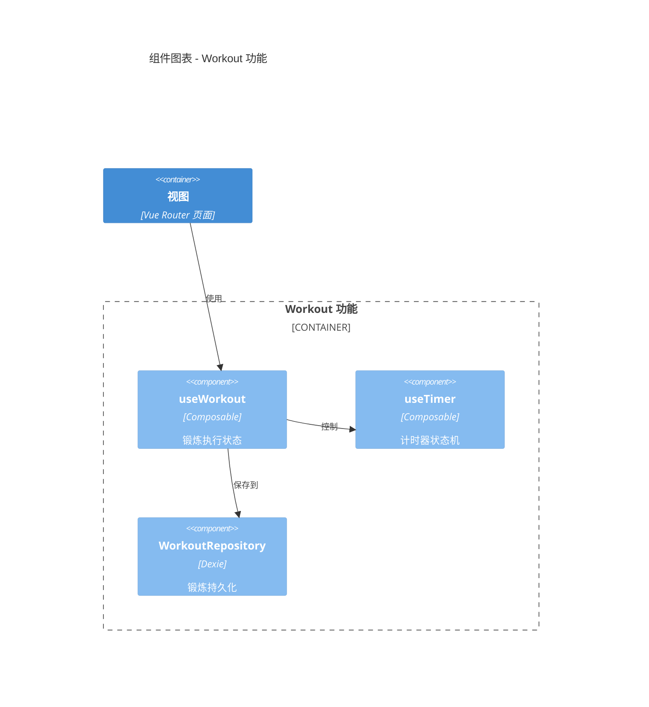
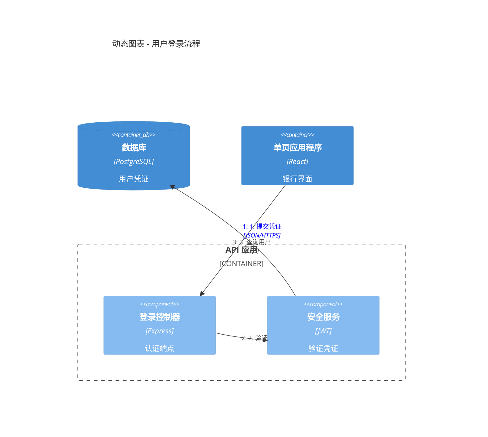
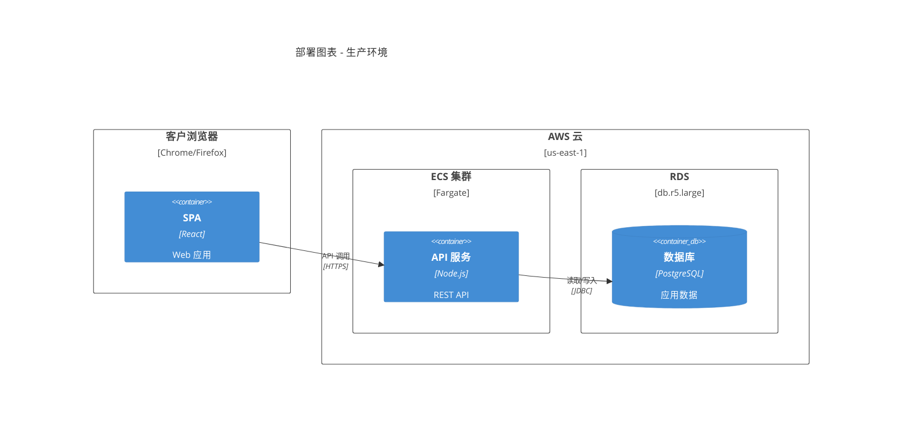
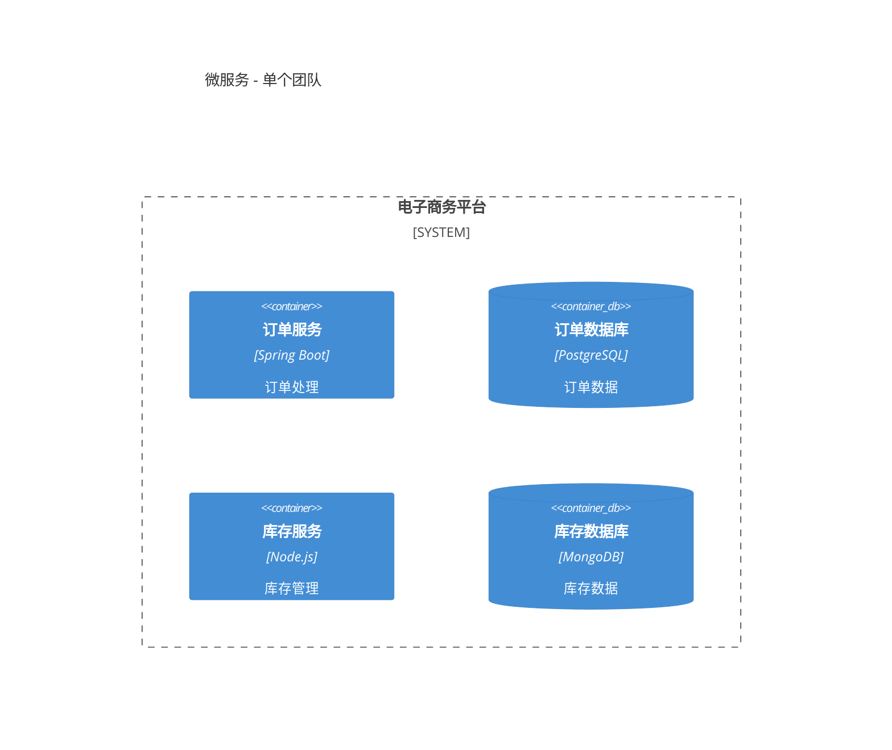
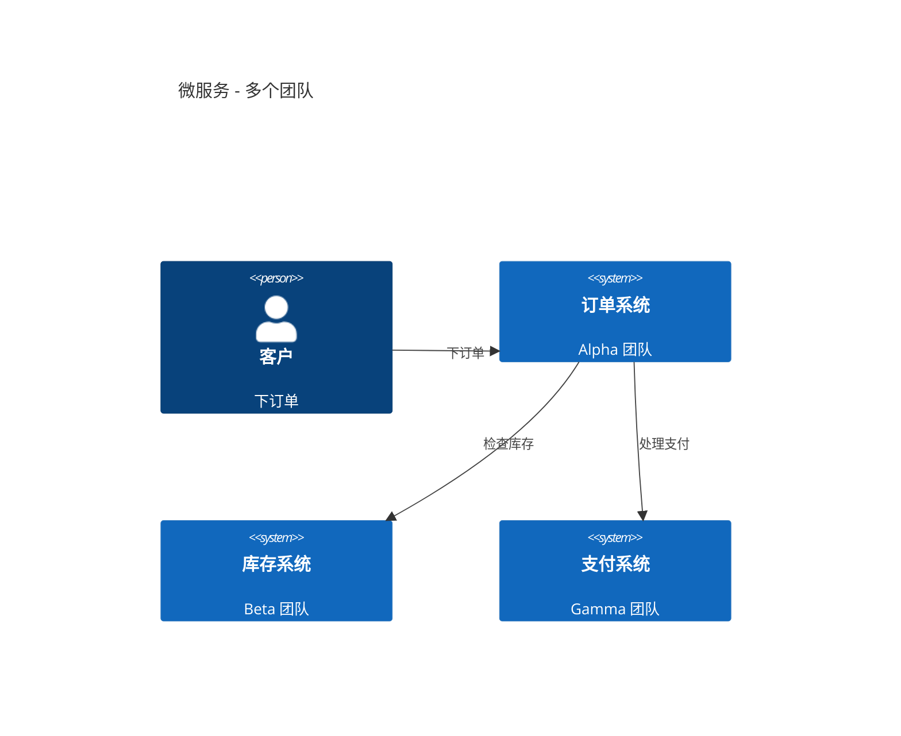
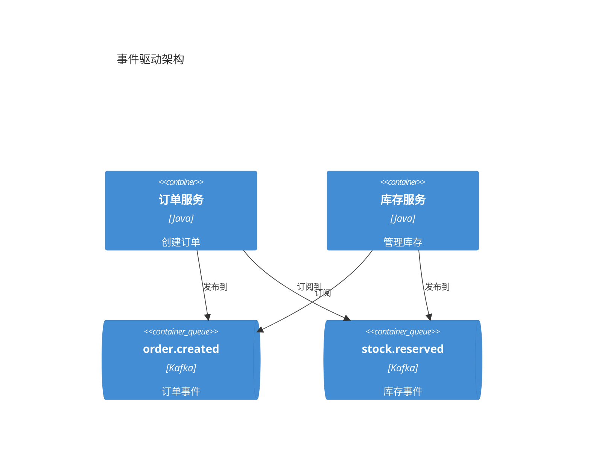

# C4 架构文档

使用 C4 模型图表和 Mermaid 语法生成软件架构文档。

## 工作流程

1. **理解范围** - 根据受众确定需要哪些 C4 层级
2. **分析代码库** - 探索系统以识别组件、容器和关系
3. **生成图表** - 在适当的抽象层级创建 Mermaid C4 图表
4. **文档化** - 将图表写入 markdown 文件并添加解释性上下文

## C4 图表层级

根据文档需求选择适当的层级：

| 层级 | 图表类型 | 受众 | 展示内容 | 创建时机 |
|------|----------|------|----------|----------|
| 1 | **C4Context** | 所有人员 | 系统 + 外部参与者 | 总是（必需） |
| 2 | **C4Container** | 技术人员 | 应用、数据库、服务 | 总是（必需） |
| 3 | **C4Component** | 开发人员 | 内部组件 | 仅当增加价值时 |
| 4 | **C4Deployment** | DevOps | 基础设施节点 | 用于生产系统 |
| - | **C4Dynamic** | 技术人员 | 请求流程（编号） | 用于复杂工作流 |

**关键洞察**："上下文 + 容器图表对大多数软件开发团队来说就足够了。" 仅在确实增加价值时才创建组件/代码图表。

## 快速入门示例

### 系统上下文（层级 1）


### 容器图表（层级 2）


### 组件图表（层级 3）


### 动态图表（请求流程）


### 部署图表


## 元素语法

### 人物和系统
```
Person(alias, "标签", "描述")
Person_Ext(alias, "标签", "描述")       # 外部人物
System(alias, "标签", "描述")
System_Ext(alias, "标签", "描述")       # 外部系统
SystemDb(alias, "标签", "描述")         # 数据库系统
SystemQueue(alias, "标签", "描述")      # 队列系统
```

### 容器
```
Container(alias, "标签", "技术", "描述")
Container_Ext(alias, "标签", "技术", "描述")
ContainerDb(alias, "标签", "技术", "描述")
ContainerQueue(alias, "标签", "技术", "描述")
```

### 组件
```
Component(alias, "标签", "技术", "描述")
Component_Ext(alias, "标签", "技术", "描述")
ComponentDb(alias, "标签", "技术", "描述")
```

### 边界
```
Enterprise_Boundary(alias, "标签") { ... }
System_Boundary(alias, "标签") { ... }
Container_Boundary(alias, "标签") { ... }
Boundary(alias, "标签", "类型") { ... }
```

### 关系
```
Rel(from, to, "标签")
Rel(from, to, "标签", "技术")
BiRel(from, to, "标签")                        # 双向
Rel_U(from, to, "标签")                        # 向上
Rel_D(from, to, "标签")                        # 向下
Rel_L(from, to, "标签")                        # 向左
Rel_R(from, to, "标签")                        # 向右
```

### 部署节点
```
Deployment_Node(alias, "标签", "类型", "描述") { ... }
Node(alias, "标签", "类型", "描述") { ... }  # 简写
```

## 样式和布局

### 布局配置
```
UpdateLayoutConfig($c4ShapeInRow="3", $c4BoundaryInRow="1")
```
- `$c4ShapeInRow` - 每行形状数量（默认：4）
- `$c4BoundaryInRow` - 每行边界数量（默认：2）

### 元素样式
```
UpdateElementStyle(alias, $fontColor="red", $bgColor="grey", $borderColor="red")
```

### 关系样式
```
UpdateRelStyle(from, to, $textColor="blue", $lineColor="blue", $offsetX="5", $offsetY="-10")
```
使用 `$offsetX` 和 `$offsetY` 来修复重叠的关系标签。

## 最佳实践

### 基本规则

1. **每个元素必须有**：名称、类型、技术（适用时）和描述
2. **仅使用单向箭头** - 双向箭头会制造歧义
3. **用动作动词标记箭头** - "使用电子邮件", "从读取", 而不是仅仅 "使用"
4. **包含技术标签** - "JSON/HTTPS", "JDBC", "gRPC"
5. **每张图表不超过 20 个元素** - 将复杂系统拆分为多个图表

### 清晰指南

1. **从层级 1 开始** - 上下文图表有助于框定系统范围
2. **每个文件一个图表** - 保持图表专注于单一抽象层级
3. **有意义的别名** - 使用描述性别名（例如 `orderService` 而不是 `s1`）
4. **简洁的描述** - 尽可能将描述保持在 50 个字符以内
5. **始终包含标题** - "系统上下文图表 - [系统名称]"

### 需要避免的事项

参见 [references/common-mistakes.md](references/common-mistakes.md) 获取详细的反模式：
- 混淆可部署的容器与不可部署的组件
- 将共享库建模为容器
- 将消息代理显示为单个容器而不是单独的主题
- 添加未定义的抽象层级，如 "子组件"
- 删除类型标签以 "简化" 图表

## 微服务指南

### 单个团队所有权
将每个微服务建模为容器（或容器组）：


### 多个团队所有权
当由不同团队拥有时，将微服务提升为软件系统：


### 事件驱动架构
将单个主题/队列显示为容器，而不是一个 "Kafka" 盒子：


## 输出位置

将架构文档写入 `docs/architecture/`，命名规范：
- `c4-context.md` - 系统上下文图表
- `c4-containers.md` - 容器图表
- `c4-components-{feature}.md` - 按功能划分的组件图表
- `c4-deployment.md` - 部署图表
- `c4-dynamic-{flow}.md` - 特定流程的动态图表

## 面向受众的细节

| 受众 | 推荐图表 |
|------|----------|
| 高管 | 仅上下文图表 |
| 产品经理 | 上下文 + 容器 |
| 架构师 | 上下文 + 容器 + 关键组件 |
| 开发人员 | 根据需要使用所有层级 |
| DevOps | 容器 + 部署 |

## 参考文献

- [references/c4-syntax.md](references/c4-syntax.md) - 完整的 Mermaid C4 语法
- [references/common-mistakes.md](references/common-mistakes.md) - 避免的反模式
- [references/advanced-patterns.md](references/advanced-patterns.md) - 微服务、事件驱动、部署
