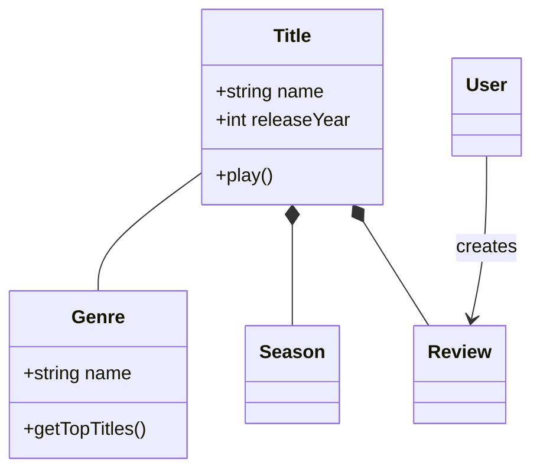
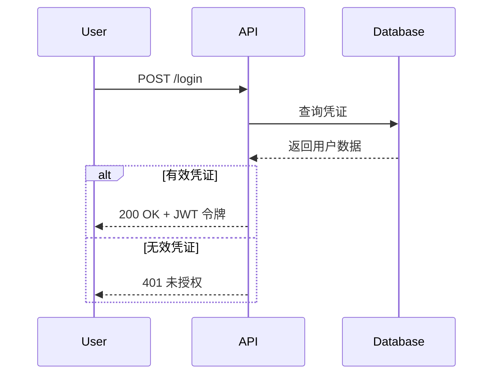
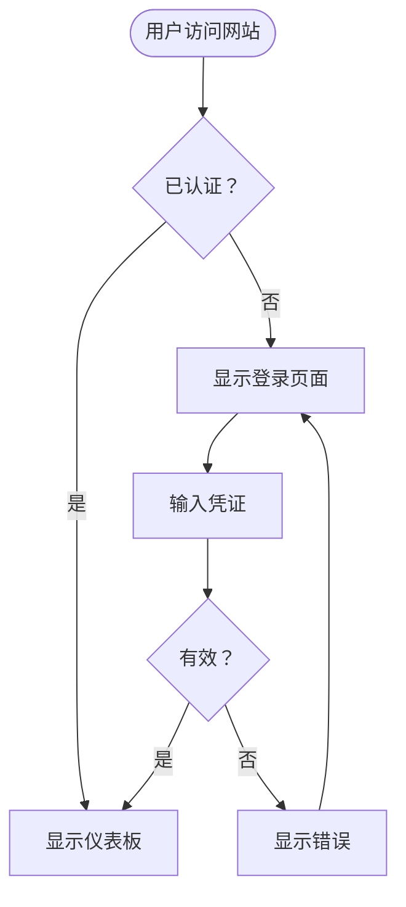
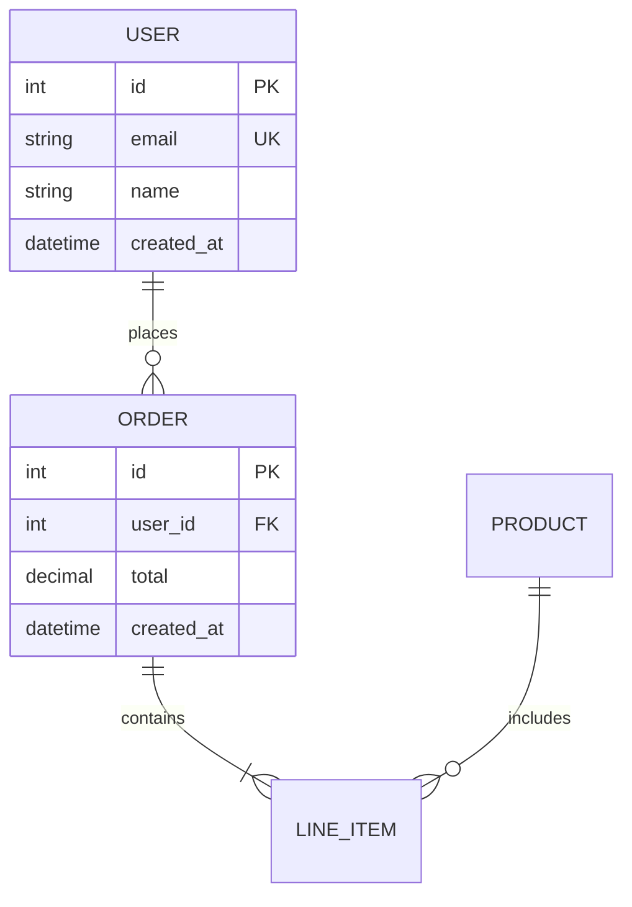
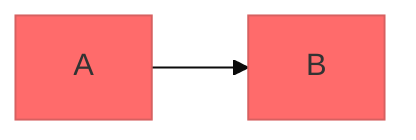

# Mermaid 图表绘制

使用 Mermaid 的文本语法创建专业的软件图表。Mermaid 可以将图表从简单的文本定义中渲染出来，使得图表版本可控、易于更新和维护，并且可以与代码一起维护。

## 核心语法结构

所有 Mermaid 图表都遵循此模式：

```mermaid
图表类型
  定义内容
```

**关键原则：**
- 第一行声明图表类型（例如，`classDiagram`、`sequenceDiagram`、`flowchart`）
- 使用 `%%` 进行注释
- 换行和缩进可以提高可读性，但不是必需的
- 未知单词会破坏图表；参数会静默失败

## 图表类型选择指南

**选择合适的图表类型：**

1. **类图** - 领域建模、面向对象设计、实体关系
   - 领域驱动设计文档
   - 面向对象类结构
   - 实体关系和依赖关系

2. **时序图** - 时间交互、消息流
   - API 请求/响应流
   - 用户认证流
   - 系统组件交互
   - 方法调用序列

3. **流程图** - 流程、算法、决策树
   - 用户旅程和工作流
   - 业务流程
   - 算法逻辑
   - 部署管道

4. **实体关系图（ERD）** - 数据库模式
   - 表关系
   - 数据建模
   - 模式设计

5. **C4 图** - 多层软件架构
   - 系统上下文（系统和用户）
   - 容器（应用程序、数据库、服务）
   - 组件（内部结构）
   - 代码（类/接口级别）

6. **状态图** - 状态机、生命周期状态
7. **Git 图** - 版本控制分支策略
8. **甘特图** - 项目时间线、调度
9. **饼图/条形图** - 数据可视化

## 快速入门示例

### 类图（领域模型）


### 时序图（API 流）


### 流程图（用户旅程）


### ERD（数据库模式）


## 详细参考

有关特定图表类型的深入指导，请参阅：

- **[references/class-diagrams.md](references/class-diagrams.md)** - 领域建模、关系（关联、组合、聚合、继承）、多重性、方法/属性
- **[references/sequence-diagrams.md](references/sequence-diagrams.md)** - 角色、参与者、消息（同步/异步）、激活、循环、alt/opt/par 块、注释
- **[references/flowcharts.md](references/flowcharts.md)** - 节点形状、连接、决策逻辑、子图、样式
- **[references/erd-diagrams.md](references/erd-diagrams.md)** - 实体、关系、基数、键、属性
- **[references/c4-diagrams.md](references/c4-diagrams.md)** - 系统上下文、容器、组件图、边界
- **[references/architecture-diagrams.md](references/architecture-diagrams.md)** - 云服务、基础设施、CI/CD 部署
- **[references/advanced-features.md](references/advanced-features.md)** - 主题、样式、配置、布局选项

## 最佳实践

1. **从简单开始** - 从核心实体/组件开始，逐步添加细节
2. **使用有意义的名称** - 清晰的标签使图表自文档化
3. **广泛注释** - 使用 `%%` 注释来解释复杂关系
4. **保持专注** - 每个图表一个概念；将大型图表拆分为多个专注的视图
5. **版本控制** - 将 `.mmd` 文件与代码一起存储，以便轻松更新
6. **添加上下文** - 包括标题和注释来解释图表目的
7. **迭代** - 随着理解的深入，逐步完善图表

## 配置和主题

使用 frontmatter 进行配置：



**可用主题：** default、forest、dark、neutral、base

**布局选项：**
- `layout: dagre`（默认）- 经典平衡布局
- `layout: elk` - 高级布局，适用于复杂图表（需要集成）

**外观选项：**
- `look: classic` - 传统 Mermaid 风格
- `look: handDrawn` - 绘图板样式

## 导出和渲染

**原生支持在：**
- GitHub/GitLab - 自动在 Markdown 中渲染
- VS Code - 使用 Markdown Mermaid 扩展
- Notion、Obsidian、Confluence - 内置支持

**导出选项：**
- [Mermaid Live Editor](https://mermaid.live) - 在线编辑器，支持 PNG/SVG 导出
- Mermaid CLI - `npm install -g @mermaid-js/mermaid-cli` 然后 `mmdc -i input.mmd -o output.png`
- Docker - `docker run --rm -v $(pwd):/data minlag/mermaid-cli -i /data/input.mmd -o /data/output.png`

## 常见陷阱

- **破坏字符** - 避免在注释中使用 `{}`，使用适当的转义序列处理特殊字符
- **语法错误** - 拼写错误会破坏图表；在 Mermaid Live 中验证语法
- **过度复杂** - 将复杂图表拆分为多个专注的视图
- **缺失关系** - 记录实体之间所有重要的连接

## 何时创建图表

**始终在以下情况下创建图表：**
- 开始新项目或功能
- 记录复杂系统
- 解释架构决策
- 设计数据库模式
- 规划重构工作
- 新成员入职

**使用图表来：**
- 对技术决策达成共识
- 协作记录领域模型
- 可视化数据流和系统交互
- 编码前规划
- 创建随代码演变的动态文档
