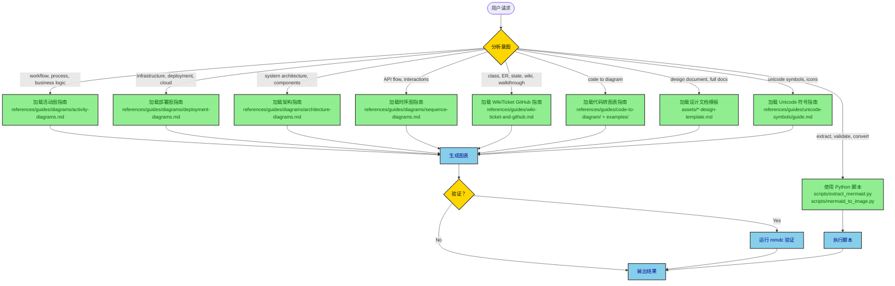
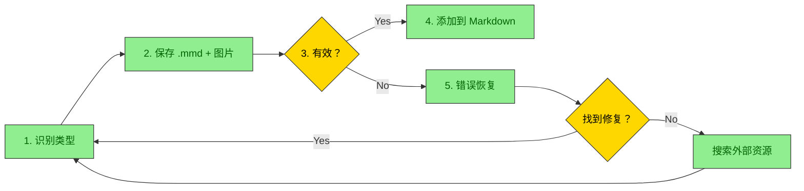
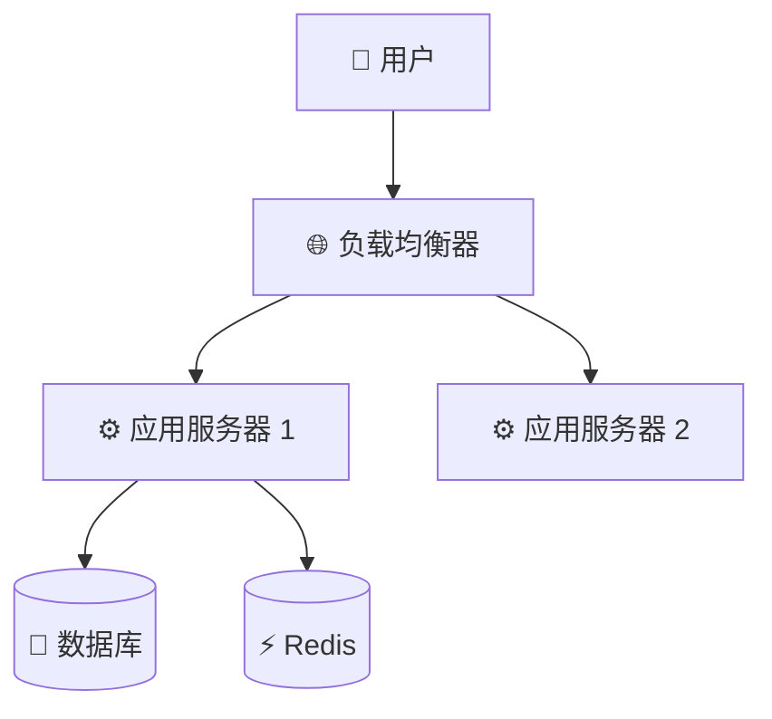
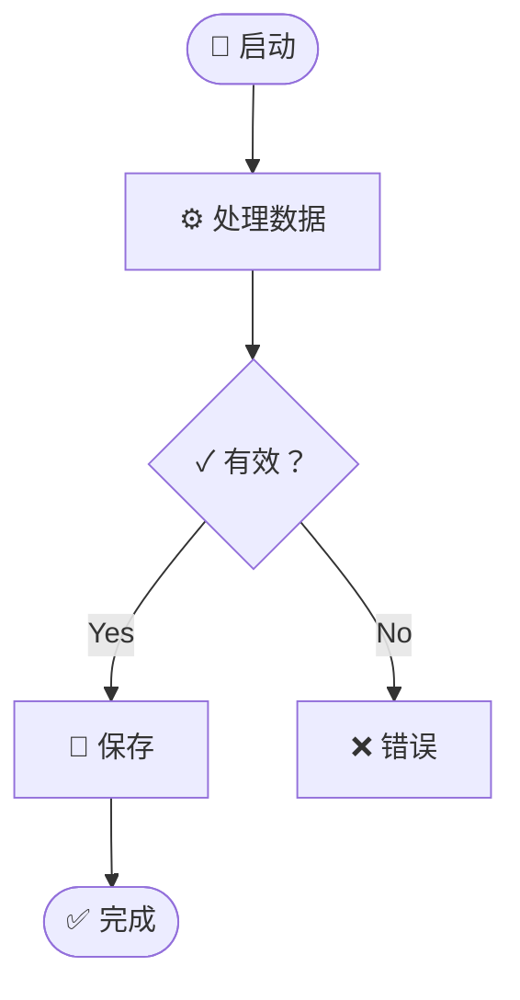
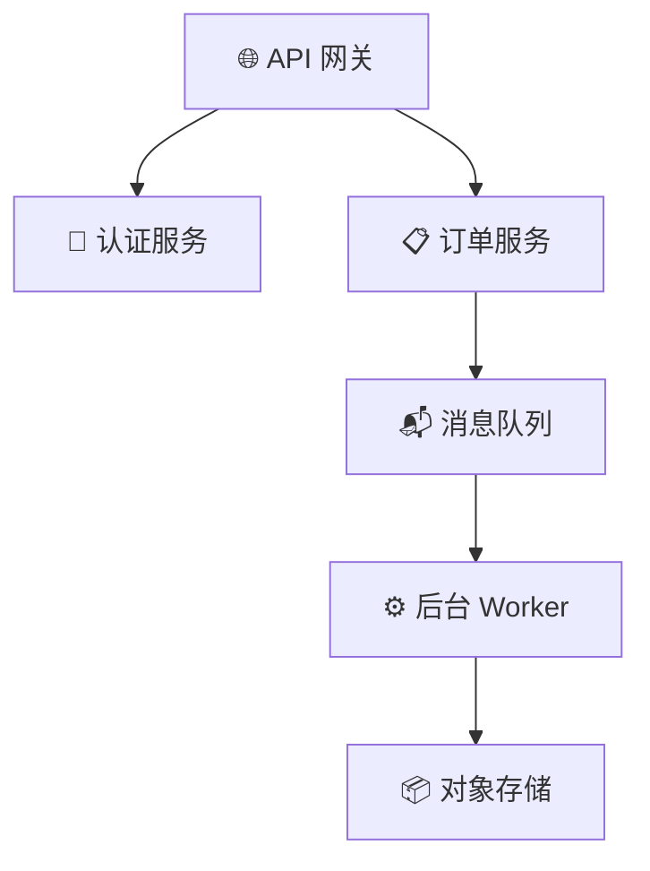

# Mermaid Architect - 层次化图表与文档技能

具备专用指南与代码转图表能力的 Mermaid 图表与文档系统。

## 目录

- [决策树](#decision-tree)
- [GitHub wiki、WikiTicket 与 Confluence](#github-wiki-wikiticket-and-confluence)
- [可用指南与资源](#available-guides-and-resources)
- [使用模式](#usage-patterns)
- [弹性工作流](#resilient-workflow)
- [Unicode 语义符号](#unicode-semantic-symbols)
- [Python 工具](#python-utilities)
- [决策树示例](#decision-tree-examples)
- [高对比度样式](#high-contrast-styling)
- [文件组织](#file-organization)
- [工作流总结](#workflow-summary)
- [何时使用什么](#when-to-use-what)
- [最佳实践](#best-practices)
- [学习路径](#learning-path)

## 决策树

**该技能的工作原理：**

1. **用户提出请求** → 技能分析意图
2. **技能确定图表/文档类型** → 加载相应指南
3. **AI 读取专用指南** → 使用模板生成图表/文档
4. **结果交付** → 附带验证与导出选项

**用户意图分析：**



## 可用指南与资源

### 图表类型指南（`references/guides/diagrams/`）

| 指南 | 完整路径 | 用户需要时加载 | 示例 |
|-------|-----------|----------------|----------|
| 活动图 | `references/guides/diagrams/activity-diagrams.md` | 工作流、流程、业务逻辑、用户流程、决策树 | "展示结账流程", "编写 ETL 管道", "创建审批工作流" |
| 部署图 | `references/guides/diagrams/deployment-diagrams.md` | 基础设施、云端架构、K8s、serverless、网络拓扑 | "展示 AWS 架构", "编写 GCP 部署", "创建 K8s 图" |
| 架构图 | `references/guides/diagrams/architecture-diagrams.md` | 系统架构、组件设计、高层结构 | "展示系统组件", "编写微服务", "架构概览" |
| 时序图 | `references/guides/diagrams/sequence-diagrams.md` | API 交互、服务通信、请求/响应流程 | "展示 API 调用时序", "编写认证流程", "服务交互" |
| WikiTicket / GitHub / Confluence | `references/guides/wiki-ticket-and-github.md` | 设计文档、讲解、需求、wiki 发布、Confluence 图片 | "architecture doc", "代码讲解", "wiki", "Confluence" |

对于 WikiTicket 和 GitHub wiki，默认为本技能，包括 `classDiagram`、`erDiagram` 和 `stateDiagram-v2`。请勿将这些发送到 PlantUML。如果 GitHub 无法渲染 C4 / architecture-beta / block-beta，则回退到 `flowchart TD`。

### 代码转图表指南与示例

| 资源 | 完整路径 | 提供内容 |
|----------|-----------|------------------|
| **主指南** | `references/guides/code-to-diagram/README.md` | 分析任意代码库并提取图表的全流程 |
| **Spring Boot** | `examples/spring-boot/README.md` | Controller→Service→Repository 架构、部署配置、方法时序、业务逻辑活动 |
| **FastAPI** | `examples/fastapi/README.md` | Python 异步模式、Pydantic 模型、依赖注入、云端部署 |
| **React** | `examples/react/README.md` | 组件层级、状态管理、数据流、构建流水线 |
| **Python ETL** | `examples/python-etl/README.md` | 数据管道、转换步骤、错误处理、调度 |
| **Node/Express** | `examples/node-webapp/README.md` | 中间件链、路由处理器、异步模式、部署 |
| **Java Web App** | `examples/java-webapp/README.md` | 传统 MVC、Servlet 容器、WAR 部署 |

### 设计文档模板

| 模板 | 完整路径 | 用途 | 加载时机 |
|----------|-----------|---------|-----------|
| 架构设计 | `assets/architecture-design-template.md` | 系统级架构 | "创建架构文档", "编写系统设计" |
| API 设计 | `assets/api-design-template.md` | API 规范 | "API 设计文档", "编写 REST API" |
| 功能设计 | `assets/feature-design-template.md` | 功能规划 | "功能设计", "规划新功能" |
| 数据库设计 | `assets/database-design-template.md` | 数据库结构 | "数据库设计", "编写结构" |
| 系统设计 | `assets/system-design-template.md` | 完整系统 | "系统设计文档", "完整系统文档" |

### Unicode 符号指南

**完整路径：** `references/guides/unicode-symbols/guide.md`

**在用户提及以下内容时加载：** "unicode 符号", "图表中的 emoji", "语义图标", "添加符号"

**快速参考：**
- 📦 基础设施：☁️ 🌐 🔌 📡 🗄️
- ⚙️ 计算：⚙️ ⚡ 🔄 ♻️ 🚀 💨
- 💾 数据：💾 📦 📊 📈 🗃️ 🧊
- 📨 消息：📨 📬 📤 📥 🐰 📢
- 🔐 安全：🔐 🔑 🛡️ 🚪 👤 🎫
- 📝 监控：📝 📊 🚨 ⚠️ ✅ ❌

### Python 脚本（`scripts/`）

| 脚本 | 用途 | 加载时机 |
|--------|---------|-----------|
| `extract_mermaid.py` | 从 Markdown 提取图表、验证语法、替换为图片 | "提取图表", "验证 mermaid", "查找所有图表" |
| `mermaid_to_image.py` | 将 .mmd 转换为 PNG/SVG、批量转换、自定义主题 | "转换为图片", "渲染图表", "创建 PNG" |
| `resilient_diagram.py` | 完整工作流：保存 .mmd、生成图片、验证、错误恢复 | "生成图表", "带验证创建图表", "弹性图表" |

## GitHub wiki、WikiTicket 与 Confluence

为 WikiTicket 设计文档、代码讲解、需求、GitHub wiki 或 Confluence 加载 `references/guides/wiki-ticket-and-github.md`。

| 目标 | 交付内容 |
|--------|----------------|
| GitHub wiki / GFM | 围栏 `mermaid` 代码块。GitHub 可渲染 class、ER、state、sequence、flowchart、C4。 |
| Confluence / Notion / Word / PDF | 同时渲染 PNG 或 SVG（`scripts/resilient_diagram.py` 或 `mmdc`）并上传图片。不要依赖 Confluence 渲染 Mermaid。 |

对 Salt 线框图、用例、定时、ArchiMate、nwdiag 和 WBS 为可选启用 PlantUML，始终以 PNG 或 SVG 形式交付。

## 使用模式

常见请求模式与指南选择。完整映射请参阅 [何时使用什么](#when-to-use-what)。

| 模式 | 示例请求 | 加载指南 |
|---------|-----------------|----------------|
| 单张图表 | "为登录流程创建活动图" | 图表类型指南 + Unicode 符号 |
| 代码转图表 | "根据 application.yml 生成部署图" | 框架示例 + 部署指南 |
| 设计文档 | "创建 API 设计文档" | assets/ 中的模板 + 相关图表指南 |
| 提取/验证 | "从 design.md 提取图表" | 使用 `scripts/extract_mermaid.py` |
| 批量转换 | "将所有 .mmd 转换为 PNG" | 使用 `scripts/mermaid_to_image.py` |

## 弹性工作流

**关键：** 这是所有图表生成推荐采用的方法。它确保验证、错误恢复与一致的文件组织。

**完整指南：** `references/guides/resilient-workflow.md`

### 工作流概览



### 关键原则

**绝不将图表添加到 Markdown 中，直到通过验证。** 这防止文档中出现损坏的图表。

### 使用脚本（推荐）

```bash
# 生成并带完整错误恢复
python scripts/resilient_diagram.py \
    --code "flowchart TD; A-->B" \
    --markdown-file design_doc \
    --diagram-num 1 \
    --title "process_flow" \
    --format png \
    --json
```

**输出：** 在 `./diagrams/` 目录下同时生成 `.mmd` 和 `.png` 文件。

### 文件命名约定

```
./diagrams/<markdown_file]_<num>]_<type>]_<title].mmd
./diagrams/<markdown_file]_<num>]_<type>]_<title].png
```

**示例：** `./diagrams/api_design_01_sequence_auth_flow.png`

### 错误恢复优先级

当验证失败时，工作流会自动：

1. **检查故障排除指南** - `references/guides/troubleshooting.md`（记录 28 个错误）
2. **使用 perplexity 搜索** - `perplexity_ask` MCP 用于语法问题
3. **使用 brave 搜索** - `brave_web_search` MCP 用于最新解决方案
4. **询问 gemini** - `gemini` 技能获取替代视角
5. **通用搜索** - 以 `WebSearch` 工具作为备选

### 手动回退步骤

如果脚本不可用：

1. **根据首行识别图表类型**（flowchart、sequence 等）
2. **从 `references/guides/diagrams/` 加载参考指南**
3. **保存到** `./diagrams/<markdown_file]_<num>]_<type>]_<title].mmd`
4. **验证：** `mmdc -i file.mmd -o file.png -b transparent`
5. **出错时：** 在 `references/guides/troubleshooting.md` 中查找匹配的错误
6. **若未找到：** 按上述优先级使用搜索工具
7. **添加引用：** ``

### 模式 6：弹性图表生成

**用户：** "创建一个时序图并添加到设计文档"

**技能动作：**
1. 识别意图：**图表生成** + **Markdown 集成**
2. 加载工作流指南：`references/guides/resilient-workflow.md`
3. 识别图表类型：**sequence**
4. 加载图表指南：`references/guides/diagrams/sequence-diagrams.md`
5. 使用模板生成 Mermaid 代码
6. 执行弹性工作流：
   ```bash
   python scripts/resilient_diagram.py \
       --code "[生成代码]" \
       --markdown-file design_doc \
       --diagram-num 1 \
       --title "api_sequence" \
       --json
   ```
7. 若验证失败 → 应用故障排除修复 → 重试
8. 成功 → 在 Markdown 中添加 ``

## Unicode 语义符号

始终使用 Unicode 符号增强图表清晰度。常见模式：

### 基础设施与部署


### 带状态的活动流程


### 微服务架构


**如需完整符号参考，请加载：** `references/guides/unicode-symbols/guide.md`

## Python 工具

### 提取 Mermaid 图表

```bash
# 列出所有图表
python scripts/extract_mermaid.py document.md --list-only

# 提取为独立文件
python scripts/extract_mermaid.py document.md --output-dir diagrams/

# 验证所有图表
python scripts/extract_mermaid.py document.md --validate

# 替换为图片引用（用于 Confluence 上传）
python scripts/extract_mermaid.py document.md --replace-with-images \
  --image-format png --output-markdown output.md
```

### 转换为图像

```bash
# 单次转换
python scripts/mermaid_to_image.py diagram.mmd output.png

# 带自定义设置
python scripts/mermaid_to_image.py diagram.mmd output.svg \
  --theme dark --background white --width 1200

# 批量转换目录
python scripts/mermaid_to_image.py diagrams/ output/ --format png --recursive

# 从标准输入
echo "graph TD; A-->B" | python scripts/mermaid_to_image.py - output.png
```

## 决策树示例

### 示例 1：用户请求工作流程图

**输入：** "展示结账流程的工作流"

**技能决策路径：**
```
1. 分析：工作流、流程 → ACTIVITY DIAGRAM
2. 加载指南：guides/diagrams/activity-diagrams.md
3. 查找模式：电商结账（指南中存在模板）
4. 使用模板 + Unicode 符号生成
5. 输出带决策点的活动图
```

**输出：** 带 cart、payment、order 状态 Unicode 符号的完整活动图。

### 示例 2：用户提供 Spring Boot 代码

**输入：** "这是我的 Spring Boot 控制器，创建图表"

**技能决策路径：**
```
1. 分析：Spring Boot、提供的代码 → CODE-TO-DIAGRAM + SPRING BOOT
2. 加载指南：
   - examples/spring-boot/README.md
   - guides/diagrams/architecture-diagrams.md（用于结构）
   - guides/diagrams/sequence-diagrams.md（用于方法调用）
   - guides/diagrams/activity-diagrams.md（用于业务逻辑）
3. 生成多个图表：
   a. 根据 @RestController/@Service/@Repository 注解生成架构图
   b. 根据方法调用链生成时序图
   c. 根据业务逻辑流程生成活动图
4. 输出所有图表及说明
```

**输出：** 展示 Spring Boot 应用不同视图的 3-4 张图表。

### 示例 3：用户需要基础设施文档

**输入：** "为我的 GCP Cloud Run 部署与 AlloyDB 编写文档"

**技能决策路径：**
```
1. 分析：基础设施、GCP、Cloud Run → DEPLOYMENT DIAGRAM
2. 加载指南：
   - guides/diagrams/deployment-diagrams.md
   - examples/spring-boot/ 或 examples/fastapi/（若提供代码）
3. 检查 IaC 文件（Pulumi、Terraform、docker-compose）
4. 生成部署图，包含：
   - 带规格说明的 Cloud Run 服务
   - VPC 连接器
   - AlloyDB 集群
   - 安全（IAM、Secret Manager）
   - 监控
5. 应用 Unicode 符号以增强清晰度
6. 输出包含资源说明
```

**输出：** 包含所有资源标签的完整 GCP 部署图。

## 高对比度样式

**所有图表 MUST 使用高对比度颜色：**

```mermaid
graph TB
    classDef primary fill:#90EE90,stroke:#333,stroke-width:2px,color:darkgreen
    classDef secondary fill:#87CEEB,stroke:#333,stroke-width:2px,color:darkblue
    classDef database fill:#E6E6FA,stroke:#333,stroke-width:2px,color:darkblue
    classDef error fill:#FFB6C1,stroke:#DC143C,stroke-width:2px,color:black

    %% 每个 classDef MUST 包含 color: 属性
```

**规则：**
- 浅色背景 → 深色文本颜色
- 深色背景 → 浅色文本颜色
- 每个 `classDef` 始终指定 `color:` 属性

## 文件组织

```
design-doc-mermaid/
├── SKILL.md                          # 此文件 - 主要调度器
├── README.md                         # 用户文档
├── CLAUDE.md                         # Claude Code 说明
│
├── references/                       # 参考材料
│   ├── mermaid-diagram-guide.md     # 旧版通用指南
│   └── guides/                       # 专用指南（按需加载）
│       ├── diagrams/
│       │   ├── activity-diagrams.md      # 工作流、流程
│       │   ├── deployment-diagrams.md    # 基础设施、云端
│       │   ├── architecture-diagrams.md  # 系统架构
│       │   └── sequence-diagrams.md      # API 交互
│       ├── code-to-diagram/
│       │   └── README.md                 # 代码分析主指南
│       ├── unicode-symbols/
│       │   └── guide.md                  # 完整符号参考
│       └── troubleshooting.md        # 常见语法错误与修复
│
├── assets/                           # 设计文档模板
│   ├── architecture-design-template.md
│   ├── api-design-template.md
│   ├── feature-design-template.md
│   ├── database-design-template.md
│   └── system-design-template.md
│
├── scripts/                          # Python 工具
│   ├── extract_mermaid.py           # 提取与验证图表
│   └── mermaid_to_image.py          # 转换为 PNG/SVG
│
├── examples/                         # 特定语言模式
│   ├── spring-boot/                 # Spring Boot 模式
│   ├── fastapi/                     # FastAPI 模式
│   ├── react/                       # React 模式
│   ├── python-etl/                  # 数据管道模式
│   ├── node-webapp/                 # Express.js 模式
│   └── java-webapp/                 # 传统 Java 模式
│
└── references/                       # 通用 Mermaid 参考
    └── mermaid-diagram-guide.md     # 完整 Mermaid 语法指南
```

## 工作流总结

1. **分析用户意图** → 确定图表类型、文档类型或所需操作
2. **加载适当指南** → 仅读取所需内容（节省 token）
3. **应用模板与模式** → 使用指南中的示例
4. **生成输出** → 创建图表或文档
5. **验证**（可选）→ 使用脚本验证
6. **转换**（可选）→ 如有需要导出为图片

## 何时使用什么

| 用户请求 | 加载此内容 |
|--------------|-----------|
| "活动图", "工作流", "流程" | `references/guides/diagrams/activity-diagrams.md` |
| "部署", "基础设施", "云端", "k8s" | `references/guides/diagrams/deployment-diagrams.md` |
| "架构", "系统设计", "组件" | `references/guides/diagrams/architecture-diagrams.md` + 设计模板 |
| "API", "时序", "交互", "流程" | `references/guides/diagrams/sequence-diagrams.md` |
| "类图", "ER", "状态机", "wiki", "讲解", "架构文档" | `references/guides/wiki-ticket-and-github.md` 及匹配的图表指南 |
| "Confluence", "上传图片", "PNG", "SVG" | `scripts/resilient_diagram.py` 或 `scripts/mermaid_to_image.py` |
| "Spring Boot 代码" | `examples/spring-boot/` + 相关图表指南 |
| "FastAPI 代码", "Python API" | `examples/fastapi/` + 相关图表指南 |
| "React 应用", "前端" | `examples/react/` + 架构指南 |
| "ETL", "数据管道", "Python 批处理" | `examples/python-etl/` + 活动指南 |
| "符号", "unicode", "emoji" | `references/guides/unicode-symbols/guide.md` |
| "语法错误", "图表无法渲染", "故障排查" | `references/guides/troubleshooting.md` |
| "提取图表" | `scripts/extract_mermaid.py` |
| "转换为图片", "PNG", "SVG" | `scripts/mermaid_to_image.py` |
| "创建图表", "生成图表", "将图表添加到 Markdown" | `scripts/resilient_diagram.py` + `references/guides/resilient-workflow.md` |
| "设计文档", "完整文档" | `assets/*-design-template.md` + 图表指南 |

## 最佳实践

1. **单一职责**：一张图表 = 一个概念
2. **Unicode 增强**：始终使用语义符号以增强清晰度
3. **高对比度**：切勿省略样式中的 `color:` 属性
4. **尽早验证**：使用脚本发现语法错误
5. **模板复用**：利用现有模板与示例
6. **按需加载**：仅读取特定请求所需的指南
7. **Token 效率**：使用层级加载而非读取全部内容

## 学习路径

**初学 Mermaid 时从这里开始：**
1. 阅读 `references/guides/unicode-symbols/guide.md` 了解符号含义
2. 阅读 `references/guides/diagrams/activity-diagrams.md` 学习基本模式
3. 在 `examples/spring-boot/` 或 `examples/fastapi/` 中尝试示例
4. 使用 `scripts/extract_mermaid.py --validate` 检查工作

**需要记录代码时：** 遵循以下步骤：
1. 识别框架 → 加载相关 `examples/{framework}/`
2. 将代码模式与图表类型匹配
3. 使用指南中的模板
4. 使用脚本验证

**创建设计文档时：** 遵循以下步骤：
1. 选择文档类型 → 从 `assets/` 加载模板
2. 填写文本部分
3. 根据需要加载图表指南
4. 全文使用 Unicode 符号
5. 保存至 `docs/design/`，并附带时间戳

---

**版本：** 2.0（层次化架构）
**最后更新：** 2025-01-13
**维护方：** Claude Code Skills
