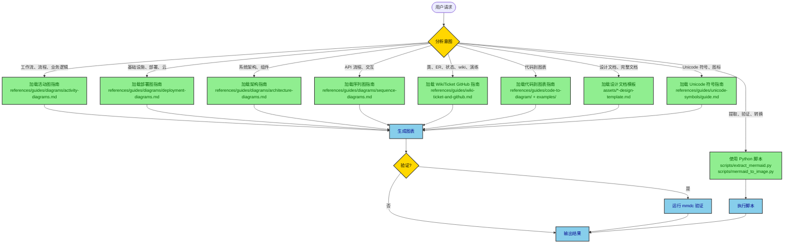
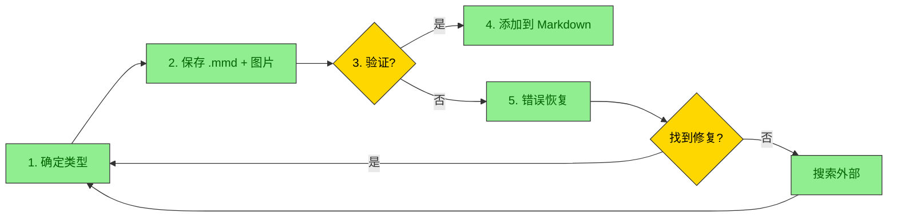
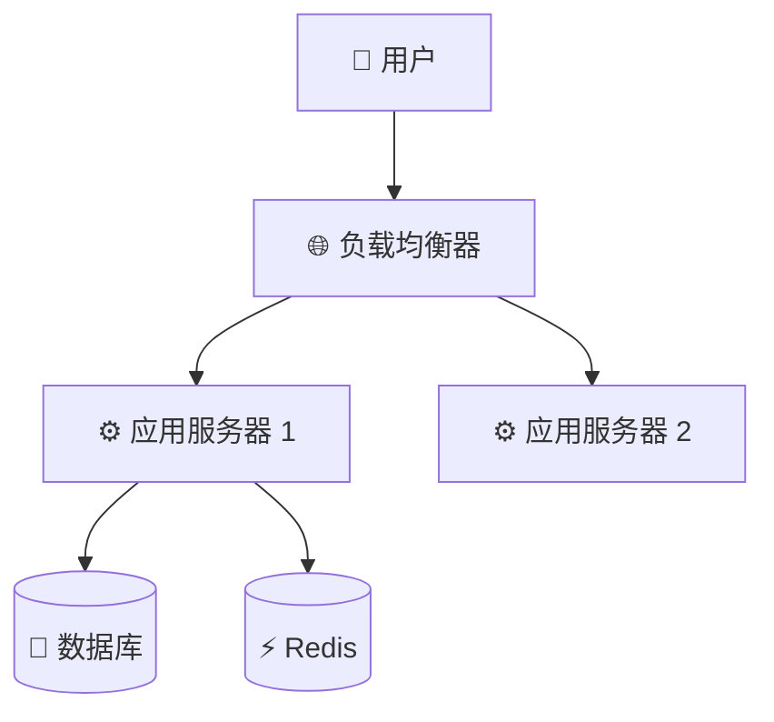
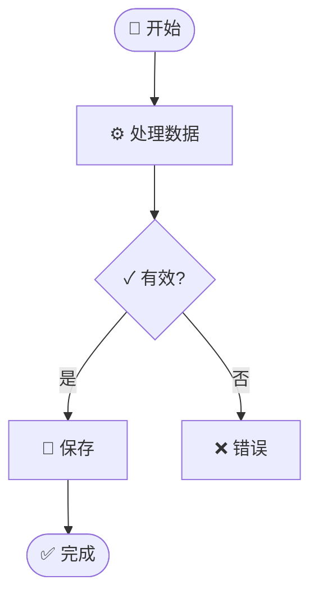
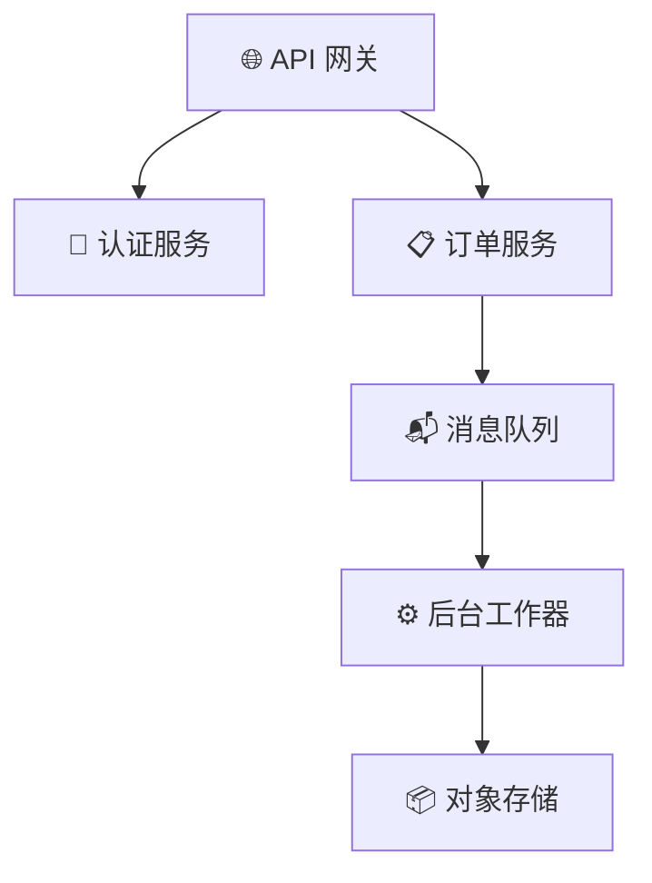

# Mermaid 架构师 - 层次结构图和文档技能

Mermaid 图表和文档系统，包含专业指南和代码到图表的能力。

## 目录

- [决策树](#决策树)
- [GitHub wiki, WikiTicket 和 Confluence](#github-wiki-wikiticket-and-confluence)
- [可用指南和资源](#可用指南和资源)
- [使用模式](#使用模式)
- [弹性工作流](#弹性工作流)
- [Unicode 语义符号](#unicode-语义符号)
- [Python 工具](#python-工具)
- [决策树示例](#决策树示例)
- [高对比度样式](#高对比度样式)
- [文件组织](#文件组织)
- [工作流摘要](#工作流摘要)
- [何时使用什么](#何时使用什么)
- [最佳实践](#最佳实践)
- [学习路径](#学习路径)

## 决策树

**此技能的工作原理：**

1. **用户发起请求** → 技能分析意图
2. **技能确定图表/文档类型** → 加载相应的指南
3. **AI 读取专业指南** → 使用模板生成图表/文档
4. **交付结果** → 带有验证和导出选项

**用户意图分析：**



## 可用指南和资源

### 图表类型指南 (`references/guides/diagrams/`)

| 指南 | 完整路径 | 用户想要加载时 | 示例 |
|------|----------|----------------|------|
| 活动图 | `references/guides/diagrams/activity-diagrams.md` | 工作流、流程、业务逻辑、用户流程、决策树 | "显示结账流程"、"记录 ETL 管道"、"创建审批工作流" |
| 部署图 | `references/guides/diagrams/deployment-diagrams.md` | 基础设施、云架构、K8s、无服务器、网络拓扑 | "显示 AWS 架构"、"记录 GCP 部署"、"创建 K8s 图表" |
| 架构图 | `references/guides/diagrams/architecture-diagrams.md` | 系统架构、组件设计、高层结构 | "显示系统组件"、"记录微服务"、"架构概述" |
| 序列图 | `references/guides/diagrams/sequence-diagrams.md` | API 交互、服务通信、请求/响应流程 | "显示 API 调用序列"、"记录认证流程"、"服务交互" |
| WikiTicket / GitHub / Confluence | `references/guides/wiki-ticket-and-github.md` | 设计文档、演练、需求、wiki 发布、Confluence 图片 | "架构文档"、"代码演练"、"wiki"、"Confluence" |

WikiTicket 和 GitHub wiki 的默认值为此技能，包括 `classDiagram`、`erDiagram` 和 `stateDiagram-v2`。不要将它们发送到 PlantUML。如果 GitHub 无法渲染 C4 / architecture-beta / block-beta，则回退到 `flowchart TD`。

### 代码到图表指南和示例

| 资源 | 完整路径 | 提供的内容 |
|------|----------|------------|
| **主指南** | `references/guides/code-to-diagram/README.md` | 分析任何代码库并提取图表的完整工作流 |
| **Spring Boot** | `examples/spring-boot/README.md` | 控制器→服务→仓库架构、部署配置、从方法→序列图、从业务逻辑→活动图 |
| **FastAPI** | `examples/fastapi/README.md` | Python 异步模式、Pydantic 模型、依赖注入、云部署 |
| **React** | `examples/react/README.md` | 组件层次结构、状态管理、数据流、构建管道 |
| **Python ETL** | `examples/python-etl/README.md` | 数据管道、转换步骤、错误处理、调度 |
| **Node/Express** | `examples/node-webapp/README.md` | 中间件链、路由处理程序、异步模式、部署 |
| **Java Web 应用** | `examples/java-webapp/README.md` | 传统 MVC、servlet 容器、WAR 部署 |

### 设计文档模板

| 模板 | 完整路径 | 用于 | 加载时 |
|------|----------|------|--------|
| 架构设计 | `assets/architecture-design-template.md` | 系统级架构 | "创建架构文档"、"记录系统设计" |
| API 设计 | `assets/api-design-template.md` | API 规范 | "API 设计文档"、"记录 REST API" |
| 功能设计 | `assets/feature-design-template.md` | 功能规划 | "功能设计"、"规划新功能" |
| 数据库设计 | `assets/database-design-template.md` | 数据库模式 | "数据库设计"、"记录模式" |
| 系统设计 | `assets/system-design-template.md` | 完整系统 | "系统设计文档"、"完整系统文档" |

### Unicode 符号指南

**完整路径：** `references/guides/unicode-symbols/guide.md`

**加载时用户提到：** "Unicode 符号"、"图表中的表情符号"、"语义图标"、"添加符号"

**快速参考：**
- 📦 基础设施：☁️ 🌐 🔌 📡 🗄️
- ⚙️ 计算：⚙️ ⚡ 🔄 ♻️ 🚀 💨
- 💾 数据：💾 📦 📊 📈 🗃️ 🧊
- 📨 消息：📨 📬 📤 📥 🐰 📢
- 🔐 安全：🔐 🔑 🛡️ 🚪 👤 🎫
- 📝 监控：📝 📊 🚨 ⚠️ ✅ ❌

### Python 脚本 (`scripts/`)

| 脚本 | 用于 | 加载时 |
|------|------|--------|
| `extract_mermaid.py` | 从 Markdown 提取图表、验证语法、替换为图片 | "提取图表"、"验证 mermaid"、"查找所有图表" |
| `mermaid_to_image.py` | 将 .mmd 转换为 PNG/SVG、批量转换、自定义主题 | "转换为图片"、"渲染图表"、"创建 PNG" |
| `resilient_diagram.py` | 完整工作流：保存 .mmd、生成图片、验证、错误恢复 | "生成图表"、"使用验证创建图表"、"弹性图表" |


## GitHub wiki, WikiTicket 和 Confluence

加载 `references/guides/wiki-ticket-and-github.md` 用于 WikiTicket 设计文档、代码演练、需求、GitHub wiki 或 Confluence。

| 目标 | 发送的内容 |
|------|----------------|
| GitHub wiki / GFM | 带有分隔符的 `mermaid` 块。GitHub 渲染 class、ER、state、sequence、flowchart、C4。 |
| Confluence / Notion / Word / PDF | 也渲染 PNG 或 SVG (`scripts/resilient_diagram.py` 或 `mmdc`) 并上传图片。不要依赖 Confluence 渲染 Mermaid。 |

Salt wireframes 的 PlantUML 是可选的，用于用例、时序图、ArchiMate、nwdiag 和 WBS。这些始终作为 PNG 或 SVG 发送。

## 使用模式

常见请求模式和指南选择。参见 [何时使用什么](#何时使用什么) 获取完整映射。

| 模式 | 示例请求 | 加载的指南 |
|------|----------|------------|
| 单个图表 | "创建登录流程的活动图" | 图表类型指南 + Unicode 符号 |
| 代码到图表 | "从 application.yml 生成部署" | 框架示例 + 部署指南 |
| 设计文档 | "创建 API 设计文档" | 资产/中的模板 + 相关图表指南 |
| 提取/验证 | "从 design.md 提取图表" | 使用 `scripts/extract_mermaid.py` |
| 批量转换 | "将所有 .mmd 转换为 PNG" | 使用 `scripts/mermaid_to_image.py` |

## 弹性工作流

**关键：** 这是所有图表生成的推荐方法。它确保验证、错误恢复和一致的文件组织。

**完整指南：** `references/guides/resilient-workflow.md`

### 工作流概述



### 关键原则

**永远在图表通过验证之前将其添加到 Markdown 中。** 这可以防止文档中损坏的图表。

### 使用脚本（推荐）

```bash
# 带有完整错误恢复生成
python scripts/resilient_diagram.py \
    --code "flowchart TD; A-->B" \
    --markdown-file design_doc \
    --diagram-num 1 \
    --title "process_flow" \
    --format png \
    --json
```

**输出：** `./diagrams/` 目录中的 `.mmd` 和 `.png` 文件。

### 文件命名约定

```
./diagrams/<markdown_file>_<num>_<type>_<title>.mmd
./diagrams/<markdown_file>_<num>_<type>_<title>.png
```

**示例：** `./diagrams/api_design_01_sequence_auth_flow.png`

### 错误恢复优先级

当验证失败时，工作流自动：

1. **检查故障排除指南** - `references/guides/troubleshooting.md` (28 个记录的错误)
2. **使用 perplexity 搜索** - `perplexity_ask` MCP 用于语法问题
3. **使用 brave 搜索** - `brave_web_search` MCP 用于最新解决方案
4. **询问 gemini** - `gemini` 技能用于替代观点
5. **一般搜索** - `WebSearch` 工具作为回退

### 手动回退步骤

如果脚本不可用：

1. **从第一行识别图表类型** (flowchart、sequence 等)
2. **从 `references/guides/diagrams/` 加载参考指南**
3. **保存到** `./diagrams/<markdown_file>_<num>_<type>_<title>.mmd`
4. **验证：** `mmdc -i file.mmd -o file.png -b transparent`
5. **出错：** 在 `references/guides/troubleshooting.md` 中搜索匹配的错误
6. **如果未找到：** 按上述优先级使用搜索工具
7. **添加参考：** ``

### 模式 6：弹性图表生成

**用户：** "创建一个序列图并将其添加到设计文档"

**技能操作：**
1. 识别意图：**图表生成** + **Markdown 集成**
2. 加载工作流指南：`references/guides/resilient-workflow.md`
3. 识别图表类型：**序列**
4. 加载图表指南：`references/guides/diagrams/sequence-diagrams.md`
5. 使用模板生成 Mermaid 代码
6. 执行弹性工作流：
   ```bash
   python scripts/resilient_diagram.py \
       --code "[生成的代码]" \
       --markdown-file design_doc \
       --diagram-num 1 \
       --title "api_sequence" \
       --json
   ```
7. 如果验证失败 → 应用故障排除修复 → 重试
8. 成功后 → 将 `` 添加到 Markdown

## Unicode 语义符号

始终使用 Unicode 符号来增强图表的清晰度。常见模式：

### 基础设施 & 部署


### 带状态的活动流程


### 微服务架构


**完整符号参考，加载：** `references/guides/unicode-symbols/guide.md`

## Python 工具

### 提取 Mermaid 图表

```bash
# 列出所有图表
python scripts/extract_mermaid.py document.md --list-only

# 提取到单独文件
python scripts/extract_mermaid.py document.md --output-dir diagrams/

# 验证所有图表
python scripts/extract_mermaid.py document.md --validate

# 替换为图片引用（用于 Confluence 上传）
python scripts/extract_mermaid.py document.md --replace-with-images \
  --image-format png --output-markdown output.md
```

### 转换为图片

```bash
# 单个转换
python scripts/mermaid_to_image.py diagram.mmd output.png

# 带有自定义设置
python scripts/mermaid_to_image.py diagram.mmd output.svg \
  --theme dark --background white --width 1200

# 批量转换目录
python scripts/mermaid_to_image.py diagrams/ output/ --format png --recursive

# 从 stdin
echo "graph TD; A-->B" | python scripts/mermaid_to_image.py - output.png
```

## 决策树示例

### 示例 1：用户要求工作流图表

**输入：** "显示结账流程"

**技能决策路径：**
```
1. 分析：工作流、流程 → 活动图
2. 加载指南：guides/diagrams/activity-diagrams.md
3. 查找模式：电子商务结账（指南中存在模板）
4. 使用模板 + Unicode 符号生成
5. 输出带有决策点的活动图
```

**输出：** 带有 Unicode 符号的完整活动图，用于购物车、支付、订单状态。

### 示例 2：用户提供 Spring Boot 代码

**输入：** "这是我的 Spring Boot 控制器，创建图表"

**技能决策路径：**
```
1. 分析：Spring Boot、代码提供 → 代码到图表 + SPRING BOOT
2. 加载指南：
   - examples/spring-boot/
   - guides/diagrams/architecture-diagrams.md (用于结构)
   - guides/diagrams/sequence-diagrams.md (用于方法调用)
   - guides/diagrams/activity-diagrams.md (用于业务逻辑)
3. 生成多个图表：
   a. 从 @RestController/@Service/@Repository 注释生成架构图
   b. 从方法调用链生成序列图
   c. 从业务逻辑流生成活动图
4. 输出所有图表并附有说明
```

**输出：** 3-4 个图表，显示 Spring Boot 应用的不同视图。

### 示例 3：用户想要基础设施文档

**输入：** "记录我的 GCP Cloud Run 部署，使用 AlloyDB"

**技能决策路径：**
```
1. 分析：基础设施、GCP、Cloud Run → 部署图
2. 加载指南：
   - guides/diagrams/deployment-diagrams.md
   - examples/spring-boot/ 或 examples/fastapi/ (如果提供代码)
3. 检查 IaC 文件 (Pulumi、Terraform、docker-compose)
4. 生成部署图，包括：
   - Cloud Run 服务及其规格
   - VPC 连接器
   - AlloyDB 集群
   - 安全 (IAM、Secret Manager)
   - 监控
5. 应用 Unicode 符号以提高清晰度
6. 输出并附有资源规格
```

**输出：** 完整的 GCP 部署图，所有资源均标记。
