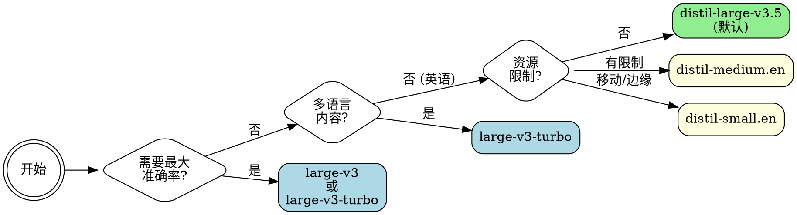

# 更快的Whisper

本地语音转文字使用faster-whisper——OpenAI的Whisper的CTranslate2重实现，速度比**快4-6倍**，但准确率完全相同。使用GPU加速，预期转录速度可达**~20倍实时**（10分钟的音频文件可在~30秒内完成）。

## 使用场景

当你需要以下功能时，请使用此技能：

- **转录音频/视频文件**——会议、采访、播客、讲座、YouTube视频
- **生成字幕**——SRT、VTT、ASS、LRC或TTML广播标准字幕
- **识别说话人**——通过`--diarize`参数进行说话人分割，标注谁说了什么
- **从URL转录**——YouTube链接和直接音频URL（通过yt-dlp自动下载）
- **转录播客源**——`--rss <feed-url>`获取并转录节目
- **批量处理文件**——支持glob模式、目录、跳过已存在文件；自动显示预计完成时间
- **本地语音转文字**——无需API成本，离线工作（模型下载后）
- **翻译成英语**——使用`--translate`参数将任何语言翻译成英语
- **多语言转录**——支持99+种语言，自动检测
- **不同语言批量文件转录**——使用`--language-map`为每个文件分配不同语言
- **多语言音频转录**——使用`--multilingual`参数处理混合语言音频
- **特定术语音频转录**——使用`--initial-prompt`参数处理专业术语或任何其他需要关注的词汇
- **转录前预处理嘈杂音频**——转录前使用`--normalize`和`--denoise`参数
- **流式输出**——使用`--stream`参数实时显示转录内容
- **剪辑时间范围**——使用`--clip-timestamps`参数转录特定时间段
- **搜索转录内容**——使用`--search "term"`参数查找单词/短语出现的所有时间戳
- **检测章节**——使用`--detect-chapters`参数从静音间隙中检测章节分割
- **导出说话人音频**——使用`--export-speakers DIR`参数将每个说话人的发言保存为单独的WAV文件
- **电子表格输出**——使用`--format csv`参数生成带时间戳的CSV文件

**触发短语：**
"转录这个音频"、"将语音转换为文字"、"他们说了什么"、"制作转录文本",
"音频转文字"、"为视频制作字幕"、"谁在说话"、"翻译这个音频"、"翻译成英语",
"查找X在哪里被提及"、"搜索转录内容"、"他们何时说的"、"在什么时间戳",
"添加章节"、"检测章节"、"查找音频中的断点"、"这个录音的目录",
"TTML字幕"、"DFXP字幕"、"广播格式字幕"、"Netflix格式",
"ASS字幕"、"Aegisub格式"、"高级Substation Alpha"、"mpv字幕",
"LRC字幕"、"定时歌词"、"卡拉OK字幕"、"音乐播放器歌词",
"HTML转录文本"、"带置信度颜色的转录文本"、"彩色编码转录文本",
"每个说话人单独的音频"、"导出说话人音频"、"按说话人分割",
"转录文本为CSV"、"电子表格输出"、"转录播客"、"播客RSS源",
"批量处理不同语言"、"每文件语言映射",
"多格式转录"、"同时生成srt和txt"、"同时输出srt和文本",
"去除填充词"、"清理um和uh"、"去除犹豫声音"、"去除你知道和我的意思",
"转录左声道"、"转录右声道"、"立体声道"、"仅左声道",
"包裹字幕行"、"每行字符限制"、"字幕每行最大字符数",
"检测段落"、"段落断点"、"分组为段落"、"添加段落间距"

**⚠️ 代理指导——保持调用最小化：**

_CORE规则：默认命令（`./scripts/transcribe audio.mp3`）是最快路径——仅在用户明确要求该功能时才添加标志。_

**转录：**

- 仅在用户要求"谁说了什么" / "识别说话人" / "标注说话人"时添加`--diarize`
- 仅在用户要求特定格式（srt/vtt/ass/lrc/ttml）的字幕/字幕时添加`--format`
- 仅在用户要求CSV或电子表格输出时添加`--format csv`
- 仅在用户需要单词级时间戳时添加`--word-timestamps`
- 仅在有特定领域术语时添加`--initial-prompt`
- 仅在用户需要将非英语音频翻译成英语时添加`--translate`
- 仅在用户提到音频质量差或噪音时添加`--normalize`/`--denoise`
- 仅在用户需要长文件实时/渐进输出时添加`--stream`
- 仅在用户需要特定时间范围时添加`--clip-timestamps`
- 仅在模型在音乐/静音上产生幻觉时添加`--temperature 0.0`
- 仅在VAD过度切割语音或包含噪音时添加`--vad-threshold`
- 仅在已知说话人数时添加`--min-speakers`/`--max-speakers`
- 仅在token未缓存于`~/.cache/huggingface/token`时添加`--hf-token`
- 仅在字幕可读性需要时添加`--max-words-per-line`（例如Netflix格式，每行42个字符）
- 仅在转录内容包含明显伪影（音乐标记、重复）时添加`--filter-hallucinations`
- 仅在用户要求句子级字幕提示时添加`--merge-sentences`
- 仅在用户要求去除填充词（um、uh、你知道、我的意思、犹豫声音）时添加`--clean-filler`
- 仅在用户提到立体轨道、双通道录音或需要特定声道时添加`--channel left|right`
- 仅在用户指定每行字符限制时添加`--max-chars-per-line N`（例如Netflix格式，每行42个字符）；优先级高于`--max-words-per-line`
- 仅在用户要求段落断点或结构化文本输出时添加`--detect-paragraphs`；`--paragraph-gap`（默认3.0秒）仅在需要自定义间隙时添加
- 仅在用户提供真实姓名以替换SPEAKER_1/2时添加`--speaker-names "Alice,Bob"`——始终需要`--diarize`
- 仅在用户命名`--initial-prompt`无法良好服务的特定罕见术语时添加`--hotwords WORDS`；优先使用`--initial-prompt`处理通用领域术语
- 仅在用户知道音频起始的确切单词时添加`--prefix TEXT`
- 仅在用户仅需要识别语言而不需要转录时添加`--detect-language-only`
- 仅在用户要求性能统计、RTF或基准信息时添加`--stats-file PATH`
- 仅在处理大型CPU批量任务时添加`--parallel N`；GPU可高效处理单个文件——不要为单个文件或小批量添加
- 仅在处理不可靠输入（URL、网络文件）且预期存在暂时性故障时添加`--retries N`
- 仅在用户明确要求将字幕嵌入/烧录到视频中时添加`--burn-in OUTPUT`；需要ffmpeg和视频文件输入
- 仅在用户可能重新处理相同URL以避免重新下载时添加`--keep-temp`
- 仅在用户在批量模式下指定自定义命名模式时添加`--output-template`
- **多格式输出**（`--format srt,text`）：仅在用户明确要求一次处理多种格式时添加；始终与`-o <dir>`配合使用
- 任何单词级功能自动运行wav2vec2对齐（额外开销~5-10秒）
- `--diarize`在上述基础上增加~20-30秒

**搜索：**

- 仅在用户要求在音频中查找/定位/搜索特定单词或短语时添加`--search "term"`
- `--search`**替换**正常转录输出——仅打印匹配段和时间戳
- 仅在用户提到近似/部分匹配或拼写错误时添加`--search-fuzzy`
- 要将搜索结果保存到文件，使用`-o results.txt`

**章节检测：**

- 仅在用户要求章节、段落、目录或"主题何时变化"时添加`--detect-chapters`
- 默认`--chapter-gap 8`（8秒静音=新章节）适用于大多数播客/讲座；密集内容可调低
- `--chapter-format youtube`（默认）输出YouTube兼容时间戳；使用`json`用于程序化使用
- **始终使用`--chapters-file PATH`**在章节与转录输出结合时——避免章节标记混入转录文本
- 如果用户仅需要章节（不需要转录），将stdout重定向到文件`-o /dev/null`并使用`--chapters-file`
- **批量模式限制：** `--chapters-file`接受单个路径——在批量模式下，每个文件的章节会覆盖前一个。对于批量章节检测，省略`--chapters-file`（章节在`=== CHAPTERS (N) ===`下打印到stdout）或为每个文件单独运行

**说话人音频导出：**

- 仅在用户明确要求将每个说话人的音频单独保存时添加`--export-speakers DIR`
- 始终与`--diarize`配合使用——如果没有说话人标签则静默跳过
- 需要ffmpeg；输出`SPEAKER_1.wav`、`SPEAKER_2.wav`等（如果设置了`--speaker-names`则为真实姓名）

**语言映射：**

- 仅在批量模式下，用户确认文件间语言不同时添加`--language-map`
- 内联格式：`"interview*.mp3=en,lecture*.mp3=fr"`——文件名glob匹配
- JSON文件格式：`@/path/to/map.json`，文件内容为`{"pattern": "lang_code"}`

**RSS / 播客：**

- 仅在用户提供播客RSS源URL时添加`--rss URL`
- 默认获取5个最新节目；`--rss-latest 0`获取全部；`--skip-existing`安全续传
- **始终使用`-o <dir>`**与`--rss`配合使用——否则所有节目转录内容会打印到stdout并连接，难以使用；设置`-o <dir>`后每个节目将生成独立文件

**代理传递的输出格式：**

- **搜索结果**（`--search`）→ 直接打印给用户；输出为人类可读
- **章节输出** → 如果没有`--chapters-file`，章节在转录后的stdout中以`=== CHAPTERS (N) ===`标题显示；使用`--format json`时，章节也嵌入JSON的`"chapters"`键下
- **字幕格式**（SRT、VTT、ASS、LRC、TTML）→ 始终写入`-o`文件；告诉用户输出路径，不要粘贴原始字幕内容
- **数据格式**（CSV、HTML、TTML、JSON）→ 始终写入`-o`文件；告诉用户输出路径，不要粘贴原始XML/CSV/HTML
- **ASS格式** → 用于Aegisub、VLC、mpv；写入文件并告诉用户可以在Aegisub中打开或在VLC/mpv中播放
- **LRC格式** → 音乐播放器（Foobar2000、AIMP、VLC）的定时歌词；写入文件
- **多格式**（`--format srt,text`）→ 需要`-o <dir>`；每种格式写入单独文件；告诉用户所有路径
- **JSON格式** → 用于程序化后处理；不适合完整粘贴给用户
- **文本/转录** → 短文件可安全直接显示给用户；长文件需总结
- **统计输出**（`--stats-file`）→ 为用户总结关键字段（时长、处理时间、RTF）而不是粘贴原始JSON
- **语言检测**（`--detect-language-only`）→ 直接打印结果；为单行
- **ETA**会自动打印到stderr，批量任务无需操作

**不使用场景：**

- 仅云环境且无本地计算
- 文件<10秒且API调用延迟不重要

**faster-whisper vs whisperx：**
此技能涵盖whisperx的所有功能——说话人分割（`--diarize`）、单词级时间戳（`--word-timestamps`）、SRT/VTT字幕——因此无需whisperx。仅在需要pyannote管道或这里未涵盖的批量GPU功能时使用whisperx。

## 快速参考

| 任务                           | 命令                                                                                | 备注                                               |
| ------------------------------ | -------------------------------------------------------------------------------------- | --------------------------------------------------- |
| **基本转录**        | `./scripts/transcribe audio.mp3`                                                       | 批量推理，VAD开启，distil-large-v3.5        |
| **SRT字幕**              | `./scripts/transcribe audio.mp3 --format srt -o subs.srt`                              | 自动启用单词时间戳                        |
| **VTT字幕**              | `./scripts/transcribe audio.mp3 --format vtt -o subs.vtt`                              | WebVTT格式                                       |
| **单词时间戳**            | `./scripts/transcribe audio.mp3 --word-timestamps --format srt`                        | wav2vec2对齐 (~10ms)                            |
| **说话人分割**        | `./scripts/transcribe audio.mp3 --diarize`                                             | 需要 pyannote.audio                             |
| **翻译→英语**        | `./scripts/transcribe audio.mp3 --translate`                                           | 任何语言→英语                              |
| **流式输出**              | `./scripts/transcribe audio.mp3 --stream`                                              | 实时分段转录                        |
| **片段时间范围**            | `./scripts/transcribe audio.mp3 --clip-timestamps "30,60"`                             | 仅30s–60s                                        |
| **降噪+标准化**        | `./scripts/transcribe audio.mp3 --denoise --normalize`                                 | 先清理嘈杂音频                          |
| **减少幻觉**       | `./scripts/transcribe audio.mp3 --hallucination-silence-threshold 1.0`                 | 跳过幻觉的静音                           |
| **YouTube/URL**                | `./scripts/transcribe https://youtube.com/watch?v=...`                                 | 自动通过yt-dlp下载                           |
| **批量处理**              | `./scripts/transcribe *.mp3 -o ./transcripts/`                                         | 输出到目录                                 |
| **批量跳过已存在**            | `./scripts/transcribe *.mp3 --skip-existing -o ./out/`                                 | 继续中断的批量                          |
| **领域术语**               | `./scripts/transcribe audio.mp3 --initial-prompt 'Kubernetes gRPC'`                    | 提升罕见术语                              |
| **关键词增强**             | `./scripts/transcribe audio.mp3 --hotwords 'JIRA Kubernetes'`                          | 偏向特定单词解码                          |
| **前缀条件**        | `./scripts/transcribe audio.mp3 --prefix 'Good morning,'`                              | 用已知开头词初始化第一段                        |
| **固定模型版本**          | `./scripts/transcribe audio.mp3 --revision v1.2.0`                                     | 可重复的转录与固定版本   |
| **调试库日志**         | `./scripts/transcribe audio.mp3 --log-level debug`                                     | 显示faster_whisper内部日志                   |
| **Turbo模型**                | `./scripts/transcribe audio.mp3 -m turbo`                                              | large-v3-turbo的别名                        |
| **更快英语**             | `./scripts/transcribe audio.mp3 --model distil-medium.en -l en`                        | 英语专用，6.8x更快                           |
| **最大准确率**           | `./scripts/transcribe audio.mp3 --model large-v3 --beam-size 10`                       | 全模型                                          |
| **JSON输出**                | `./scripts/transcribe audio.mp3 --format json -o out.json`                             | 带统计信息的程序化访问                      |
| **过滤噪声**               | `./scripts/transcribe audio.mp3 --min-confidence 0.6`                                  | 丢弃低置信度分段                        |
| **混合量化**        | `./scripts/transcribe audio.mp3 --compute-type int8_float16`                           | 节省VRAM，最小质量损失                     |
| **减少批量大小**          | `./scripts/transcribe audio.mp3 --batch-size 4`                                        | GPU内存不足时                               |
| **TSV输出**                 | `./scripts/transcribe audio.mp3 --format tsv -o out.tsv`                               | OpenAI Whisper兼容TSV                       |
| **修正幻觉**         | `./scripts/transcribe audio.mp3 --temperature 0.0 --no-speech-threshold 0.8`           | 锁定温度+跳过静音                     |
| **调整VAD灵敏度**       | `./scripts/transcribe audio.mp3 --vad-threshold 0.6 --min-silence-duration 500`        | 更严格的语音检测                            |
| **已知说话人数量**        | `./scripts/transcribe meeting.wav --diarize --min-speakers 2 --max-speakers 3`         | 限制说话人分割                               |
| **字幕单词换行**     | `./scripts/transcribe audio.mp3 --format srt --word-timestamps --max-words-per-line 8` | 分割长字幕提示                                     |
| **私有/门控模型**        | `./scripts/transcribe audio.mp3 --hf-token hf_xxx`                                     | 直接传递token                                 |
| **显示版本**               | `./scripts/transcribe --version`                                                       | 打印faster-whisper版本                        |
| **原地升级**           | `./setup.sh --update`                                                                  | 无需完整重装升级                      |
| **系统检查**               | `./setup.sh --check`                                                                   | 验证GPU、Python、ffmpeg、venv、yt-dlp、pyannote  |
| **仅检测语言**       | `./scripts/transcribe audio.mp3 --detect-language-only`                                | 快速语言ID，不转录                          |
| **检测语言JSON**       | `./scripts/transcribe audio.mp3 --detect-language-only --format json`                  | 机器可读语言检测                 |
| **LRC字幕**              | `./scripts/transcribe audio.mp3 --format lrc -o lyrics.lrc`                            | 音乐播放器用的带时间戳歌词格式               |
| **ASS字幕**              | `./scripts/transcribe audio.mp3 --format ass -o subtitles.ass`                         | Advanced SubStation Alpha (Aegisub、mpv、VLC)       |
| **合并句子**            | `./scripts/transcribe audio.mp3 --format srt --merge-sentences`                        | 将片段合并为句子块                 |
| **性能统计文件**              | `./scripts/transcribe audio.mp3 --stats-file stats.json`                               | 转录后写入性能统计JSON                   |
| **批量统计**                | `./scripts/transcribe *.mp3 --stats-file ./stats/`                                     | 目录中每个输入一个统计文件                     |
| **模板命名**            | `./scripts/transcribe audio.mp3 -o ./out/ --output-template "{stem}_{lang}.{ext}"`     | 自定义批量输出文件名                       |
| **标准输入**                | `ffmpeg -i input.mp4 -f wav - \| ./scripts/transcribe -`                               | 直接从标准输入管道音频                      |
| **自定义模型目录**           | `./scripts/transcribe audio.mp3 --model-dir ~/my-models`                               | 自定义HuggingFace缓存目录                        |
| **本地模型**                | `./scripts/transcribe audio.mp3 -m ./my-model-ct2`                                     | CTranslate2模型目录                               |
| **HTML转录**            | `./scripts/transcribe audio.mp3 --format html -o out.html`                             | 带置信度着色的HTML                        |
| **烧录字幕**             | `./scripts/transcribe video.mp4 --burn-in output.mp4`                                  | 需要ffmpeg+视频输入                       |
| **命名说话人**              | `./scripts/transcribe audio.mp3 --diarize --speaker-names "Alice,Bob"`                 | 替换SPEAKER_1/2                                |
| **过滤幻觉**      | `./scripts/transcribe audio.mp3 --filter-hallucinations`                               | 移除伪影                                   |
| **保留临时文件**            | `./scripts/transcribe https://... --keep-temp`                                         | 用于URL重新处理                               |
| **并行批量**             | `./scripts/transcribe *.mp3 --parallel 4 -o ./out/`                                    | CPU多文件处理                                  |
| **推荐RTX 3070**       | `./scripts/transcribe audio.mp3 --compute-type int8_float16`                           | 节省~1GB VRAM，最小质量损失               |
| **CPU线程数**           | `./scripts/transcribe audio.mp3 --threads 8`                                           | 强制CPU线程数（默认：自动）              |
| **播客RSS（最新5集）**     | `./scripts/transcribe --rss https://feeds.example.com/podcast.xml`                     | 下载并转录最新5集播客                     |
| **播客RSS（所有集）**     | `./scripts/transcribe --rss https://... --rss-latest 0 -o ./episodes/`                 | 所有集，每个文件一个                     |
| **播客+SRT字幕**    | `./scripts/transcribe --rss https://... --format srt -o ./subs/`                       | 字幕所有集                               |
| **失败重试**           | `./scripts/transcribe *.mp3 --retries 3 -o ./out/`                                     | 错误时最多重试3次，带退避                |
| **CSV输出**                 | `./scripts/transcribe audio.mp3 --format csv -o out.csv`                               | 电子表格格式，带表头，正确引号             |
| **带说话人CSV**          | `./scripts/transcribe audio.mp3 --diarize --format csv -o out.csv`                     | 添加说话人列                                 |
| **语言映射（内联）**      | `./scripts/transcribe *.mp3 --language-map "interview*.mp3=en,lecture.wav=fr"`         | 批量中每文件语言映射                          |
| **语言映射（JSON）**        | `./scripts/transcribe *.mp3 --language-map @langs.json`                                | JSON文件：{"pattern": "lang"}                      |
| **批量显示ETA**             | `./scripts/transcribe *.mp3 -o ./out/`                                                 | 自动显示每个文件的预计完成时间             |
| **TTML字幕**             | `./scripts/transcribe audio.mp3 --format ttml -o subtitles.ttml`                       | 广播标准DFXP/TTML (Netflix、BBC、Amazon) |
| **带说话人标签的TTML**   | `./scripts/transcribe audio.mp3 --diarize --format ttml -o subtitles.ttml`             | 说话人标记的TTML                                |
| **搜索转录**          | `./scripts/transcribe audio.mp3 --search "keyword"`                                    | 查找关键词出现的时间戳               |
| **搜索到文件**             | `./scripts/transcribe audio.mp3 --search "keyword" -o results.txt`                     | 保存搜索结果                                 |
| **模糊搜索**               | `./scripts/transcribe audio.mp3 --search "aproximate" --search-fuzzy`                  | 近似/部分匹配                        |
| **检测章节**            | `./scripts/transcribe audio.mp3 --detect-chapters`                                     | 自动从静音间隙检测章节                     |
| **章节间隙调整**         | `./scripts/transcribe audio.mp3 --detect-chapters --chapter-gap 5`                     | 间隙≥5s生成章节（默认：8s）                  |
| **章节到文件**           | `./scripts/transcribe audio.mp3 --detect-chapters --chapters-file ch.txt`              | 保存YouTube格式章节列表                    |
| **章节JSON**              | `./scripts/transcribe audio.mp3 --detect-chapters --chapter-format json`               | 机器可读章节列表                       |
| **导出说话人音频**       | `./scripts/transcribe audio.mp3 --diarize --export-speakers ./speakers/`               | 将每个说话人的音频保存为单独WAV文件     |
| **多格式输出**        | `./scripts/transcribe audio.mp3 --format srt,text -o ./out/`                           | 一次写入SRT+TXT                          |
| **移除填充词**        | `./scripts/transcribe audio.mp3 --clean-filler`                                        | 移除um/uh/er/ah/hmm和话语标记             |
| **仅左声道**          | `./scripts/transcribe audio.mp3 --channel left`                                        | 转录前提取立体声左声道                     |
| **仅右声道**          | `./scripts/transcribe audio.mp3 --channel right`                                       | 提取立体声右声道                        |
| **每行最大字符数**        | `./scripts/transcribe audio.mp3 --format srt --max-chars-per-line 42`                  | 基于字符的字幕换行                   |
| **检测段落**          | `./scripts/transcribe audio.mp3 --detect-paragraphs`                                   | 在文本输出中插入段落分隔符              |
| **段落间隙调整**       | `./scripts/transcribe audio.mp3 --detect-paragraphs --paragraph-gap 5.0`               | 调整间隙阈值（默认 3.0s）                   |

## 模型选择

根据需求选择合适的模型：



### 模型表

#### 标准模型（完整Whisper）

| 模型                  | 大小  | 速度     | 准确性  | 应用场景                           |
| ---------------------- | ----- | --------- | --------- | ---------------------------------- |
| `tiny` / `tiny.en`     | 39M   | 最快     | 基础     | 快速草稿                           |
| `base` / `base.en`     | 74M   | 非常快   | 良好      | 通用使用                          |
| `small` / `small.en`   | 244M  | 快       | 更好    | 大多数任务                         |
| `medium` / `medium.en` | 769M  | 中等     | 高      | 高质量语音转录                    |
| `large-v1/v2/v3`       | 1.5GB | 较慢     | 最佳      | 最大准确性                       |
| `large-v3-turbo`       | 809M  | 快       | 优秀    | 高准确性（比distil慢）            |

#### 精简模型 (~6倍更快，~1% WER差异)

| 模型                   | 大小 | 与标准速度比较 | 准确性  | 应用场景                           |
| ----------------------- | ---- | ------------- | --------- | ---------------------------------- |
| **`distil-large-v3.5`** | 756M | ~6.3倍更快      | 7.08% WER | **默认，最佳平衡**          |
| `distil-large-v3`       | 756M | ~6.3倍更快      | 7.53% WER | 之前的默认值                   |
| `distil-large-v2`       | 756M | ~5.8倍更快      | 10.1% WER | 备用                           |
| `distil-medium.en`      | 394M | ~6.8倍更快      | 11.1% WER | 仅英语，资源受限               |
| `distil-small.en`       | 166M | ~5.6倍更快      | 12.1% WER | 移动/边缘设备                |

`.en` 模型仅支持英语，且对英语内容稍快/稍好。

> **精简模型的注意事项：** HuggingFace 建议禁用所有精简模型的 `condition_on_previous_text` 以防止重复循环。脚本会**自动应用** `--no-condition-on-previous-text` 当检测到 `distil-*` 模型时。如需覆盖，请传递 `--condition-on-previous-text`。

## 自定义和微调模型

WhisperModel 接受本地 CTranslate2 模型目录和 HuggingFace 仓库名称 — 无需代码更改。

### 加载本地 CTranslate2 模型

```bash
./scripts/transcribe audio.mp3 --model /path/to/my-model-ct2
```

### 将 HuggingFace 模型转换为 CTranslate2

```bash
pip install ctranslate2
ct2-transformers-converter \
  --model openai/whisper-large-v3 \
  --output_dir whisper-large-v3-ct2 \
  --copy_files tokenizer.json preprocessor_config.json \
  --quantization float16
./scripts/transcribe audio.mp3 --model ./whisper-large-v3-ct2
```

### 通过 HuggingFace 仓库名称加载模型（自动下载）

```bash
./scripts/transcribe audio.mp3 --model username/whisper-large-v3-ct2
```

### 自定义模型缓存目录

默认情况下，模型缓存在 `~/.cache/huggingface/`。使用 `--model-dir` 覆盖：

```bash
./scripts/transcribe audio.mp3 --model-dir ~/my-models
```

## 配置

### Linux / macOS / WSL2

```bash
# 基础安装（创建虚拟环境，安装依赖，自动检测GPU）
./setup.sh

# 带说话人分割支持
./setup.sh --diarize
```

要求：

- Python 3.10+
- ffmpeg 不是基本语音转录所必需的 — PyAV（与 faster-whisper 一起捆绑）处理音频解码。ffmpeg 仅用于 `--burn-in`、`--normalize` 和 `--denoise`。
- 可选：yt-dlp（用于 URL/YouTube 输入）
- 可选：pyannote.audio（用于 `--diarize`，通过 `setup.sh --diarize` 安装）

### 平台支持

| 平台               | 加速 | 速度            |
| ---------------------- | ------------ | ---------------- |
| **Linux + NVIDIA GPU** | CUDA         | ~20倍实时 🚀 |
| **WSL2 + NVIDIA GPU**  | CUDA         | ~20倍实时 🚀 |
| macOS Apple Silicon    | CPU\*        | ~3-5倍实时   |
| macOS Intel            | CPU          | ~1-2倍实时   |
| Linux (无GPU)         | CPU          | ~1倍实时     |

\*faster-whisper 使用 CTranslate2，它在 macOS 上仅支持 CPU，但 Apple Silicon 足够快，可用于实际使用。

### GPU 支持（重要！）

设置脚本会自动检测您的 GPU 并安装带 CUDA 的 PyTorch。**如果可用，始终使用 GPU** — CPU 语音转录速度极慢。

| 硬件       | 速度          | 9分钟视频 |
| -------------- | -------------- | ----------- |
| RTX 3070 (GPU) | ~20倍实时  | ~27秒     |
| CPU (int8)     | ~0.3倍实时 | ~30分钟     |

> **RTX 3070 小贴士：** 使用 `--compute-type int8_float16` 进行混合量化 — 节省 ~1GB VRAM 且质量损失最小。非常适合在语音转录的同时运行说话人分割。

如果设置未检测到您的 GPU，手动安装带 CUDA 的 PyTorch：

```bash
# 对于 CUDA 12.x
uv pip install --python .venv/bin/python torch --index-url https://download.pytorch.org/whl/cu121

# 对于 CUDA 11.x
uv pip install --python .venv/bin/python torch --index-url https://download.pytorch.org/whl/cu118
```

- **WSL2 用户**：确保您在 Windows 上安装了 [NVIDIA CUDA 驱动程序 for WSL](https://docs.nvidia.com/cuda/wsl-user-guide/)。

## 使用

```bash
# 基本语音转录
./scripts/transcribe audio.mp3

# SRT 字幕
./scripts/transcribe audio.mp3 --format srt -o subtitles.srt

# WebVTT 字幕
./scripts/transcribe audio.mp3 --format vtt -o subtitles.vtt

# 从 YouTube URL 语音转录
./scripts/transcribe https://youtube.com/watch?v=dQw4w9WgXcQ --language en

# 说话人分割
./scripts/transcribe meeting.wav --diarize

# 分割的 VTT 字幕
./scripts/transcribe meeting.wav --diarize --format vtt -o meeting.vtt

# 使用领域术语初始化
./scripts/transcribe lecture.mp3 --initial-prompt "Kubernetes, gRPC, PostgreSQL, NGINX"

# 批量处理目录
./scripts/transcribe ./recordings/ -o ./transcripts/

# 批量处理，跳过已完成的文件
./scripts/transcribe *.mp3 --skip-existing -o ./transcripts/

# 过滤低置信度片段
./scripts/transcribe noisy-audio.mp3 --min-confidence 0.6

# 带完整元数据的 JSON 输出
./scripts/transcribe audio.mp3 --format json -o result.json

# 指定语言（比自动检测快）
./scripts/transcribe audio.mp3 --language en
```

## 选项

```
输入：
  AUDIO                 音频文件、目录、通配符模式或 URL
                        接受：mp3, wav, m4a, flac, ogg, webm, mp4, mkv, avi, wma, aac
                        URL 通过 yt-dlp 自动下载（YouTube、直接链接等）

模型与语言：
  -m, --model NAME      Whisper 模型（默认：distil-large-v3.5；“turbo” = large-v3-turbo）
  --revision REV        模型修订版（git 分支/标签/提交）以锁定特定版本
  -l, --language CODE   语言代码，例如 en, es, fr（省略时自动检测）
  --initial-prompt TEXT  用于条件化模型的提示（术语、格式风格）
  --prefix TEXT         用于条件化第一段的前缀（例如已知起始单词）
  --hotwords WORDS      空格分隔的热词以增强识别
  --translate           将任何语言翻译成英语（而不是转录）
  --multilingual        启用多语言/代码转换模式（有助于较小的模型）
  --hf-token TOKEN      HuggingFace 令牌，用于私有/受保护模型和说话人分割
  --model-dir PATH      自定义模型缓存目录（默认：~/.cache/huggingface/）

输出格式：
  -f, --format FMT      text | json | srt | vtt | tsv | lrc | html | ass | ttml (默认：text)
                        接受逗号分隔列表：--format srt,text 一次性写入两者
                        多格式需要 -o <dir> 保存到文件时
  --word-timestamps     包含单词级时间戳（wav2vec2 自动对齐）
  --stream              输出段随着转录实时输出（禁用说话人分割/对齐）
  --max-words-per-line N  对于 SRT/VTT，将段分割为最多 N 个单词的子条目
  --max-chars-per-line N  对于 SRT/VTT/ASS/TTML，分割行以便每行不超过 N 个字符
                        当两者都设置时优先于 --max-words-per-line
  --clean-filler        从转录文本中删除犹豫填充词（um, uh, er, ah, hmm, hm）和话语标记
                        （you know, I mean, you see）默认关闭。
  --detect-paragraphs   在文本输出中在自然边界处插入段落分隔（空行）。
                        新段落开始时：静音间隔 ≥ --paragraph-gap，或前一段结束句子且间隔 ≥ 1.5s。
  --paragraph-gap SEC   开始新段落的最低静音间隔（秒）（默认：3.0）。
                        与 --detect-paragraphs 一起使用。
  --channel {left,right,mix}
                        立体声通道转录：左（c0）、右（c1）或混合（默认：混合）。
                        通过 ffmpeg 在转录前提取通道。需要 ffmpeg。
  --merge-sentences     将连续段合并为句子级块
                        （提高 SRT/VTT 可读性；按终止标点或 >2s 间隔分组）
  -o, --output PATH     输出文件或目录（目录用于批量模式）
  --output-template TEMPLATE
                        批量输出文件名模板。变量：{stem}, {lang}, {ext}, {model}
                        示例："{stem}_{lang}.{ext}" → "interview_en.srt"

推理调优：
  --beam-size N         并行搜索大小；越高 = 更准确但越慢（默认：5）
  --temperature T       采样温度或逗号分隔的备用列表，例如
                        '0.0' 或 '0.0,0.2,0.4'（默认：faster-whisper 的调度）
  --no-speech-threshold PROB
                        标记段为静音的概率阈值（默认：0.6）
  --batch-size N        批量推理批处理大小（默认：8；OOM 时减小）
  --no-vad              禁用语音活动检测（默认开启）
  --vad-threshold T     VAD 语音概率阈值（默认：0.5）
  --vad-neg-threshold T VAD 结束语音的负阈值（默认：自动）
  --vad-onset T         --vad-threshold 的别名（遗留）
  --vad-offset T        --vad-neg-threshold 的别名（遗留）
  --min-speech-duration MS  最小语音段持续时间（毫秒）（默认：0）
  --max-speech-duration SEC 最大语音段持续时间（秒）（默认：无限制）
  --min-silence-duration MS 最小静音间隔分割段（毫秒）（默认：2000）
  --speech-pad MS       语音段周围的填充（毫秒）（默认：400）
  --no-batch            禁用批量推理（使用标准 WhisperModel）
  --hallucination-silence-threshold SEC
                        跳过模型幻觉的静音部分（例如 1.0）
  --no-condition-on-previous-text
                        不基于前文进行条件化（减少重复/幻觉循环；
                        根据 HuggingFace 建议，distil 模型自动启用）
  --condition-on-previous-text
                        强制启用基于前文的条件化（覆盖 distil 模型的自动禁用）
  --compression-ratio-threshold RATIO
                        过滤高于此压缩比的分段（默认：2.4）
  --log-prob-threshold PROB
                        过滤低于此平均对数概率的分段（默认：-1.0）
  --max-new-tokens N    每段最大令牌数（防止无限制生成）
  --clip-timestamps RANGE
                        转录特定时间范围：'30,60' 或 '0,30;60,90'（秒）
  --progress            显示转录进度条
  --best-of N           非零温度采样时的候选（默认：5）
  --patience F          并行搜索耐心因子（默认：1.0）
  --repetition-penalty F 重复令牌的惩罚（默认：1.0）
  --no-repeat-ngram-size N  防止此大小的 n-gram 重复（默认：0 = 关闭）

高级推理：
  --no-timestamps       不带时间信息的输出文本（更快；与
                        --word-timestamps, --format srt/vtt/tsv, --diarize 不兼容）
  --chunk-length N      批量推理的音频块长度（秒）（默认：自动）
  --language-detection-threshold T
                        语言自动检测的置信度阈值（默认：0.5）
  --language-detection-segments N
                        用于语言检测的音频段数量（默认：1）
  --length-penalty F    并行搜索长度惩罚；>1 倾向于更长，<1 倾向于更短（默认：1.0）
  --prompt-reset-on-temperature T
                        当温度备用达到阈值时重置初始提示（默认：0.5）
  --no-suppress-blank   禁用空白令牌抑制（可能有助于软/安静语音）
  --suppress-tokens IDS 逗号分隔的额外抑制令牌 ID（默认 -1）
  --max-initial-timestamp T
                        第一个段的最大时间戳（秒）（默认：1.0）
  --prepend-punctuations CHARS
                        合并到前一个单词的标点字符（默认："'¿([{-)
  --append-punctuations CHARS
                        合并到下一个单词的标点字符（默认： "'.。,，!！?？:：")]}、")

预处理：
  --normalize           转录前归一化音频音量（EBU R128 loudnorm）
  --denoise             转录前应用降噪（高通 + FFT 降噪）

高级：
  --diarize             说话人分割（需要 pyannote.audio）
  --min-speakers N      分割时提示的最小说话人数
  --max-speakers N      分割时提示的最大说话人数
  --speaker-names NAMES 逗号分隔的名称，用于替换 SPEAKER_1, SPEAKER_2（例如 'Alice,Bob'）
                        需要 --diarize
  --min-confidence PROB 过滤低于此平均单词置信度的分段（0.0–1.0）
  --skip-existing       批量模式下跳过输出已存在的文件
  --detect-language-only
                        仅检测语言并退出（不转录）。输出："Language: en (probability: 0.984)"
                        --format json 时：{"language": "en", "language_probability": 0.984}
  --stats-file PATH     转录后写入 JSON 统计文件（处理时间、RTF、单词数等）
                        目录路径 → 在内部写入 {stem}.stats.json；文件路径 → 精确路径
  --burn-in OUTPUT      将字幕烧录到原始视频（仅单文件模式；需要 ffmpeg）
  --filter-hallucinations
                        过滤常见的 Whisper 幻觉：音乐/掌声标记、重复分段，
                        'Thank you for watching'、孤立标点等
  --keep-temp           保留 URL 下载的临时文件（用于重新处理而无需重新下载）
  --parallel N          批量处理的并行工作线程数（默认：顺序）
  --retries N           重试失败文件最多 N 次，指数退避（默认：0；
                        与 --parallel 不兼容）

批量 ETA：
  顺序批量作业自动显示（无需标志）。每个文件完成后，
  下一个文件的进度行包括：[当前/总数] 文件名 | ETA: Xm Ys
  ETA 根据平均每个文件时间 × 剩余文件数计算。
  显示到 stderr（通过 OpenClaw/Clawdbot 输出暴露给用户）。

语言映射（每个文件语言覆盖）：
  --language-map MAP    批量模式下每个文件的覆盖语言。两种形式：
                          内联："interview*.mp3=en,lecture.wav=fr,keynote.wav=de"
                          JSON 文件： "@/path/to/map.json"  （必须是 {pattern: lang} 字典）
                        模式支持对文件名或 stem 进行 fnmatch 通配符。
                        优先级：精确文件名 > 精确 stem > 文件名 glob > stem glob > 落后。
                        未匹配的文件会落后到 --language（或未设置时自动检测）。

转录搜索：
  --search TERM         在转录中搜索 TERM 并打印匹配段和时间戳。
                        替代正常转录输出（使用 -o 保存结果到文件）。
                        默认为不区分大小写的精确子字符串匹配。
  --search-fuzzy        启用 --search 的模糊/近似匹配（适用于拼写错误、发音近似或部分单词；
                        使用 SequenceMatcher 比率 ≥ 0.6）

章节检测：
  --detect-chapters     从静音间隔自动检测章节/段落分隔，并打印章节标记。
                        输出打印在转录后（或到 --chapters-file）。
  --chapter-gap SEC     连续段之间开始新章节的最低静音间隔（秒）（默认：8.0）。
                        调整密集语音时降低，稀疏内容时提高。
  --chapters-file PATH  将章节标记写入此文件（默认：转录后 stdout）
  --chapter-format FMT  youtube | text | json — 章节输出格式：
                          youtube: "0:00 Chapter 1"（YouTube 描述准备就绪）
                          text:    "Chapter 1: 00:00:00"
                          json:    包含章节、开始、标题字段的 JSON 数组
                        （默认：youtube）

说话人音频导出：
  --export-speakers DIR  分割后，将每个说话人的音频转轮导出为 DIR 中的单独 WAV 文件。
                        需要 --diarize 和 ffmpeg。
                        输出：SPEAKER_1.wav, SPEAKER_2.wav, …（如果设置了 --speaker-names 则为真实姓名）

RSS / Podcast：
  --rss URL             Podcast RSS 提供程序 URL — 提取音频封装并转录。
                        AUDIO 参数在使用 --rss 时可选。
  --rss-latest N        要处理的最新节目数量（默认：5；0 = 所有节目）

设备：
  --device DEV          auto | cpu | cuda (默认：auto)
  --compute-type TYPE   auto | int8 | int8_float16 | float16 | float32 (默认：auto)
                        int8_float16 = GPU 的混合模式（节省 VRAM，最小质量损失）
  --threads N           CTranslate2 的 CPU 线程数（默认：auto）
  -q, --quiet           抑制进度和状态消息
  --log-level LEVEL     设置 faster_whisper 库日志级别：debug | info | warning | error
                        （默认：warning；使用 debug 查看CTranslate2/VAD 内部细节）

工具：
  --version             打印已安装的 faster-whisper 版本并退出
  --update              升级 skill venv 中的 faster-whisper 并退出
```

## 输出格式

### 文本（默认）

纯文本转录。使用 --diarize 时插入说话人标签：

```
[SPEAKER_1]
 你好，欢迎参加会议。
[SPEAKER_2]
 谢谢邀请我。
```

### JSON (`--format json`)

包含元数据，包括分段、时间戳、语言检测和性能统计：

```json
{
  "file": "audio.mp3",
  "text": "你好，欢迎...",
  "language": "en",
  "language_probability": 0.98,
  "duration": 600.5,
  "segments": [...],
  "speakers": ["SPEAKER_1", "SPEAKER_2"],
  "stats": {
    "processing_time": 28.3,
    "realtime_factor": 21.2
  }
}
```

### SRT (`--format srt`)

视频播放器标准字幕格式：

```
1
00:00:00,000 --> 00:00:02,500
[SPEAKER_1] 你好，欢迎参加会议。

2
00:00:02,800 --> 00:00:04,200
[SPEAKER_2] 谢谢邀请我。
```

### VTT (`--format vtt`)

Web 视频播放器 WebVTT 格式：

```
WEBVTT

1
00:00:00.000 --> 00:00:02.500
[SPEAKER_1] 你好，欢迎参加会议。

2
00:00:02.800 --> 00:00:04.200
[SPEAKER_2] 谢谢邀请我。
```

### TSV (`--format tsv`)

制表符分隔值，OpenAI Whisper 兼容。列：`start_ms`, `end_ms`, `text`：

```
0	2500	你好，欢迎参加会议。
2800	4200	谢谢邀请我。
```

适用于管道到其他工具或电子表格。无标题行。

### ASS/SSA (`--format ass`)

高级 SubStation Alpha 格式 — 被 Aegisub、VLC、mpv、MPC-HC 和大多数视频编辑器支持。比 SRT 提供更丰富的样式（字体、大小、颜色、位置）通过 `[V4+ Styles]` 部分：

```
[Script Info]
ScriptType: v4.00+
...

[V4+ Styles]
Style: Default,Arial,20,&H00FFFFFF,...

[Events]
Format: Layer, Start, End, Style, Name, ..., Text
Dialogue: 0,0:00:00.00,0:00:02.50,Default,,[SPEAKER_1] 你好，欢迎。
Dialogue: 0,0:00:02.80,0:00:04.20,Default,,[SPEAKER_2] 谢谢邀请我。
```

时间戳使用 `H:MM:SS.cc`（百分之一秒）。在 Aegisub 中编辑 `[V4+ Styles]` 块以自定义字体、颜色和位置，而无需重新转录。

### LRC (`--format lrc`)

音乐播放器（例如 Foobar2000、VLC、AIMP）使用的定时歌词格式。时间戳使用 `[mm:ss.xx]`，其中 `xx` = 百分之一秒：

```
[00:00.50]你好，欢迎参加会议。
[00:02.80]谢谢邀请我。
```

使用 --diarize 时包含说话人标签：

```
[00:00.50][SPEAKER_1] 你好，欢迎参加会议。
[00:02.80][SPEAKER_2] 谢谢邀请我。
```

默认文件扩展名：`.lrc`。适用于音乐转录、卡拉OK和任何需要音乐播放器兼容的定时文本工作流。

## 说话人分割

使用 [pyannote.audio](https://github.com/pyannote/pyannote-audio) 识别谁在何时说话。

**设置：**

```bash
./setup.sh --diarize
```

**要求：**

- HuggingFace 令牌位于 `~/.cache/huggingface/token` (`huggingface-cli login`)
- 接受模型协议：
  - https://hf.co/pyannote/speaker-diarization-3.1
  - https://hf.co/pyannote/segmentation-3.0

**使用：**

```bash
# 基本分割（文本输出）
./scripts/transcribe meeting.wav --diarize

# 分割字幕
./scripts/transcribe meeting.wav --diarize --format srt -o meeting.srt

# 分割 JSON（包含说话人列表）
./scripts/transcribe meeting.wav --diarize --format json
```

说话人按首次出现顺序标记为 `SPEAKER_1`、`SPEAKER_2` 等。如果 CUDA 可用，分割自动在 GPU 上运行。

## 精确单词时间戳

在计算单词级时间戳时（`--word-timestamps`、`--diarize` 或 `--min-confidence`），wav2vec2 强制对齐过程会自动将 Whisper 的 ~100-200ms 精度提升至 ~10ms。无需额外标志。

```bash
# 带自动 wav2vec2 对齐的词级时间戳
./scripts/transcribe audio.mp3 --word-timestamps --format json

# 说话人分离也会自动获得精确对齐
./scripts/transcribe meeting.wav --diarize

# 精确字幕
./scripts/transcribe audio.mp3 --word-timestamps --format srt -o subtitles.srt
```

使用来自 torchaudio 的 MMS（Massively Multilingual Speech，大规模多语言语音）模型——支持 1000 多种语言。模型在首次加载后会被缓存，因此批量处理速度依然很快。

## URL 与 YouTube 输入

可传入任意 URL 作为输入——音频会通过 yt-dlp 自动下载：

```bash
# YouTube 视频
./scripts/transcribe https://youtube.com/watch?v=dQw4w9WgXcQ

# 直接音频 URL
./scripts/transcribe https://example.com/podcast.mp3

# 带选项
./scripts/transcribe https://youtube.com/watch?v=... --language en --format srt -o subs.srt
```

需要安装 `yt-dlp`（会检查 PATH 和 `~/.local/share/pipx/venvs/yt-dlp/bin/yt-dlp`）。

## 批量处理

使用通配符模式、目录或多个路径一次处理多个文件：

```bash
# 当前目录中的所有 MP3
./scripts/transcribe *.mp3

# 整个目录（自动过滤音频文件）
./scripts/transcribe ./recordings/

# 输出到目录（每个输入文件对应一个输出文件）
./scripts/transcribe *.mp3 -o ./transcripts/

# 跳过已转写的文件（恢复中断的批处理）
./scripts/transcribe *.mp3 --skip-existing -o ./transcripts/

# 混合输入
./scripts/transcribe file1.mp3 file2.wav ./more-recordings/

# 批量 SRT 字幕
./scripts/transcribe *.mp3 --format srt -o ./subtitles/
```

输出到目录时，文件命名为 `{输入文件主名}.{扩展名}`（例如 `audio.mp3` → `audio.srt`）。

批处理模式下，所有文件完成后会打印摘要：

```
📊 完成：12 个文件，3h24m 音频，耗时 10m15s（19.9× 实时速度）
```

## 工作流

面向常见使用场景的端到端流水线。

### 播客转写流水线

从任意播客 RSS 源获取并转写最新 5 期节目：

```bash
# 转写最新 5 期 → 每期生成一个 .txt
./scripts/transcribe --rss https://feeds.megaphone.fm/mypodcast -o ./transcripts/

# 所有节目，输出为 SRT 字幕
./scripts/transcribe --rss https://... --rss-latest 0 --format srt -o ./subtitles/

# 跳过已完成的节目（可安全重复执行）
./scripts/transcribe --rss https://... --skip-existing -o ./transcripts/

# 带说话人分离（区分谁说了什么）+ 网络不稳定时自动重试
./scripts/transcribe --rss https://... --diarize --retries 2 -o ./transcripts/
```

### 会议记录流水线

转写会议录音并标注说话人，然后输出干净的文本：

```bash
# 说话人分离 + 命名说话人（将 SPEAKER_1/2 替换为真实姓名）
./scripts/transcribe meeting.wav --diarize --speaker-names "Alice,Bob" -o meeting.txt

# 带说话人分离的 JSON，用于后续处理（摘要、行动项）
./scripts/transcribe meeting.wav --diarize --format json -o meeting.json

# 转写时实时流式输出（适用于长会议）
./scripts/transcribe meeting.wav --stream
```

### 视频字幕流水线

为视频文件生成即插即用的字幕：

```bash
# 带句子合并的 SRT 字幕（可读性更好）
./scripts/transcribe video.mp4 --format srt --merge-sentences -o subtitles.srt

# 将字幕直接烧录到视频中
./scripts/transcribe video.mp4 --format srt --burn-in video_subtitled.mp4

# 词级 SRT（卡拉 OK 风格），每条字幕最多 8 个词
./scripts/transcribe video.mp4 --format srt --word-timestamps --max-words-per-line 8 -o subs.srt
```

### YouTube 批量流水线

一次转写多个 YouTube 视频：

```bash
# 一行命令：转写播放列表视频 + 输出 SRT
./scripts/transcribe "https://youtube.com/watch?v=abc123" --format srt -o subs.srt

# 从包含 URL 的文本文件批量处理（每行一个 URL）
cat urls.txt | xargs ./scripts/transcribe -o ./transcripts/

# 先下载音频再转写（以便后续复用而无需重新下载）
./scripts/transcribe https://youtube.com/watch?v=abc123 --keep-temp
```

### 嘈杂音频流水线

在转写前清理低质量录音：

```bash
# 降噪 + 归一化，然后转写
./scripts/transcribe interview.mp3 --denoise --normalize -o interview.txt

# 嘈杂音频批量处理，使用激进的幻觉过滤
./scripts/transcribe *.mp3 --denoise --filter-hallucinations -o ./out/
```

### 批处理恢复流水线

处理大文件夹并带重试——失败后可安全重新运行：

```bash
# 每个失败文件最多重试 3 次，跳过已完成的
./scripts/transcribe ./recordings/ --skip-existing --retries 3 -o ./transcripts/

# 查看哪些文件失败了（在批处理摘要末尾打印）
# 重新运行相同命令——跳过成功的，重试失败的
```

## 服务器模式（OpenAI 兼容 API）

[speaches](https://github.com/speaches-ai/speaches) 将 faster-whisper 作为 OpenAI 兼容的 `/v1/audio/transcriptions` 端点运行——可替代 OpenAI Whisper API，支持流式处理、Docker 和实时转写。

### 快速开始（Docker）

```bash
docker run --gpus all -p 8000:8000 ghcr.io/speaches-ai/speaches:latest-cuda
```

### 测试

```bash
# 通过 API 转写文件（与 OpenAI 格式相同）
curl http://localhost:8000/v1/audio/transcriptions \
  -F file=@audio.mp3 \
  -F model=Systran/faster-whisper-large-v3
```

### 配合任意 OpenAI SDK 使用

```python
from openai import OpenAI
client = OpenAI(base_url="http://localhost:8000", api_key="none")
with open("audio.mp3", "rb") as f:
    result = client.audio.transcriptions.create(model="Systran/faster-whisper-large-v3", file=f)
print(result.text)
```

当你需要将转写功能作为本地 API 暴露给其他工具（如 Home Assistant、n8n、自定义应用）时非常有用。

## 常见错误

| 错误 | 问题 | 解决方案 |
| --- | --- | --- |
| **有 GPU 却使用 CPU** | 转写速度慢 10-20 倍 | 检查 `nvidia-smi`；确认 CUDA 安装正确 |
| **未指定语言** | 对已知内容浪费时间自动检测语言 | 已知语言时使用 `--language en` |
| **使用了错误的模型** | 不必要的缓慢或精度差 | 默认的 `distil-large-v3.5` 已经很好；仅在精度有问题时才用 `large-v3` |
| **忽略了蒸馏模型** | 错失 6 倍加速且精度损失不到 1% | 先尝试 `distil-large-v3.5` 再考虑标准模型 |
| **忘记了 ffmpeg** | 安装失败或无法处理音频 | 安装脚本会自动处理；手动安装需单独安装 ffmpeg |
| **内存不足错误** | 模型对可用的 VRAM/RAM 太大 | 使用更小的模型、`--compute-type int8`，或 `--batch-size 4` |
| **过度调优 beam size** | beam-size 超过 5-7 后收益递减 | 默认 5 即可；关键转写可尝试 10 |
| **使用 --diarize 但未安装 pyannote** | 运行时导入错误 | 先运行 `setup.sh --diarize` |
| **使用 --diarize 但无 HuggingFace token** | 模型下载失败 | 运行 `huggingface-cli login` 并接受模型协议 |
| **URL 输入但未安装 yt-dlp** | 下载失败 | 安装：`pipx install yt-dlp` |
| **--min-confidence 设得太高** | 会丢弃包含自然停顿的正常片段 | 从 0.5 开始，逐步调高；检查 JSON 输出中的概率值 |
| **基础转写时使用 --word-timestamps** | 增加约 5-10 秒开销，收益微乎其微 | 仅在需要词级精度时使用 |
| **批处理时未指定 -o 目录** | 所有输出混在 stdout 中 | 使用 `-o ./transcripts/` 为每个输入文件写一个输出文件 |

## 性能说明

- **首次运行**：将模型下载到 `~/.cache/huggingface/`（仅一次）
- **批量推理**：默认通过 `BatchedInferencePipeline` 启用——比标准模式快约 3 倍；VAD 默认开启
- **GPU**：可用时自动使用 CUDA
- **量化**：CPU 上使用 INT8，速度提升约 4 倍，精度损失极小
- **性能统计**：每次转写都会显示音频时长、处理时间和实时倍率
- **基准测试**（RTX 3070，21 分钟文件）：批量推理下 **约 24 秒**（distil-large-v3 和 v3.5 均适用），非批量模式约 69 秒
- **--precise 开销**：增加约 5-10 秒（wav2vec2 模型加载 + 对齐，模型会缓存供批量使用）
- **说话人分离开销**：根据音频时长增加约 10-30 秒（有 GPU 时运行在 GPU 上）
- **内存**：
  - `distil-large-v3`：约 2GB RAM / 约 1GB VRAM
  - `large-v3-turbo`：约 4GB RAM / 约 2GB VRAM
  - `tiny/base`：<1GB RAM
  - 说话人分离：额外约 1-2GB VRAM
- **OOM（内存溢出）**：如果遇到内存不足错误，降低 `--batch-size`（尝试 4）
- **预转换为 WAV**（可选）：`ffmpeg -i input.mp3 -ar 16000 -ac 1 input.wav` 在转写前转换为 16kHz 单声道 WAV。对于一次性使用，收益极小（约 5%），因为 PyAV 解码效率已经很高——最适用于需要多次重复处理同一文件的场景（研究/实验），或当某格式导致 PyAV 解码问题时。注意：`--normalize` 和 `--denoise` 已自动执行此转换。
- **Silero VAD V6**：faster-whisper 1.2.1 升级至 Silero VAD V6（改进语音检测）。运行 `./setup.sh --update` 获取更新。
- **批量静音移除**：faster-whisper 1.2.0+ 在 `BatchedInferencePipeline` 中自动移除静音（默认使用）。如果你在 2024 年 8 月前安装的，请运行 `./setup.sh --update` 获取此功能。

## 为什么选择 faster-whisper？

- **速度**：比 OpenAI 原版 Whisper 快约 4-6 倍
- **精度**：完全相同（使用相同的模型权重）
- **效率**：通过量化降低内存占用
- **生产就绪**：稳定的 C++ 后端（CTranslate2）
- **蒸馏模型**：速度提升约 6 倍，精度损失不到 1%
- **字幕**：原生支持 SRT/VTT/HTML 输出
- **精确对齐**：自动 wav2vec2 细化（约 10ms 词边界）
- **说话人分离**：可选的 pyannote 说话人识别；`--speaker-names` 映射为真实姓名
- **URL**：直接支持 YouTube/URL 输入；`--keep-temp` 保留下载文件以便复用
- **自定义模型**：加载本地 CTranslate2 目录或 HuggingFace 仓库；`--model-dir` 控制缓存路径
- **质量控制**：`--filter-hallucinations` 去除音乐/掌声标记和重复内容
- **并行批处理**：`--parallel N` 实现多线程批量处理
- **字幕烧录**：`--burn-in` 通过 ffmpeg 将字幕直接叠加到视频上

### v1.5.0 新功能

**多格式输出：**

- `--format srt,text` — 一次通过写出多种格式（例如同时输出 SRT + 纯文本）
- 接受逗号分隔的列表：`srt,vtt,json`、`srt,text` 等
- 输出多种格式时需要 `-o <目录>`；单一格式不受影响

**填充词移除：**

- `--clean-filler` — 从转写文本中去除犹豫声（um、uh、er、ah、hmm、hm）和话语标记（you know、I mean、you see）；默认关闭
- 使用保守的正则在词边界匹配，避免误删
- 清理后变为空的片段会自动丢弃

**立体声通道选择：**

- `--channel left|right|mix` — 转写前提取特定立体声通道（默认：mix）
- 适用于双轨录音（采访者在左声道，受访者右声道）
- 使用 ffmpeg pan 滤镜；找不到 ffmpeg 时优雅回退到全混合

**基于字符的字幕换行：**

- `--max-chars-per-line N` — 将字幕提示拆分，使每行不超过 N 个字符
- 适用于 SRT、VTT、ASS 和 TTML 格式；优先于 `--max-words-per-line`
- 需要词级时间戳；无词数据时回退到整段

**段落检测：**

- `--detect-paragraphs` — 在文本输出的自然边界处插入 `\n\n` 段落换行
- `--paragraph-gap SEC` — 段落最小静默间隔（默认：3.0s）
- 当前一段以句子结尾且间隔 ≥ 1.5s 时也会检测段落换行

**字幕格式：**

- `--format ass` — Advanced SubStation Alpha（Aegisub、VLC、mpv、MPC-HC）
- `--format lrc` — 适用于音乐播放器的带时间歌词格式
- `--format html` — 按置信度着色的 HTML 转写文本（每个词绿/黄/红）
- `--format ttml` — W3C TTML 1.0（DFXP）广播标准（Netflix、Amazon Prime、BBC）
- `--format csv` — 带表头行的电子表格就绪 CSV；RFC 4180 引号处理；说话人分离时含 `speaker` 列

**转写工具：**

- `--search TERM` — 查找某词/短语出现的所有时间戳；替代正常输出；`-o` 保存
- `--search-fuzzy` — 配合 `--search` 使用近似/部分匹配
- `--detect-chapters` — 根据静默间隔自动检测章节切分；`--chapter-gap SEC`（默认 8s）
- `--chapters-file PATH` — 将章节写入文件而非 stdout；`--chapter-format youtube|text|json`
- `--export-speakers DIR` — 在 `--diarize` 之后，通过 ffmpeg 将每个说话人的片段保存为独立的 WAV 文件

**批处理改进：**

- **ETA** — 顺序批处理中每个文件前显示 `[N/总数] 文件名 | ETA: Xm Ys`；无需额外标志
- `--language-map "pat=lang,..."` — 按文件覆盖语言；支持 fnmatch 通配符模式；`@file.json` 形式
- `--retries N` — 带指数退避重试失败文件；末尾输出失败文件摘要
- `--rss URL` — 转写播客 RSS 源；`--rss-latest N` 指定期数
- `--skip-existing` / `--parallel N` / `--output-template` / `--stats-file` / `--merge-sentences`

**模型与推理：**

- `distil-large-v3.5` 为默认（替代 distil-large-v3）
- 自动为蒸馏模型禁用 `condition_on_previous_text`（防止重复循环）
- `--condition-on-previous-text` 可覆盖；`--log-level` 输出库调试信息
- `--model-dir PATH` — 自定义 HuggingFace 缓存目录；支持本地 CTranslate2 模型
- `--no-timestamps`、`--chunk-length`、`--length-penalty`、`--repetition-penalty`、`--no-repeat-ngram-size`
- `--clip-timestamps`、`--stream`、`--progress`、`--best-of`、`--patience`、`--max-new-tokens`
- `--hotwords`、`--prefix`、`--revision`、`--suppress-tokens`、`--max-initial-timestamp`

**说话人与质量：**

- `--speaker-names "Alice,Bob"` — 将 SPEAKER_1/2 替换为真实姓名（需要 `--diarize`）
- `--filter-hallucinations` — 去除音乐/掌声标记、重复内容、"Thank you for watching"
- `--burn-in OUTPUT` — 通过 ffmpeg 将字幕烧录到视频
- `--keep-temp` — 保留通过 URL 下载的音频以便重新处理

**安装配置：**

- `setup.sh --check` — 系统诊断：GPU、CUDA、Python、ffmpeg、pyannote、HuggingFace token（约 12 秒完成）
- 基础转写不再需要 ffmpeg（PyAV 处理解码）；`skill.json` 已更新反映此变化（`ffmpeg` 现为 `optionalBins`）

## 故障排除

**"CUDA不可用 — 使用CPU"**: 安装带有CUDA的PyTorch（参见上述GPU支持）
**设置失败**: 确保已安装Python 3.10+
**内存不足**: 使用较小的模型、`--compute-type int8` 或 `--batch-size 4`
**CPU运行缓慢**: 预期如此 — 使用GPU进行实际转录
**模型下载失败**: 检查 `~/.cache/huggingface/` 的权限
**语音分割模型失败**: 确保存在HuggingFace token并接受模型协议；
或直接使用 `--hf-token hf_xxx` 传递token
**URL下载失败**: 检查是否已安装yt-dlp (`pipx install yt-dlp`)
**批处理中无音频文件**: 检查文件扩展名是否匹配支持的格式
**检查已安装版本**: 运行 `./scripts/transcribe --version`
**升级faster-whisper**: 运行 `./setup.sh --update`（原地升级，无需完整重新安装）
**静音/音乐时出现幻觉**: 尝试 `--temperature 0.0 --no-speech-threshold 0.8`
**VAD错误分割语音**: 使用 `--vad-threshold 0.3`（降低）或 `--min-silence-duration 300` 调整
**提高语音检测**: 运行 `./setup.sh --update` 升级faster-whisper到最新版本（包含Silero VAD V6）。

## 参考

- [faster-whisper GitHub](https://github.com/SYSTRAN/faster-whisper)
- [Distil-Whisper 论文](https://arxiv.org/abs/2311.00430)
- [HuggingFace模型](https://huggingface.co/collections/Systran/faster-whisper)
- [pyannote.audio](https://github.com/pyannote/pyannote-audio)（语音分割）
- [yt-dlp](https://github.com/yt-dlp/yt-dlp)（URL/YouTube下载）
