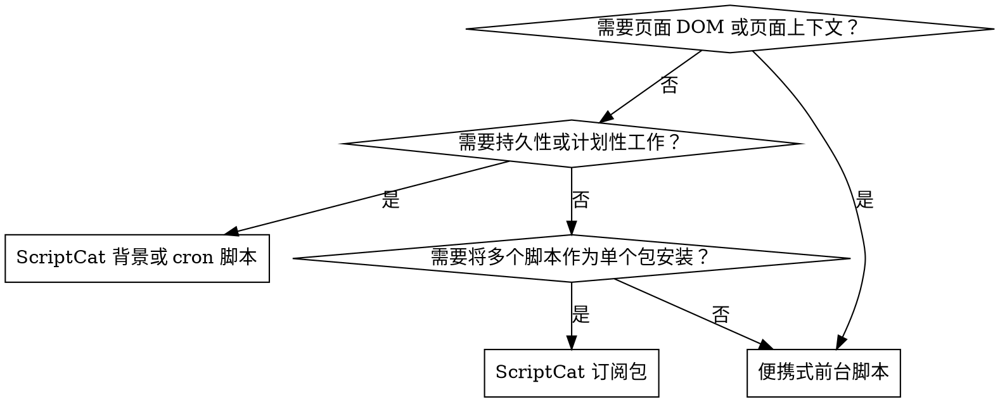

用户脚本的工作通常在运行时和元数据边界处中断，而不是在页面逻辑中。首先选择运行时， upfront 声明最小权限，然后在脚本实际运行的环境中进行调试。

## 何时使用

使用此技巧：

- 编写或修复 Tampermonkey 或 ScriptCat 用户脚本
- 调试注入时机、缺失权限、CSP 回退方案、更新检查或 `GM_*` 行为
- 在便携式前台脚本和 ScriptCat 仅 `@background` 或 `@crontab` 之间进行选择
- 使用 `==UserConfig==` 添加配置 UI
- 打包 ScriptCat `==UserSubscribe==` 套件或准备 CloudCat 兼容脚本

不要使用此技巧进行完整的浏览器扩展开发或用户脚本管理器外的通用浏览器自动化。

## 运行时选择

## 预检查

- 确认管理器和浏览器。在 Manifest V3 浏览器中，ScriptCat 可能需要在脚本运行前要求 `Allow User Scripts` 或浏览器开发者模式。
- 在编写代码前决定页面脚本还是背景脚本。ScriptCat 背景脚本不能操作 DOM。
- 从元数据开始，而不是实现：`@match`、`@grant`、`@connect`、`@run-at` 和任何更新 URL。
- 对于普通页面脚本，优先使用便携式 `==UserScript==` 模式。只有在实际需要时才切换到 ScriptCat 仅有的头部。

## 工作流程

1. 首先选择运行时和元数据。
2. 声明符合任务的最小权限范围。
3. 针对所选运行时进行实现。
4. 在代码实际运行的地方进行调试。
   - 前台脚本：页面控制台加上管理器日志。
   - ScriptCat 背景脚本：首先运行日志，然后 `background.html` 进行实际环境调试。
5. 使用正确的更新模型发布。
   - 普通脚本：保持 `@version` 准确，仅在需要时添加 `@updateURL` 或 `@downloadURL`。
   - 订阅包：使用 `==UserSubscribe==`、HTTPS URL 和订阅级别的 `@connect`。

## 快速参考

| 意图                               | 默认选择                               | 注意事项                                                                 |
| ------------------------------------ | -------------------------------------------- | ------------------------------------------------------------------------- |
| 页面 UI、DOM 抓取、页面修补       | 便携式 `==UserScript==`                    | `@match`、`@grant`、`@run-at`、CSP 敏感注入                              |
| 跨域 API 访问                      | 带显式 `@connect` 的 `GM_xmlhttpRequest` | 缺失主机、cookie 行为差异、用户授权                                      |
| 长运行工作线程                      | ScriptCat `@background`                      | 无 DOM，必须返回 `Promise` 进行异步工作                              |
| 计划任务                           | ScriptCat `@crontab`                         | 只有第一个 `@crontab` 有效，优先使用 5 字段 cron，避免时间间隔重叠 |
| 用户可编辑设置                     | `==UserConfig==` 加上 `GM_getValue`          | 块放置和 `group.key` 命名                                    |
| 静默包安装和更新                   | `==UserSubscribe==`                          | HTTPS、`user.sub.js`、订阅 `connect` 覆盖子脚本                      |

## 常见错误

- 缺少脚本实际使用的 API 的 `@grant`。
- 缺少 `GM_xmlhttpRequest` 或 `GM_cookie` 使用的 `@connect`。
- 将 `@include` 视为普通主机定位比 `@match` 更好的默认选项。
- 在 ScriptCat 背景或 cron 脚本中使用 DOM API。
- 在 ScriptCat 背景脚本中异步 GM 工作未真正完成前就返回。
- 混合 `==UserScript==` 和 `==UserSubscribe==` 打包概念。
- 将 `==UserConfig==` 放在错误位置或未使用 `group.key` 命名读取配置键。
- 假设 Tampermonkey 和 ScriptCat 的存储、通知或请求行为相同。

## 参考

- [`references/metadata-and-api-map.md`](./references/metadata-and-api-map.md)
- [`references/scriptcat-extensions.md`](./references/scriptcat-extensions.md)
