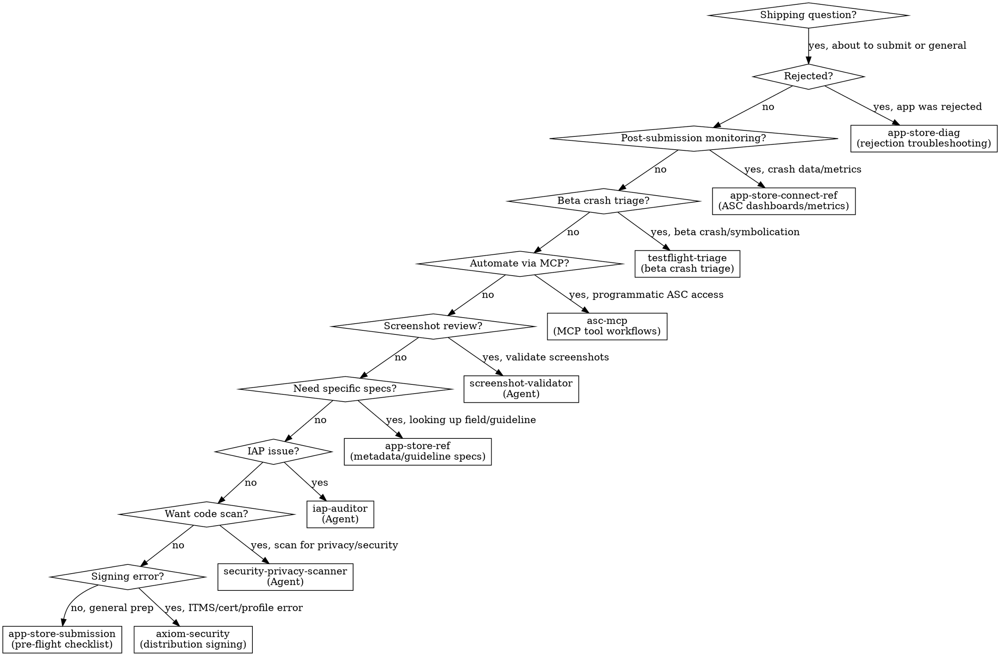

# 发货 & App Store

**在准备提交任何应用、处理 App Store 拒绝或处理发布工作流程时，您必须使用此技能。**

<!-- AXIOM_AUDITOR_INLINE_BEGIN — 由脚本 build-inlined-auditors.ts 自动维护；请勿手动编辑 -->
> **不在 Claude Code 中？** 当此路由器说“启动 `some-auditor` 代理”时，请在此套件中阅读该审计器的文件并按内联方式执行——相同的程序，只需文件搜索和读取。
>
> 位于其他套件中：`axiom-integration/skills/iap-auditor.md`，`axiom-security/skills/security-privacy-scanner.md`。
>
> 需要 Bash 的代理——构建、测试、模拟器、崩溃符号化——保留在 Claude Code 中；没有这些的内联等效项。
<!-- AXIOM_AUDITOR_INLINE_END -->

## 何时使用

当您遇到以下情况时使用此技能：
- 准备应用提交到 App Store
- App Store 拒绝（任何指南）
- 元数据要求（截图、描述、关键词）
- 隐私清单和营养标签问题
- 年级评级和内容分类
- 出口合规和加密声明
- EU DSA 商人状态
- 账户删除或使用 Apple 登录要求
- 构建上传和处理问题
- App Review 申诉
- WWDC25/WWDC26 App Store Connect 更改
- 首次提交工作流程

## 快速参考

| 症状 / 任务 | 参考 |
|----------------|-----------|
| 如何提交我的应用？ | 查看 `skills/app-store-submission.md` |
| 预飞行清单 | 查看 `skills/app-store-submission.md` |
| 首次提交 | 查看 `skills/app-store-submission.md` |
| 加密合规 | 查看 `skills/app-store-submission.md` |
| 无障碍营养标签 | 查看 `skills/app-store-submission.md` |
| 元数据字段要求 | 查看 `skills/app-store-ref.md` |
| 产品页面标题、资源库、搜索视觉效果 `OS27` | 查看 `skills/app-store-ref.md` (第 11 部分) |
| 保留消息（订阅取消流程） `OS27` | 查看 `skills/app-store-ref.md` (第 11 部分) |
| 分组 / 批量订阅销售（ABM、ASM、批量定价） `OS27` | 查看 `skills/app-store-ref.md` (第 11 部分) |
| 指南编号查找 | 查看 `skills/app-store-ref.md` |
| 隐私清单模式 | 查看 `skills/app-store-ref.md` |
| 年级评级等级 | 查看 `skills/app-store-ref.md` |
| EU DSA 合规 | 查看 `skills/app-store-ref.md` |
| WWDC25/WWDC26 ASC 更改 | 查看 `skills/app-store-ref.md` |
| 应用被拒绝 | 查看 `skills/app-store-diag.md` |
| 指南 2.1/4.2/4.3 拒绝 | 查看 `skills/app-store-diag.md` |
| 撰写申诉 | 查看 `skills/app-store-diag.md` |
| 重复拒绝 | 查看 `skills/app-store-diag.md` |
| App Review 指南参考 | 查看 `skills/app-review-guidelines.md` |
| 专家审查清单 | 查看 `skills/expert-review-checklist.md` |
| App Store Connect 中的崩溃数据 | 查看 `skills/app-store-connect-ref.md` |
| TestFlight 崩溃报告 | 查看 `skills/app-store-connect-ref.md` |
| ASC 指标仪表板 | 查看 `skills/app-store-connect-ref.md` |
| Beta 测试器崩溃报告、本地组织者崩溃语料库 (.xccrashpoint) | 查看 `skills/testflight-triage.md` |
| 生产语料库分诊（Sentry、ASC — 多个分组问题） | 查看 `skills/production-triage.md` + `triage-analyzer` 代理或 `/axiom:triage` |
| 崩溃日志符号化 (.ips / MetricKit / .crash) | 查看 axiom-tools (skills/xcsym-ref.md) 或 `/axiom:analyze-crash`；`skills/testflight-triage.md` 用于完整的 TF 工作流程 |
| 自动化 App Store Connect | 查看 `skills/asc-mcp.md` |
| 程序提交构建 | 查看 `skills/asc-mcp.md` |
| 通过 MCP 管理TestFlight | 查看 `skills/asc-mcp.md` |
| 上传时出现 ITMS 签名错误 | 查看 axiom-security (skills/code-signing-diag.md) |
| 证书/配置文件不匹配 | 查看 axiom-security (skills/code-signing-diag.md) |
| 代码签名设置 | 查看 axiom-security (skills/code-signing.md) |
| App Clips（大小等级、调用、AASA、启动体验） | 查看 `skills/app-clips.md` |
| App Clip 权限 / 大小 / 数据共享参考 | 查看 `skills/app-clips-ref.md` |
| Apple Pay / Wallet / Tap to Pay 支付 | 查看 `axiom-payments` 套件 |
| 使用 Claude 模型-ID 更改的发货更新（4.6 → 4.7，等） | 查看 **`claude-api`** 技能（外部）+ 此技能用于提交 |
| 在应用内切换云 AI 提供商（OpenAI → Claude，等） | 查看 **`claude-api`** 技能（外部）+ 此技能用于提交 |

## 路由逻辑

### 1. 提交前准备 → **app-store-submission**

**触发器**：
- “我该如何提交我的应用？”
- “提交前我需要什么？”
- 准备首次提交
- 需要预飞行清单
- 截图要求
- 元数据完整性检查
- 加密合规问题
- 无障碍营养标签
- 提交所需的隐私清单要求

**为什么 app-store-submission**：该技能具有 8 种反模式、决策树和压力场景。它可以防止导致 90% 拒绝的错误。

**参考**：`skills/app-store-submission.md`

---

### 2. 元数据、指南和 API 参考 → **app-store-ref**

**触发器**：
- “App Store Connect 中需要哪些字段？”
- “应用描述的最大长度是多少？”
- 查找特定指南编号
- 隐私清单模式详细信息
- 年级评级等级和问卷
- IAP 提交元数据
- EU DSA 合规详细信息
- 构建上传方法
- WWDC25 和 WWDC26 对 App Store Connect 的更改

**为什么 app-store-ref**：11 部分的参考涵盖了每个元数据字段、指南和合规要求，并具有精确的规范。

**参考**：`skills/app-store-ref.md`

---

### 3. 拒绝故障排除 → **app-store-diag**

**触发器**：
- “我的应用被拒绝了”
- “指南 2.1 拒绝”
- “二进制文件被拒绝了”
- 指南 4.2 或 4.3 拒绝（应用过于简单、Web 包装器、垃圾邮件、重复）
- 指南 1.x 拒绝（令人反感的內容、UGC 调节、儿童类别）
- 如何回应拒绝
- 撰写申诉
- 理解拒绝消息
- 第三次或重复拒绝
- 解决方案中心沟通

**为什么 app-store-diag**：9 种诊断模式将拒绝类型映射到根本原因和修复方案，包括主观拒绝（4.2/4.3、1.x）。包括申诉写作指南和重复拒绝的危机场景。

**参考**：`skills/app-store-diag.md`

---

### 4. 隐私 & 安全合规 → **security-privacy-scanner**（代理）

**触发器**：
- “在提交前扫描我的代码以查找隐私问题”
- 硬编码的 API 密钥或密钥
- 缺少隐私清单
- 需要的 Reason API 声明
- ATS 违规

**为什么 security-privacy-scanner**：自主代理，扫描导致拒绝的安全漏洞和隐私合规问题。

**调用**：启动 `security-privacy-scanner` 代理或 `/axiom:audit security`

---

### 5. IAP 审查问题 → **iap-auditor**（代理）

**触发器**：
- IAP 被拒绝或无法工作
- 缺少 transaction.finish()
- 缺少恢复购买
- 订阅跟踪问题

**为什么 iap-auditor**：扫描 IAP 代码以查找导致 StoreKit 拒绝的模式。

**调用**：启动 `iap-auditor` 代理

---

### 6. 截图验证 → **screenshot-validator**（代理）

**触发器**：
- “检查我的 App Store 截图”
- “我的截图尺寸是否正确？”
- “提交前验证截图”
- “审查我的营销截图”
- 截图内容或尺寸问题

**为什么 screenshot-validator**：多模态代理，对每个截图进行视觉检查，以查找占位符文本、错误尺寸、调试痕迹、损坏的 UI 和竞争对手参考。可以捕获人工审查遗漏的问题。

**调用**：启动 `screenshot-validator` 代理或 `/axiom:audit screenshots`

---

### 7. 程序化 ASC 访问 → **asc-mcp**

**触发器**：
- “自动化 App Store Connect”
- “程序提交构建”
- “从 Claude 管理TestFlight”
- “通过 API 回应评论”
- “设置 asc-mcp”
- “通过 MCP 分发到 TestFlight 组”
- “无需打开 ASC 创建新版本”

**为什么 asc-mcp**：工作流程技能，教 Claude 使用 asc-mcp MCP 工具进行发布管道、TestFlight 分发、评论管理和反馈分诊——所有这些都不离开 Claude Code。

**参考**：`skills/asc-mcp.md`

---

### 8. 提交后监控 → **app-store-connect-ref**

**触发器**：
- “我如何在 App Store Connect 中查看崩溃数据？”
- “我的 TestFlight 崩溃报告在哪里？”
- “我如何阅读 ASC 指标仪表板？”
- 发布后的崩溃调查
- 从 ASC 下载崩溃日志

**为什么 app-store-connect-ref**：ASC 导航，用于崩溃仪表板、TestFlight 反馈、性能指标和数据导出工作流程。

**参考**：`skills/app-store-connect-ref.md`

---

### 9. Beta 崩溃分诊 → **testflight-triage**

**触发器**：
- Beta 测试器报告崩溃
- 崩溃出现在组织者或 App Store Connect 中
- 崩溃日志需要符号化
- 发布后的崩溃调查（单个文件或组织者）

**为什么 testflight-triage**：从符号化到根本原因分析的系统化崩溃分诊。使用 `xcsym` 作为第一步（解析 → 发现 dSYMs → 符号化 → 使用 `pattern_tag` 分类 → 发出结构化 JSON）。

**参考**：`skills/testflight-triage.md`。对于 xcsym 子命令/退出代码参考，请查看 axiom-tools (skills/xcsym-ref.md)。对于一键代理工作流程，`/axiom:analyze-crash`。

---

### 10a. 生产语料库分诊 → **production-triage** / **triage-analyzer**

**触发器**：
- “分诊我的 Sentry 崩溃”
- “生产中的主要崩溃系列是什么？”
- “向我展示从 App Store Connect 中需要首先修复的问题”
- 来自聚合器（Sentry、ASC）的多个分组问题——几十个问题，而不是单个文件
- “这些崩溃中有哪些是真实错误而不是噪音？”
- 语料库级挂起分诊（“我的 ANR 报告是真实的阻塞吗？”）

**为什么 production-triage**：语料库级分诊需要从聚合器获取，对每个问题进行分类，将挂起假阳性标记为噪音，并将它们聚类为根本原因系列。`testflight-triage` 覆盖组织者路径——单个文件和本地磁盘 `.xccrashpoint` 语料库；`production-triage` 覆盖聚合器路径（Sentry / ASC 分组问题）。

**参考**：`skills/production-triage.md`（获取 + NormalizedReport 模式 + flag-never-hide 规则）。**代理**：`triage-analyzer` 或 `/axiom:triage sentry` / `/axiom:triage asc`。

---

### 10. 分发签名问题 → **code-signing** / **code-signing-diag**

**触发器**：
- ITMS-90035 上传时无效签名
- ITMS-90161 无效的配置文件
- “归档时找不到签名证书”
- 提交前证书过期
- 归档成功但导出/上传失败
- 配置文件与捆绑 ID 不匹配
- 上传时权限不匹配

**为什么 code-signing**：分发签名错误是上传失败的首要原因。使用 CLI 工具诊断需要 5 分钟。code-signing-diag 有 6 个决策树将 ITMS 错误映射到根本原因。

**参考**：查看 axiom-security (skills/code-signing-diag.md)（故障排除）或 查看 axiom-security (skills/code-signing.md)（设置）

---

### 11. App Clips → **app-clips**

**触发器**：
- 添加 App Clip 目标，或选择调用方法
- “App Clip 大小限制是什么？” / 构建超出最大大小
- 关联域 / AASA for App Clip 链接
- App Store Connect 默认和高级启动体验
- 将 App Clip 数据传递给升级后的完整应用
- “我的 App Clip 链接什么也没做”

**为什么 app-clips**：App Clips 嵌入在完整应用中，并受到严格的大小（10/15/100 MB）、权限和功能限制。该技能涵盖了大小等级、权限、AASA 和数据传递；参考中有表格。

**参考**：`skills/app-clips.md`，`skills/app-clips-ref.md`

---

## 决策树

简化：

1. 应用被拒绝？→ `skills/app-store-diag.md`
2. 提交后崩溃数据/指标？→ `skills/app-store-connect-ref.md`
3. Beta 崩溃分诊/符号化（组织者或单个文件）？→ `skills/testflight-triage.md`
4. 生产语料库分诊（Sentry/ASC，多个分组问题）？→ `skills/production-triage.md` + `triage-analyzer` 代理
5. 通过 MCP 工具自动化 ASC？→ `skills/asc-mcp.md`
6. 验证截图？→ `screenshot-validator`（代理）
7. 需要特定元数据/指南规范？→ `skills/app-store-ref.md`
8. IAP 提交问题？→ `iap-auditor`（代理）
9. 想要预提交代码扫描？→ `security-privacy-scanner`（代理）
10. 上传时出现 ITMS 签名/证书/配置文件错误？→ 查看 axiom-security (skills/code-signing-diag.md)
11. 一般提交准备？→ `skills/app-store-submission.md`
12. App Clip（大小等级、调用、AASA、数据传递）？→ `skills/app-clips.md`，`skills/app-clips-ref.md`

#### 平台特定提交
- watchOS 26 SDK 要求、64 位、独立应用提交 → 查看 axiom-watchos (skills/platform-basics.md)

## 反理性化

| 思维 | 现实 |
|------|------|
| "我就提交看看会发生什么" | 40% 的拒绝是由于指南 2.1（完整性）。app-store-submission 在 10 分钟内就能捕捉到它们。 |
| "我以前提交过应用，我知道流程" | 要求每年都会变化。隐私声明、年龄分级等级、欧盟 DSA、无障碍营养标签自 2024 年起都是新的。 |
| "拒绝是错误的，我只要重新提交" | 没有修改就重新提交会浪费每个周期 24-48 小时。app-store-diag 找到根本原因。 |
| "隐私声明只有大应用才需要" | 自 2024 年 5 月起，使用 Required Reason API 的每个应用都需要隐私声明。缺失 = 自动拒绝。 |
| "我稍后会添加元数据" | 缺失元数据会完全阻止提交。app-store-ref 包含完整的字段列表。 |
| "只是一个 Bug 修复，我不需要完整的检查清单" | Bug 修复更新仍然需要 What's New 文本、正确的截图和有效的构建版本。app-store-submission 覆盖这些。 |
| "我自己会肉眼检查截图" | 人工检查会遗漏尺寸不匹配（即使 1px 偏移 = 拒绝）、微妙的占位符文本和调试指示器。单个遗漏的问题会导致重新提交花费 24-48 小时。screenshot-validator 在 2 分钟内就能捕捉到它。 |
| "我就在 ASC 网络仪表板中处理" | 如果 asc-mcp 已配置，MCP 工具对批量操作更快——分发构建版本、回复评论、创建版本。asc-mcp 有工作流程。 |
| "上传失败并显示 ITMS 错误，让我重新归档" | ITMS 签名错误是配置问题——错误的证书、过期的配置文件、缺失的权限。使用相同配置重新归档会产生相同结果。code-signing-diag 有修复方案。 |
| "只是一个模型 ID 交换（Claude 4.6 → 4.7）" | 4.6 → 4.7 移除了 `temperature`、`top_p`、`top_k` 和 Messages API 的预填充。构建成功；提交后运行时返回 HTTP 400。在上传前阅读 `claude-api`（外部）并测试实时端点。 |
| "我的 App Clip 可以是 100 MB，所以我也会添加 App Clip 代码" | 100 MB 层级（iOS 17+）仅限数字调用；添加任何 NFC/QR/App Clip 代码会将限制降至 15 MB。参见 `skills/app-clips.md`。 |

## 外部资源

**Cloud Claude 迁移（`claude-api` 技能，Axiom 外部发布）—— 在提交任何 Claude 模型 ID 变更前强制执行。** Opus 4.7 从 Messages API 移除了 `temperature`、`top_p`、`top_k` 和预填充；在 4.6 上构建成功的代码在运行时返回 HTTP 400。提交包含此回归的 App Store 更新属于加急审核情况。`claude-api` 技能自动化迁移（模型 ID 交换、采样参数移除、预填充替换）并从一开始就强制执行提示缓存。将其视为你的预飞行检查清单的一部分，而不是一个侧边参考。

## 不应使用的情况（冲突解决）

**不要使用 axiom-shipping 处理以下情况——使用正确的技能：**

| 问题 | 正确技能 | 为什么不用 axiom-shipping |
|------|---------|------------------------|
| 构建在归档前失败 | **axiom-build** | 环境构建问题，不是提交 |
| SwiftData 迁移崩溃 | **axiom-data** | 模式问题，不是 App Store |
| 隐私声明编码（编写文件） | **axiom-build** | security-privacy-scanner 处理代码扫描 |
| StoreKit 2 实现（编写 IAP 代码） | **axiom-integration** | 应用内购买 / storekit-ref 覆盖实现 |
| 测试期间发现的性能问题 | **axiom-performance** | 性能分析问题，不是提交 |
| 无障碍实现 | **axiom-accessibility** | 代码级无障碍，不是 App Store 标签 |

**axiom-shipping 用于提交工作流程，而不是代码实现：**
- 准备元数据和合规性 → axiom-shipping
- 编写实际代码 → 特定领域技能（axiom-build、axiom-data 等）
- 应用被拒绝 → axiom-shipping
- 代码更改以修复拒绝 → 特定领域技能，然后回到 axiom-shipping 以验证

## 示例调用

用户："我如何将应用提交到 App Store？"
→ 查看 `skills/app-store-submission.md`

用户："我的应用因指南 2.1 被拒绝"
→ 查看 `skills/app-store-diag.md`

用户："我需要哪些截图？"
→ 查看 `skills/app-store-ref.md`

用户："App Store Connect 中需要哪些字段？"
→ 查看 `skills/app-store-ref.md`

用户："我如何填写年龄分级问卷？"
→ 查看 `skills/app-store-ref.md`

用户："我需要加密合规声明吗？"
→ 查看 `skills/app-store-submission.md`

用户："我的应用不断被拒绝，我该怎么办？"
→ 查看 `skills/app-store-diag.md`

用户："我如何申诉 App Store 拒绝？"
→ 查看 `skills/app-store-diag.md`

用户："我的应用因指南 4.2 最小功能被拒绝"
→ 查看 `skills/app-store-diag.md`

用户："因 Web 包装/重复应用被拒绝"
→ 查看 `skills/app-store-diag.md`

用户："因无审核的用户生成内容被拒绝"
→ 查看 `skills/app-store-diag.md`

用户："儿童类别合规性拒绝"
→ 查看 `skills/app-store-diag.md`

用户："扫描我的代码以查找 App Store 合规性问题"
→ 启动 `security-privacy-scanner` 代理

用户："在提交前检查我的 IAP 实现"
→ 启动 `iap-auditor` 代理

用户："检查我的 App Store 截图在 ~/Screenshots"
→ 启动 `screenshot-validator` 代理

用户："我的截图尺寸是否正确？"
→ 启动 `screenshot-validator` 代理

用户："我的 Sentry 崩溃进行分诊"
→ 启动 `triage-analyzer` 代理（或 `/axiom:triage sentry`）

用户："当前生产中的顶级崩溃类型是什么？"
→ 启动 `triage-analyzer` 代理（或 `/axiom:triage sentry`）

用户："显示我应首先修复的 ASC 问题"
→ 启动 `triage-analyzer` 代理（或 `/axiom:triage asc`）

用户："我如何在 App Store Connect 中查找崩溃数据？"
→ 查看 `skills/app-store-connect-ref.md`

用户："我的 TestFlight 崩溃报告在哪里 ASC？"
→ 查看 `skills/app-store-connect-ref.md`

用户："今年 App Store Connect 有什么新内容？"
→ 查看 `skills/app-store-ref.md`

用户："我需要为欧盟设置 DSA 交易者状态"
→ 查看 `skills/app-store-ref.md`

用户："无障碍营养标签是什么？"
→ 查看 `skills/app-store-submission.md`

用户："这是我第一次提交应用"
→ 查看 `skills/app-store-submission.md`

用户："程序化地将此构建提交到 App Store"
→ 查看 `skills/asc-mcp.md`

用户："为 App Store Connect 设置 asc-mcp"
→ 查看 `skills/asc-mcp.md`

用户："通过 MCP 将构建 42 分发给我的测试人员"
→ 查看 `skills/asc-mcp.md`

用户："从 Claude 回复 App Store 负面评论"
→ 查看 `skills/asc-mcp.md`

用户："上传时显示 ITMS-90035 无效签名"
→ 查看 axiom-security（技能/code-signing-diag.md）

用户："我的配置文件过期了，我无法上传"
→ 查看 axiom-security（技能/code-signing-diag.md）

用户："我如何添加 App Clip？" / "App Clip 大小限制是多少？" / "我的 App Clip 链接什么也不做"
→ 查看 `skills/app-clips.md`
