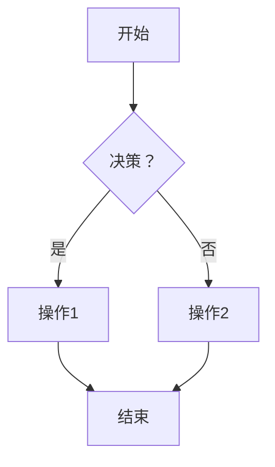
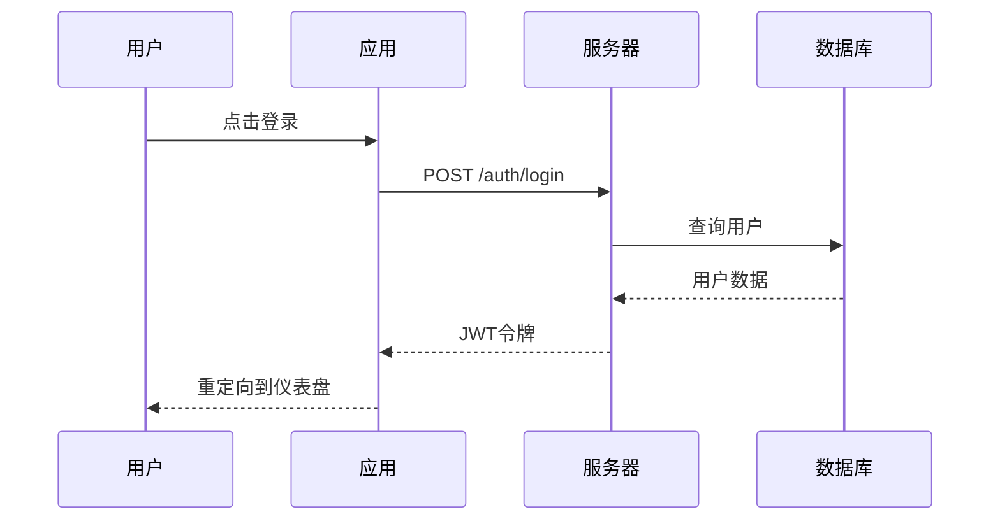
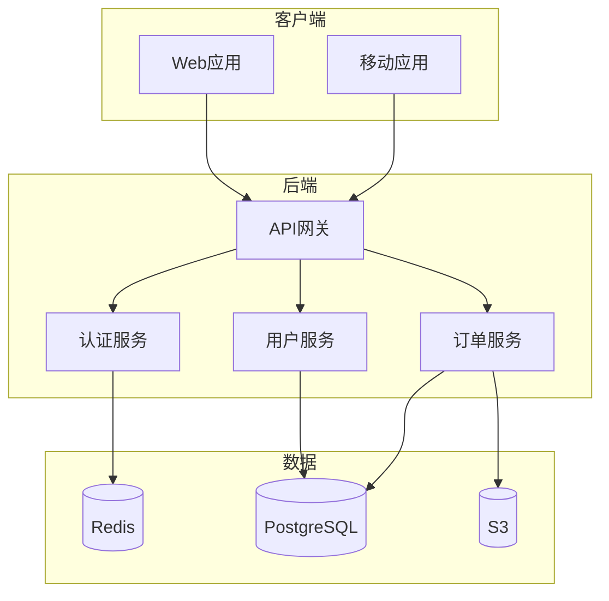
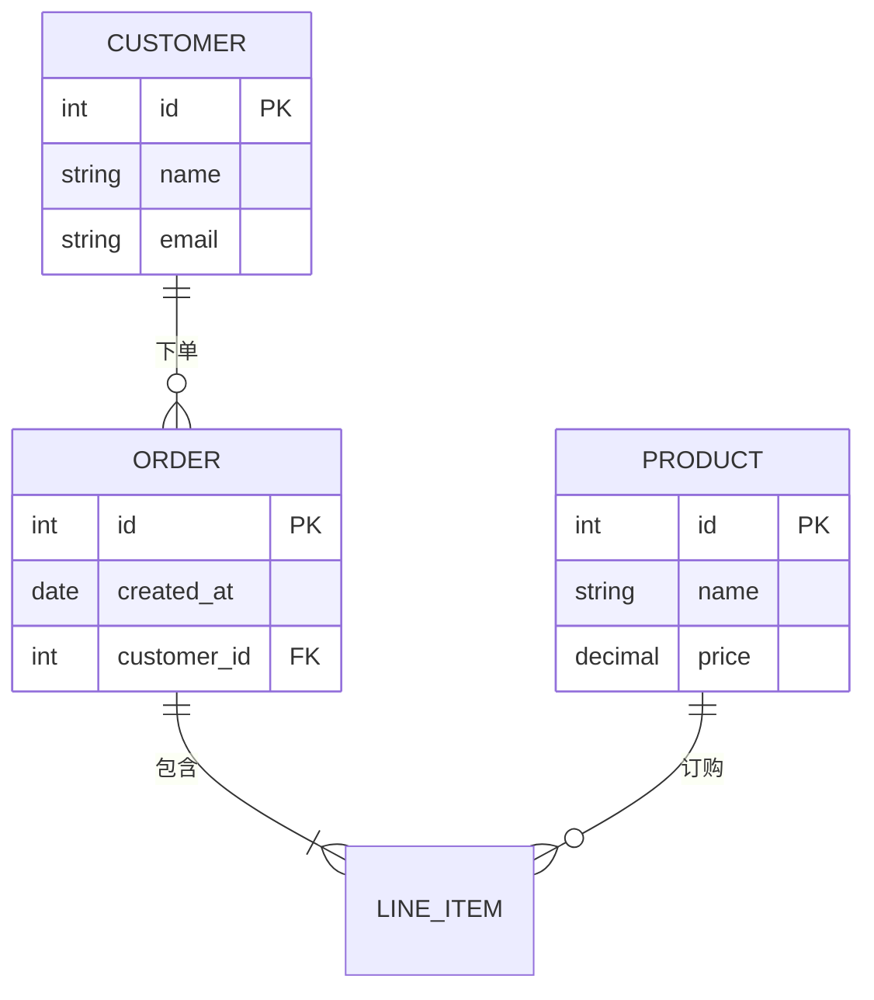
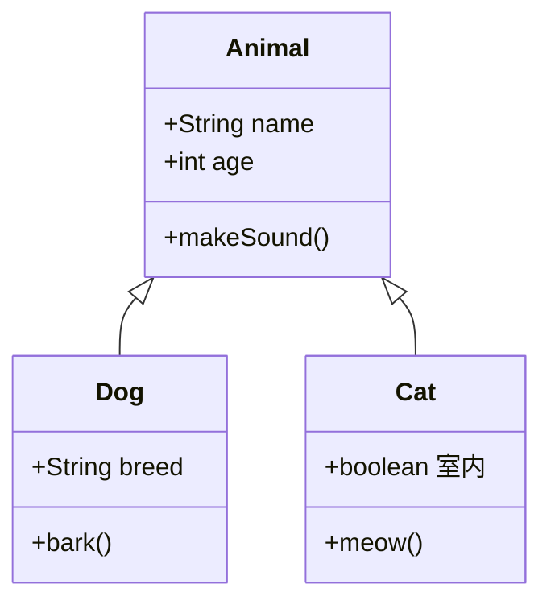
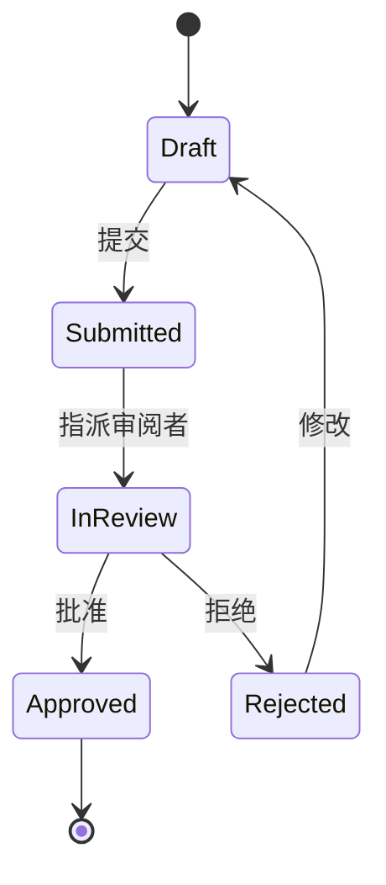
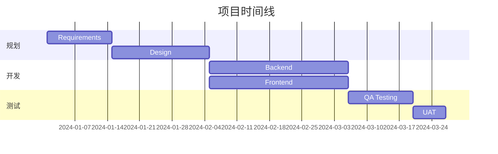
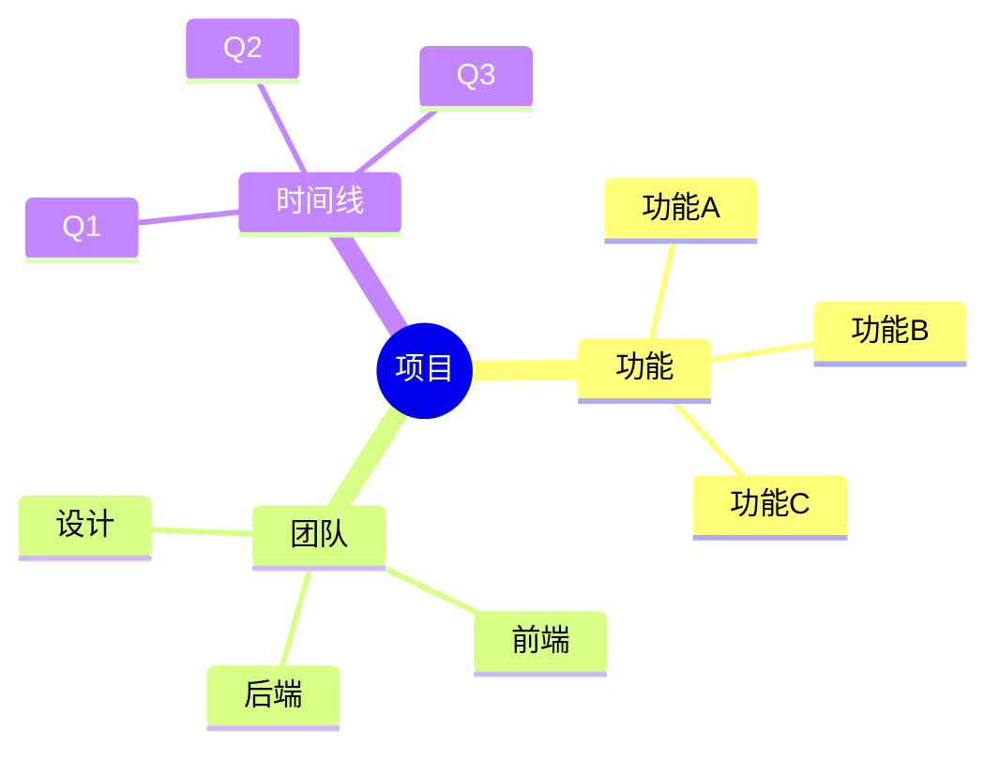
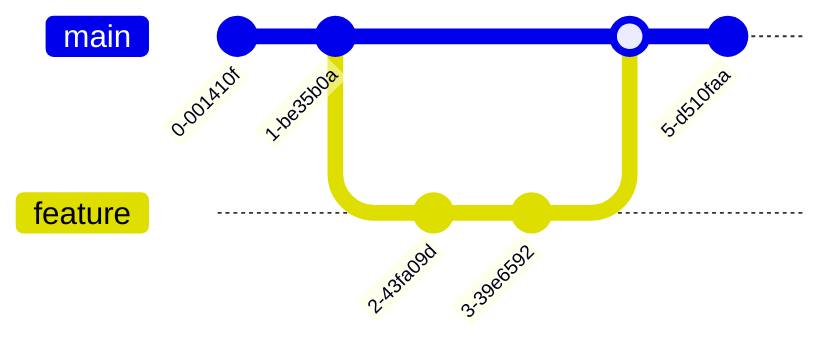
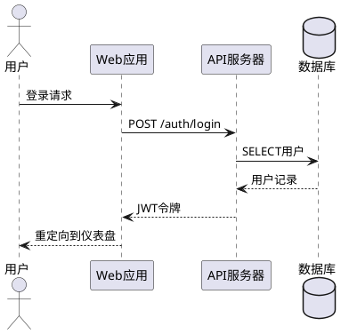

# 图表创建技能

## 概述

我帮助你使用基于文本的图表工具（如Mermaid和PlantUML）创建专业图表。这些图表可以在文档、演示文稿和开发工具中渲染。

**我能做什么：**
- 创建流程图和流程图
- 生成时序图
- 构建架构和系统图
- 设计ER（实体关系）图
- 创建类图和UML
- 生成组织结构图
- 构建甘特图和时间线

**我不能做什么：**
- 直接渲染图像（使用Mermaid在线编辑器或类似工具）
- 创建像素级精确的定制设计
- 生成光栅图像

---

## 如何使用我

### 第一步：描述你的图表

告诉我：
- 要可视化的流程/系统/概念
- 需要的图表类型
- 详细程度
- 目标受众

### 第二步：选择格式

- **Mermaid**：最适合网页、Markdown、GitHub
- **PlantUML**：最适合UML、复杂图表
- **ASCII**：简单、通用兼容性
- **D2**：现代、时尚图表

### 第三步：指定样式

- 颜色和主题
- 方向（自上而下、自左而右）
- 详细程度

---

## 图表类型

### 1. 流程图 / 流程图

**用于**：业务流程、决策树、工作流



### 2. 时序图

**用于**：API调用、用户交互、系统通信



### 3. 架构图

**用于**：系统设计、基础设施、组件关系



### 4. 实体关系图

**用于**：数据库设计、数据模型



### 5. 类图

**用于**：面向对象设计、代码结构



### 6. 状态图

**用于**：状态机、状态工作流



### 7. 甘特图

**用于**：项目时间线、日程安排



### 8. 思维导图

**用于**：头脑风暴、概念组织



### 9. Git图

**用于**：分支可视化、Git工作流



---

## 输出格式

```markdown
# 图表：[名称]

**类型**：[流程图 / 时序图 / 架构图 / 等.]
**工具**：[Mermaid / PlantUML]
**目的**：[说明内容]

---

## 图表代码

### Mermaid

```mermaid
[Mermaid代码]
```

### PlantUML（替代方案）

```plantuml
[PlantUML代码]
```

---

## 渲染说明

1. **Mermaid在线编辑器**：https://mermaid.live/
2. **GitHub**：直接粘贴到Markdown文件中
3. **VS Code**：安装Mermaid扩展
4. **Notion**：使用mermaid类型的代码块

---

## 定制选项

### 颜色主题
添加到开头：
```
%%{init: {'theme':'forest'}}%%
```

可用主题：default、forest、dark、neutral

### 方向
- TB（自上而下）
- BT（自下而上）
- LR（自左而右）
- RL（自右而左）

---

## 注意事项

- [关于图表的任何备注]
- [做出的假设]
```

---

## PlantUML示例

### 时序图


### 组件图
```plantuml
@startuml
package "前端" {
    [React应用]
    [移动应用]
}

package "后端" {
    [API网关]
    [认证服务]
    [用户服务]
}

数据库 "PostgreSQL" as DB

[React应用] --> [API网关]
[移动应用] --> [API网关]
[API网关] --> [认证服务]
[API网关] --> [用户服务]
[用户服务] --> DB
@enduml
```

---

## 创建更好图表的技巧

1. **保持简洁** - 不要过度拥挤
2. **使用一致的命名** - 清晰、描述性标签
3. **分组相关项** - 使用子图/包
4. **选择合适的类型** - 使图表与概念匹配
5. **考虑受众** - 技术型 vs. 商业型
6. **谨慎使用颜色** - 仅用于强调
7. **添加图例** - 当使用符号/颜色时
8. **保持层次结构** - 自上而下或自左而右的流程

---

## 渲染工具

| 工具 | URL | 最适合 |
|------|-----|----------|
| Mermaid在线 | mermaid.live | 快速编辑 |
| PlantUML服务器 | plantuml.com | PlantUML渲染 |
| Draw.io | draw.io | 手动编辑 |
| Excalidraw | excalidraw.com | 手绘风格 |
| Lucidchart | lucidchart.com | 专业图表 |

---

## 限制

- 无法直接渲染图像
- 复杂布局可能需要手动调整
- 与设计工具相比，样式有限
- 部分图表类型在所有工具中都不支持

---

*由Claude办公技能社区构建。欢迎贡献！*
