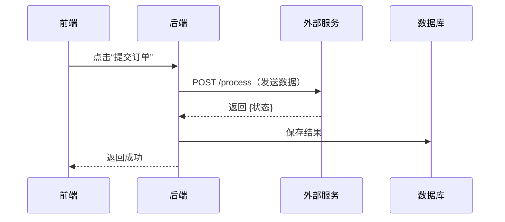
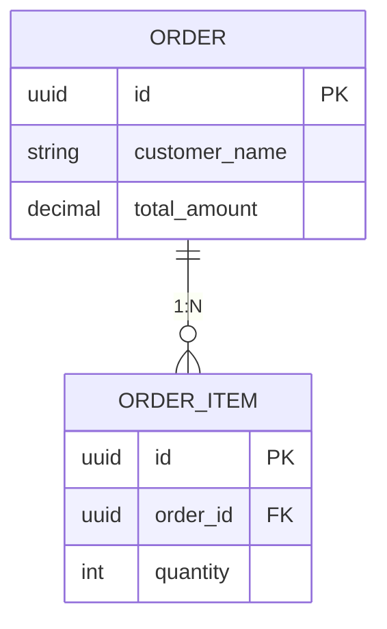

# 会议纪要生成器

通过迭代审查，将原始会议记录转化为全面、有据可查的会议纪要。

## 快速入门

**预处理（可选但推荐）：**
- **文档转换**：使用 `doc-to-markdown` 技能先将 .docx/.pdf 转换为 Markdown（保留表格/图片）
- **记录清理**：如果记录质量差，使用 `transcript-fixer` 技能修复 ASR/STT 错误
- **上下文文件**：准备 `context.md` 文件，包含团队目录，以便准确识别发言人

**核心工作流程：**
1. 读取用户提供的记录
2. 如果用户提供了项目特定上下文文件（可选），则加载（可选）
3. **智能文件命名**：根据内容自动生成文件名（见下文）
4. **发言人识别**：如果记录中有 "Speaker 1/2/3"，首先要求用户在源平台标记发言人并重新导出（见步骤 1.5 阶段 0）；作为后备方案，仅从文本中推断
5. **多轮生成**：使用多个传递或具有隔离上下文的子代理，使用 UNION 合并
6. 使用 [参考资料/完整性审查清单.md](references/completeness_review_checklist.md) 进行自我审查
7. 向用户展示草稿，进行人工逐行审查
8. **跨 AI 对比**（可选）：人类可能提供其他 AI 工具（例如，Gemini、ChatGPT）的输出 - 合并以减少偏差
9. 根据反馈进行迭代，直到人工批准最终版本

### 智能文件命名

根据记录内容自动生成输出文件名：

**模式**：`YYYY-MM-DD-<主题>-<类型>.md`

| 组件 | 来源 | 示例 |
|------|------|------|
| 日期 | 记录元数据或首次提及的日期 | `2026-01-25` |
| 主题 | 主要讨论主题（2-4 个单词，小写破折号连接） | `api-design`, `product-roadmap` |
| 类型 | 会议类别 | `review`, `sync`, `planning`, `retro`, `kickoff` |

**示例：**
- `2026-01-25-order-api-design-review.md`
- `2026-01-20-q1-sprint-planning.md`
- `2026-01-18-onboarding-flow-sync.md`

**在写入之前，要求用户确认建议的文件名。**

## 核心工作流程

复制此清单并跟踪进度：

```
会议纪要进度：
- [ ] 步骤 0（可选）：使用 transcript-fixer 预处理记录
- [ ] 步骤 1：读取和分析记录
- [ ] 步骤 1.5：发言人识别（如果记录中有 "Speaker 1/2/3"）
  - [ ] 阶段 0 首先要求用户在源平台标记发言人（飞书纪要 / 腾讯会议），重新导出，使用标记后的记录
  - [ ] 仅作为后备方案（源标记不可用或用户拒绝）：
    - [ ] 分析发言人特征（字数、风格、主题焦点）
    - [ ] 与 `context.md` 团队目录进行匹配（如果提供）
    - [ ] 向用户展示按发言人划分的映射，并附上证据供确认
- [ ] 步骤 1.6：生成智能文件名，并要求用户确认
- [ ] 步骤 1.7：质量评估（可选，影响处理深度）
- [ ] 步骤 2：多轮生成（并行子代理使用任务工具）
  - [ ] 创建记录特定目录：`<output_dir>/intermediate/<transcript-name>/`
  - [ ] 并行启动 3 个任务子代理（单条消息，3 个任务工具调用）
    - [ ] 子代理 1 → `<output_dir>/intermediate/<transcript-name>/version1.md`
    - [ ] 子代理 2 → `<output_dir>/intermediate/<transcript-name>/version2.md`
    - [ ] 子代理 3 → `<output_dir>/intermediate/<transcript-name>/version3.md`
  - [ ] 合并：UNION 所有版本，激进地包含所有图表 → `draft_minutes.md`
  - [ ] 最终：将草稿与记录进行比较，补充遗漏内容
- [ ] 步骤 3：自我审查以检查完整性
- [ ] 步骤 3.5：检索自我测试（消费端验证）
  - [ ] 新上下文子代理仅从记录中提取未来查询声明列表（永远不会看到草稿）→ `intermediate/<transcript-name>/retrieval-claims.md`
  - [ ] 将每个声明与可检索层（关键决策/行动项/待办事项/开放问题）进行匹配，按组件，使用词汇锚点
  - [ ] 在任何提升之前进行撤销扫描；使用 `[自我测试提升]` 标签 + 可搜索的逐字引用进行提升；不确定的 → 开放问题
  - [ ] 报告 "枚举 N / 匹配 M / 提升的 K / 不确定列表"（永远不会是二进制通过）；如果提取失败，则失败打开并带有可见的 NOT-RUN 注释
- [ ] 步骤 4：向用户展示草稿供人工审查
- [ ] 步骤 5：跨 AI 对比（如果人类提供外部 AI 输出）
- [ ] 步骤 6：根据人类反馈进行迭代（预期多轮）
- [ ] 步骤 7：人类批准最终版本

注意：<output_dir> = 最终会议纪要保存的目录（例如，`project-docs/meeting-minutes/`）
注意：<transcript-name> = 从记录文件派生的名称（例如，`2026-01-15-product-api-design`）
```

### 步骤 1：读取和分析记录

分析记录以识别：
- 会议主题和与会者
- 带有支持性引用的关键决策
- 带有负责人的行动项
- 推迟事项/开放问题

### 步骤 1.5：发言人识别（当需要时）

**触发条件**：记录仅包含通用标签，如 "Speaker 1"、"Speaker 2"、"发言人1" 等。

#### 阶段 0：源端标记（始终首先尝试）

当记录来自支持手动发言人标记的平台（飞书纪要、腾讯会议或任何具有语音分割编辑页面的工具）时，**停止并要求用户在源平台标记发言人，然后重新导出/重新导入标记后的记录**，再生成纪要。将源页面链接发送给用户——它通常在记录的前置元数据中（`minute_url`、会议 URL）。

为什么优于推断：
- 平台标记是人工听取实际声音——权威来源。基于文本的推断只能解决在会议中被提及的发言人；其他人仍然是猜测。
- 分割合并的片段（多人合并为一个标签）仅从文本中无法恢复——无论推断多么努力都无法修复，但源端重新标记可以。
- 推断输出强制使用 `[推断]` 标记，并需要每名发言人的人工审查轮次；源标记一旦产生，就会产生干净的真相。

仅在以下情况下才回退到阶段 A–C 下方：（a）用户明确表示要继续推断，或（b）源端无法标记（原始音频文件，没有平台页面，没有编辑权限）。在后备方案中，每个映射都必须附带证据和置信度，未解决的标签保持原样（永远不要强制分配），并且当用户稍后标记源端时，返回并更正纪要。

**后备方法**（受 Anker 技能启发）：

#### 阶段 A：特征分析（模式识别）

对每个发言人进行分析：

| 特征 | 查找内容 |
|------|----------|
| **字数** | 总共说过的字数（高 = 高级/领导，低 = 观察者） |
| **片段数** | 他们说话的次数（频繁 = 积极参与者） |
| **平均片段长度** | 每次发言的平均字数（长 = 演讲者，短 = 响应者） |
| **填充词比率** | 填充词的百分比（对/嗯/啊/就是/然后）- 低 = 准备充分的发言人 |
| **说话风格** | 正式/非正式，技术深度，决策权 |
| **主题焦点** | 他们讨论最多的领域（后端，前端，产品等） |
| **交互模式** | 是否有人向他们提问？他们是否分配任务？ |

**示例分析输出：**
```
发言人分析：
┌──────────┬────────┬──────────┬─────────────┬─────────────┬────────────────────────┐
│ 发言人   │ 字数   │ 片段数   │ 平均长度    │ 填充词 %    │ 角色猜测             │
├──────────┼────────┼──────────┼─────────────┼─────────────┼────────────────────────┤
│ 发言人1  │ 41,736 │ 93       │ 449 字符    │ 3.6%        │ 主讲人 (99% 的内容)   │
│ 发言人2  │ 101    │ 8        │ 13 字符    │ 4.0%        │ 对话者（简短回复）   │
└──────────┴────────┴──────────┴─────────────┴─────────────┴────────────────────────┘

推断规则：
- 占比 > 70% + 平均长度 > 100字 → 主讲人
- 平均长度 < 50字 → 对话者/响应者
- 语气词占比 < 5% → 正式/准备充分
- 语气词占比 > 10% → 非正式/即兴发言
```

#### 阶段 B：上下文映射（如果提供了上下文文件）

当用户提供项目上下文文件（例如，`context.md`）时：

1. 加载团队目录部分
2. 将特征模式与已知团队成员进行匹配
3. 将角色与说话模式进行交叉引用

**上下文文件应包含：**
```markdown
## 团队目录
| 名称   | 角色   | 沟通风格 |
|--------|--------|----------|
| Alice  | 后端负责人 | 技术，果断，分配后端任务 |
| Bob    | 产品经理 | 产品导向，询问需求问题 |
| Carol  | TPM    | 流程导向，跟踪时间线/资源 |
```

#### 阶段 C：继续进行前的确认

**关键**：永远不要默默假设发言人身份。

向用户展示分析摘要：
```
发言人分析：
- 发言人 1 → Alice（后端负责人）- 80% 置信度基于：技术焦点，任务分配模式
- 发言人 2 → Bob（产品经理）- 75% 置信度基于：产品问题，需求讨论
- 发言人 3 → Carol（TPM）- 70% 置信度基于：时间线问题，资源跟踪

请在继续之前确认或更正这些映射。
```

在用户确认后，在整个文档中一致地应用映射。

### 步骤 1.7：记录质量评估（可选）

评估记录质量以确定处理深度：

**评分标准（1-10 分）：**

| 因素   | 分数影响 |
|--------|----------|
| **内容量** | >10k 字符：+2，5-10k：+1，<2k：限制在 3 |
| **填充词比率** | <5%：+2，5-10%：+1，>10%：-1 |
| **发言人清晰度** | 主要发言人 >80%：+1（清晰的演讲者） |
| **技术深度** | 高技术内容：+1 |

**质量等级：**

| 分数   | 等级   | 处理方法 |
|--------|--------|----------|
| ≥8     | **高** | 完整结构化纪要，包含所有部分，图表，引用 |
| 5-7    | **中** | 标准纪要，重点在于关键决策和行动项 |
| <5     | **低** | 仅摘要——简要要点，跳过详细转录 |

**示例评估：**
```
📊 记录质量评估：
- 内容：41,837 字符 (+2)
- 填充词比率：3.6% (+2)
- 主要发言人：99% (+1)
- 技术深度：高 (+1)
→ 质量分数：10/10（高）
→ 推荐：完整结构化纪要，包含图表
```

**用户决策点**：如果质量低（<5），要求用户：
> "记录质量低（碎片对话/噪音较多）。生成完整纪要还是仅摘要？"

### 步骤 2：多轮初始生成（关键）

**单次传递绝对会丢失内容。** 使用多轮生成，并使用**冗余完整传递**：

#### 核心原则：多次完整传递 + UNION 合并

每次传递生成**完整的纪要（所有部分）**。多次传递具有隔离的上下文可以捕获不同的细节。UNION 合并整合所有发现。

**❌ 错误：窄焦点传递**（浪费代币，导致偏差）
```
传递 1：仅提取决策
传递 2：仅提取行动项
传递 3：仅提取讨论
```

**✅ 正确：完整传递，具有隔离上下文**
```
传递 1：生成完整纪要（所有部分）→ version1.md
传递 2：具有新鲜上下文生成完整纪要（所有部分）→ version2.md
传递 3：具有新鲜上下文生成完整纪要（所有部分）→ version3.md
合并：UNION 所有版本，激进地包含所有图表 → draft_minutes.md
```

#### 策略 A：顺序多传递（每次传递生成完整纪要）

```
传递 1：读取记录 → 生成完整纪要 → 写入到：`<output_dir>/intermediate/version1.md`
传递 2：新鲜上下文 → 读取记录 → 生成完整纪要 → 写入到：`<output_dir>/intermediate/version2.md`
传递 3：新鲜上下文 → 读取记录 → 生成完整纪要 → 写入到：`<output_dir>/intermediate/version3.md`
合并：读取所有版本 → UNION 合并（合并重复项）→ 写入到：`draft_minutes.md`
最终：将草稿与记录进行比较 → 添加任何剩余遗漏 → `final_minutes.md`
```

#### 策略 B：并行多代理（每个代理生成完整纪要）- 推荐使用

**必须使用任务工具**来并行启动多个子代理，具有**隔离的上下文**，每个代理生成**完整的纪要**：

**使用任务工具实现：**
```
// 并行启动所有 3 个子代理（单条消息，多个任务工具调用）
Task(subagent_type="general-purpose", prompt="从记录生成完整会议纪要...", run_in_background=false) → version1.md
Task(subagent_type="general-purpose", prompt="从记录生成完整会议纪要...", run_in_background=false) → version2.md
Task(subagent_type="general-purpose", prompt="从记录生成完整会议纪要...", run_in_background=false) → version3.md

// 所有完成后：
主代理：读取所有版本 → UNION 合并，合并重复项 → `draft_minutes.md`
```

**关键：子代理提示必须包含：**
1. 完整的记录文件路径
2. 完整的输出文件路径（version1.md、version2.md、version3.md 在记录特定子目录中）
3. 要加载的上下文文件（如果提供，项目特定上下文，会议纪要模板.md）
4. 用户提供的参考图像/文档
5. 输出语言要求（匹配用户的语言偏好，保留英文技术术语）
6. 引用格式要求（见引用格式要求部分）
7. 决策识别规则：通过元素识别决策，而不是措辞——嵌入在叙述/案例审查中的指令仍然是决策，如果它具有负责人（谁）、行动（做什么），并且可选地具有条件（何时之前）。精度限制：当不确定某项是否是真实决策时，将其路由到开放问题，而不是关键决策（永远不要夸大决策表）。

**多次完整传递为何有效：**
- 每个传递独立分析相同的内容
- 不同的上下文状态捕获不同的细节（单个传递无法捕获所有内容）
- 传递 1 可能捕获决策 X 但遗漏行动项 Y
- 传递 2 可能捕获行动项 Y 但遗漏决策 X
- UNION 合并捕获 X 和 Y

**为何隔离上下文很重要：**
- 每个传递/代理都从新鲜状态开始，没有先前的假设
- 传递之间没有交叉污染
- 不同的“视角”自然地从上下文隔离中产生

#### 文件系统中的渐进式上下文卸载

**关键：将每个传递输出写入文件，而不是对话上下文。**

**路径约定**：所有中间文件应创建在 `<output_dir>/intermediate/` 下的**记录特定子目录**中，以避免不同记录处理时的冲突。

**关键：使用记录特定子目录结构：**
```
<output_dir>/intermediate/<transcript-name>/version1.md
<output_dir>/intermediate/<transcript-name>/version2.md
<output_dir>/intermediate/<transcript-name>/version3.md
```

示例：如果最终纪要将为 `project-docs/meeting-minutes/2026-01-14-api-design.md`，则：
- 中间文件：`project-docs/meeting-minutes/intermediate/2026-01-14-api-design/version1.md`
- 这可以防止在相同会话中处理多个记录时的冲突
- `intermediate/` 文件夹应添加到 `.gitignore`（临时工作文件）

**基于文件的上下文卸载的优势：**
- 对话上下文保持干净（避免令牌溢出）
- 中间结果持久化（如有需要可重新读取）
- 每次处理都从新的上下文窗口开始
- 合并阶段只读取所需内容
- **人类可以检查中间文件进行审核** - 对理解每次处理捕获了什么至关重要
- 支持超出上下文限制的非常长的文本
- **支持事后调试** - 如果最终输出缺少某些内容，人类可以追踪是哪次处理遗漏了

**重要提示：始终在特定于文本的子目录中保留中间版本：**
- `<output_dir>/intermediate/<transcript-name>/version1.md`, `version2.md`, `version3.md` - 每个子代理的输出
- 这些文件帮助人类审阅者理解合并过程
- 合并后不要删除中间文件
- 人类可能需要比较中间版本以了解覆盖范围差距
- **将 `intermediate/` 添加到 `.gitignore`** - 这些是临时工作文件，不是最终交付物
- **特定于文本的子目录** 在处理多个文本时防止冲突

#### 输出要求

- **中文输出**，保留英文技术术语
- **基于证据的决策** - 每个重要决策都需要支持性引文
- **结构化部分** - 执行摘要、关键决策、讨论、行动项、待办事项
- **正确的引文格式** - 参考引文格式要求部分
- **Mermaid 图表**（强烈推荐） - 视觉图表使会议记录超越纯文本：
  - **ER 图**用于数据库/模式讨论
  - **序列图**用于数据流和 API 交互
  - **流程图**用于流程/工作流决策
  - **状态图**用于状态机讨论
  - 图表使会议记录对人类审阅和理解更加容易
- **上下文优先的文档结构** - 将所有已审阅的工件（UI 模拟、API 文档、设计图像）放在文档顶部（元数据之后、执行摘要之前），以在决策之前建立上下文；将图像复制到 `meeting-media/<meeting-name>/` 文件夹并使用 `` 语法内嵌；包含与视觉元素的简短描述 - 这创建了“高级”人类可读的会议记录，读者在阅读讨论之前了解讨论内容
- **发言人归属** - 正确归属决策给发言人

#### 关键规则

- 始终不要假设 - 如果不清楚，请用户确认
- 逐字引用有争议的决策
- 将行动项分配给特定人员，而不是团队
- 保留数值（范围、计数、优先级）
- **始终使用多次处理** - 单次处理肯定会丢失内容
- **规范化等效术语** - 将琐碎的变体（例如，“后端架构”与“后端”、“API 端点”与“端点”）视为等效；不要指出或突出发言人之间的此类差异
- **单一事实来源** - 仅将每个信息片段放在一个位置；避免在各个部分重复表格、列表或摘要（例如，API 列表属于讨论或参考，而不是两者）
- **决策由元素识别，而不是措辞** - “我们决定 X”是不必要的；应使用叙事语气指令，包含谁 + 做什么（+ 条件），属于关键决策，而不是埋藏在讨论散文中

### 第 3 步：自我审查以检查完整性

初始生成后，立即与文本进行审查：

```
完整性检查清单：
- [ ] 所有讨论主题都已涵盖？
- [ ] 所有决策都有支持性引文？
- [ ] 所有发言人归属是否正确？
- [ ] 所有行动项都有特定负责人？
- [ ] 数值是否保留（范围、计数）？
- [ ] 实体关系是否捕获？
- [ ] 状态机是否完整（所有状态都已列出）？
```

如果发现差距，请静默添加缺失内容，无需提及遗漏了什么。

### 第 3.5 步：检索自我测试（消费端验证）

**为什么存在这个步骤。** 三个生成子代理共享一个提示和一个隐式的“决策看起来像什么”的模型——它们的错误是相关的，因此 UNION 合并可以防止内容*丢失*，但不能防止共享的盲点。第 3 步的检查清单验证了您已经识别的决策；它无法找到没有哪个处理过程将其分类为决策的内容。同时，会议记录由*检索*消耗：几周后有人问“X 是否说过我们必须做 Y？”并扫描关键决策/行动项表格。即使没有“丢失”内容，存在于讨论散文中的指令也会失败。这个步骤直接测试终端属性。（诚实范围：它是一个第二层、部分去相关的召回层——不是一个预言机。它不涵盖的已知盲点：其实用力量与其措辞相矛盾的主张（“好的，不用负载测试，但不要说我没警告你”= 记录在案的反对意见），以及没有任何话语产生的沉默同意时刻。）

**程序**（合并后、提交草稿之前）：

1. **反向提取未来查询声明列表。** 启动一个具有全新上下文的子代理，它只读取文本——它必须看不到草稿会议记录（一个发言人名称映射是好的；锚定风险来自草稿的结构，而不是花名册）。其任务：
   > 想象项目成员在 1-8 周后回来验证：“[人名] 是否曾经指示/承诺/决定/否决/提交数字 X？” 列出每个声明。每个声明 = 谁 + 类型（指示/承诺/决定/否决/数字提交/条件共识）+ 内容 + 范围（+ 过期条件如果有的话）+ 时间戳。仅包含有明确所有者的声明；跳过意见和背景叙述。

   对于长文本（大约 > 60k 字符或 > 90 分钟），分重叠块提取并合并——单个处理继承了中间注意力衰减，正好是长会议埋葬指令的地方。将列表写入 `<output_dir>/intermediate/<transcript-name>/retrieval-claims.md`（可审计的证据，表明检查已运行，人类稍后可审查）。

2. **对可检索层进行命中测试**（主代理）：可检索层 = 关键决策标题 + 决策行、行动项表格、待办事项、开放式问题——命中意味着扫描仅这些内容的人就能找到声明，无需阅读散文。按组件判断命中：谁/行动/截止日期/过期条件每个都需要存在（一个命名任务但丢失过期条件的表格行是部分遗漏）。需要**词汇锚点**——行必须共享声明的关键行动者/行动词；不要接受纯粹语义的“一个 LLM 可以论证它们匹配”的等价性，因为未来的读者是一个匆忙的人类，而不是一个慈善模型。

3. **遗漏的处理。** 在推广任何内容之前，运行**撤销扫描**：在会议中查找同一主题的后续撤销/修改/条件（“我们之前说过空运——直到海关确认为止”）。被会议中撤销的声明不应按原样推广；记录最终状态。此扫描是强制性的——推广被撤销的决策是此步骤可以使会议记录*比不运行它更糟*的唯一方式。然后：
   - 遗漏 + 真正的指示/承诺/决策 → 推广到关键决策或行动项，标记 `[self-test promoted]`，带有可以回溯到文本的逐字引文 + 时间戳（没有可回溯引文的推广被拒绝——这限制了幻觉声明风险）。
   - 遗漏 + 不确定 → 路由到开放式问题/待办事项。永远不要让不确定的推广膨胀决策表；其精确性就是其可检索性。
   - 遗漏 + 真正只是细节 → 留在讨论中，但能够说明为什么不会查询。

4. **报告，而不是二进制的“通过”。** 输出：`枚举 N / 命中 M / 推广 K / 不确定列表` 并与草稿一起显示。被推广的行是人力资源应最仔细审查的内容——与第 3 步的静默填补差距不同，推广永远不会是静默的。

5. **失败打开。** 如果提取子代理停滞或失败，无论如何交付会议记录，并附带可见注释“检索自我测试：未运行”。此门必须永远不会阻止交付——一个错误地阻止健康运行的门会训练其操作员永久跳过它。

6. **迭代轮次**（第 6 次用户反馈周期、跨 AI 合并）：在交付之前至少对最终版本运行命中测试——否则，后来添加的内容会完全绕过检查。

### 第 4 步：提交给用户进行人工审阅

将完整的会议记录作为**供人工审阅的草稿**提交。强调：
- 会议记录需要仔细逐行人工审阅
- 领域专家可以捕捉 AI 可能遗漏的术语冲突
- 最终版本通过迭代改进形成

用户可以：
- 直接接受（对于复杂会议很少见）
- 请求更深入的审阅以补充缺失内容
- 识别术语问题（例如，与现有系统的命名冲突）
- 提供另一个 AI 的输出以进行交叉比较

### 第 5 步：跨 AI 比较（减少偏差）

**当人类提供另一个 AI 工具的输出**（例如，Gemini、ChatGPT 等）：

此步骤有价值，因为：
- **不同的 AI 模型具有不同的偏差** - 每个 AI 捕获不同的细节
- **交叉验证** - 同时出现在两个输出中的内容很可能准确
- **差距检测** - 一个中但另一个没有的内容揭示了潜在的遗漏
- **错误纠正** - 一个 AI 可能捕获另一个 AI 错过的事实错误（例如，错误日期、错误与会者姓名）

**比较过程：**
1. 仔细阅读外部 AI 输出
2. 确定外部输出中但我们的草稿中缺少的项目
3. 在添加之前将每个项目与原始文本验证（不要盲目复制）
4. 确定外部 AI 出错的项目（事实错误）- 记录但不要复制错误
5. UNION 合并有效的新内容到我们的草稿
6. 记录基于交叉比较进行的任何更正

**交叉 AI 比较的示例发现：**
- 缺少关于 API 身份验证方法的决策 ✓（添加到我们的草稿）
- 缺少命名规范说明 ✓（添加到我们的草稿）
- 错误日期（2026-01-13 vs 实际 2026-01-14）✗（不要复制错误）
- 错误与会者姓名 ✗（不要复制错误）
- 缺少数据库性能问题 ✓（添加到待办事项）

### 第 6 步：根据用户反馈迭代（关键）

**当用户请求更深入的审阅**（“深入审阅”、“再次检查”、“是否有遗漏”）：

1. 逐段重读文本
2. 将每段与当前会议记录进行比较
3. 寻找：实体、字段名、数值范围、状态转换、权衡、推迟事项
4. 添加任何遗漏的内容
5. 在没有彻底逐段审查的情况下，永远不要声称“没有遗漏”

**当用户提供另一个版本进行合并：**

合并原则：**UNION，永不删除**

1. 保留现有版本的所有内容
2. 添加传入版本的所有新内容
3. 合并重复内容（不要重复相同信息）
4. 保留更详细的版本，当深度不同时
5. 维持逻辑部分编号

### 激进图表包含（关键）

**在合并阶段，必须激进地包含所有版本的图表。**

图表是高价值内容，需要花费精力生成。不同的子代理可能根据它们关注的内容生成不同的图表。在合并过程中遗漏图表是一个重大损失。

**合并图表策略：**
1. **列出每个版本**（v1、v2、v3）的所有图表
2. **包含所有唯一图表** - 不要假设图表是冗余的
3. **如果存在相似图表**，保留更详细/完整的图表
4. **检查每个可能包含图表的部分**：执行摘要、讨论、API 设计、状态机、数据流等

**常见的图表类型：**
- 序列图（数据流、API 交互）
- ER 图（数据库模式、表关系）
- 状态图（状态机、状态转换）
- 流程图（决策流、工作流）
- 组件图（系统架构）

**示例：v3 遗漏的图表**
如果 v3 有一个“状态查询机制”的流程图，而 v1/v2 没有它，那么这个流程图必须出现在合并输出中。不要假设它由其他图表涵盖。

## 输出语言

- **主要：** 与文本的语言匹配（如果指定，则匹配用户的偏好）
- **保留英文：** 技术术语、实体名称、缩写（标准做法）
- **引文：** 保留文本中的原始语言

## 参考文件

| 文件 | 加载时间 |
|------|----------|
| [meeting_minutes_template.md](references/meeting_minutes_template.md) | 生成时 - 包含模板结构 |
| [completeness_review_checklist.md](references/completeness_review_checklist.md) | 审查步骤中 - 包含完整性检查 |
| [context_file_template.md](references/context_file_template.md) | 帮助用户创建 context.md 时 - 包含团队目录模板 |
| 项目上下文文件（用户提供） | 用户提供特定于项目的上下文（团队目录、术语、规范） |

### 推荐的预处理管道

**.docx 文本的全管道：**

```
步骤 0：doc-to-markdown      # 将 .docx → Markdown（保留表格/图像）
        ↓
步骤 0.5：transcript-fixer  # 修复 ASR 错误（如果质量差，可选）
        ↓
步骤 1+：meeting-minutes-taker  # 生成结构化会议记录
```

**命令：**
```bash
# 1. 安装 markitdown（一次性）
uv tool install "markitdown[pdf]"

# 2. 将 .docx 转换为 markdown
markitdown "录音转写.docx" -o transcript.md

# 3. 然后使用 meeting-minutes-taker 在 transcript.md 上
```

**组合工作流程的优势：**
- **表格保留**：markitdown 将 Word 表格转换为 Markdown 表格
- **图像提取**：可以嵌入到最终会议记录中
- **更干净的引文**：transcript-fixer 在引文提取之前删除 ASR 错误
- **更准确的发言人 ID**：样式分析在干净文本上效果更好
- **正交设计**：每个技能做一件好事，可组合管道

## 常见模式

### 架构讨论 → Mermaid 图表（高级会议记录）

**图表使会议记录超越纯文本。** 它们使复杂讨论对人类审阅者立即可理解。始终寻找添加视觉图表的机会。

#### 使用图表的时间：
- **数据流讨论** → 序列图
- **数据库模式讨论** → ER 图
- **流程/工作流决策** → 流程图
- **状态机讨论** → 状态图
- **系统架构** → 组件图

#### 示例：数据流（序列图）



#### 示例：数据库模式（ER 图）



#### 示例：版本切换（流程图）

```mermaid
sequenceDiagram
    participant User
    participant System
    Note over System: 当前：V2 活跃
    User->>System: 创建 V3（非活跃）
    User->>System: 将 V2 设为非活跃
    User->>System: 将 V3 设为活跃
    Note over System：新：V3 活跃
```

### 引文格式要求（关键）

**引文必须使用正确的 markdown 块引文格式，并单独成行：**

**❌ 错误：内联引文格式**
```markdown
* **引文：** > "这是错误的" - **发言人**
```

**✅ 正确：单独行的块引文**
```markdown
* **引文：**
  > "这是正确的格式" - **发言人**
```

**✅ 正确：多个引用**
```markdown
* **引用：**
  > "来自讨论的第一条引用" - **发言人1**
  > "支持相同决定的第二条引用" - **发言人2**
```

**关键格式规则：**
- `* **引用：**` 单独一行（此行无引用内容）
- 不需要 `* **引用：**` 后面的空行
- 引用内容缩进两格，然后 `> ` 前缀
- 发言人归属在引用行的末尾：`- **发言人姓名**`
- 多个引用使用相同的缩进，每个引用单独一行

### 技术决策 → 决策块

```markdown
### 2.X [类别] 决策标题

* **决策：** 具体做出的决策
* **逻辑：**
  * 理由点1
  * 理由点2
* **引用：**
  > "来自记录的精确引用" - **发言人姓名**
```

### 拖延事项 → 停车场

包含如 "推迟到以后"、"第二阶段"、"不在MVP" 等关键词的项目移至停车场，并附带上下文。

## 人工参与迭代（必要）

会议纪要不是**一次性输出**。高质量的纪要需要通过多次审核循环才能形成：

### 人工审核为何至关重要

1. **术语冲突**：人类了解现有系统的命名（例如，"Note" 在现有系统中已表示评论）
2. **领域上下文**：人类能察觉某个术语可能与其他术语混淆（例如，"UserProfile" vs "Account"）
3. **组织知识**：人类了解团队惯例和先前的决策
4. **完整性缺失**：人类可以在感觉缺失时请求 "深度审核"

### 示例迭代模式

```
第一轮：初始生成
  └─ 人工审核："检查原始记录以查找缺失项"
第二轮：深度记录审核，添加遗漏内容
  └─ 人工审核："UserProfile 与现有 Account 实体命名冲突"
第三轮：更新术语使用 "CustomerProfile" 代替
  └─ 人工审核："Note 字段与现有评论系统冲突"
第四轮：更新使用 "Annotation" 代替 "Note"
  └─ 人工批准：最终版本准备就绪
```

### 关键原则

**AI 生成初稿；人类完善至最终版本。** 假设第一次输出完整或使用正确术语是错误的。始终鼓励人工审核，并准备好多次迭代循环。

## 反模式

- ❌ **从文本推断发言人身份，而源平台支持标签** - 要求用户在飞书纪要 / 腾讯会议中标记发言人并**首先重新导出**（步骤1.5 阶段0）；文本推断仅能识别被提及的发言人，无法恢复合并的语音片段
- ❌ **使用与生成草稿相同的思维模型进行自我审核** - 步骤3的清单只能验证已通过的分类；共享的盲点（例如，叙事式指令）会幸存。运行步骤3.5 的 "新上下文检索自我测试"；其提取器绝不能看到草稿
- ❌ **未进行撤销扫描就推广自我测试的遗漏** - 会议中后期被撤销的决策，原样推广，将错误决策写入表格：自我测试使纪要比跳过它更糟糕
- ❌ **将自我测试报告为二元的 "通过"** - 始终报告 "枚举 N / 匹配 M / 推广 K / 不确定列表"；没有数字的绿灯会训练人类停止阅读
- ❌ **单次生成** - 一次通过记录会绝对丢失内容
- ❌ **分段的区域无重叠** - 每次通过必须覆盖完整记录，不能按区域分割
- ❌ **狭窄聚焦的通过** - 每次通过必须生成完整的纪要（所有区域），不能仅生成一个区域类型（浪费token，导致偏差）
- ❌ 无支持引用的通用摘要
- ❌ 行动项分配给 "团队" 而非具体人员
- ❌ 缺少数值（优先级、范围、状态计数）
- ❌ 状态机缺失状态
- ❌ 完整记录的循环辩论逐字转录，而非总结
- ❌ 在多版本合并时删除内容
- ❌ 声称 "无缺失" 而未按区域审核
- ❌ 未经人工审核就将初稿视为最终版本
- ❌ 使用术语前未检查与现有系统的冲突
- ❌ 子代理之间的共享上下文（导致交叉污染和遗漏内容）
- ❌ 将所有中间输出保留在对话上下文中（导致token溢出，使用文件系统）
- ❌ **纯文本纪要无图表** - 架构/方案讨论值得视觉呈现
- ❌ **合并后删除中间文件** - 保留供人工审核和调试
- ❌ **盲目复制外部AI输出** - 合并前必须与记录核对
- ❌ **忽略跨AI比较机会** - 不同AI模型能捕捉不同细节
- ❌ **顺序子代理执行** - 必须并行启动v1、v2、v3子代理，使用单个消息中的多个Task工具调用
- ❌ **扁平中间目录** - 必须使用记录特定子目录 `intermediate/<记录名>/` 以避免冲突
- ❌ **行内引用格式** - 引用必须使用单独行的块引用格式，不能使用行内 `> "引用"`
- ❌ **合并时遗漏图表** - 必须激进地包含所有版本的所有图表，即使它们看似相似
- ❌ **突出琐碎术语差异** - 不要指出如 "backend architecture" vs "backend" 或 "API" vs "endpoint" 之间的差异；这些是等效术语，突出此类差异是不尊重的
- ❌ **跨区域重复内容** - 不要在多个区域重复相同信息（例如，"讨论" 和 "参考" 中的API端点表）；将内容放在一个权威位置并在需要时引用
- ❌ **创建不存在的链接** - 不要创建指向仓库中不存在的文件的markdown链接（例如，`[doc.md](已审核文档)`）；使用纯文本表示外部/本地文件
- ❌ **合并时丢失内容** - 移动或合并区域时，验证所有项目符号和细节是否保留；不要总结掉具体细节，如 "支持批量操作" 或 "按钮触发自动保存"
- ❌ **在角色标题中添加领域细节** - 仅使用团队目录中的角色列进行发言人归属（例如，"Backend"、"Frontend"、"TPM"）；不要添加专业如 "Backend, Infrastructure" 或 "Backend, Business Logic" - 所有具有相同角色的团队成员应具有相同的归属

## 下一步：导出至交付格式

结构化会议纪要后，建议导出：

```
会议纪要完成：[N] 个决策，[M] 个行动项已捕获。

选项：
A) 导出为PDF — 运行 /daymade-docs:pdf-creator（推荐用于共享）
B) 导出为幻灯片 — 运行 /daymade-docs:ppt-creator（用于演示）
C) 不用谢 — markdown 足够
```
