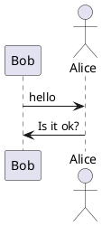
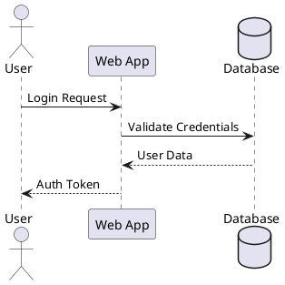
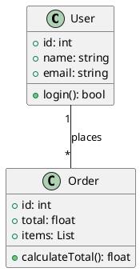
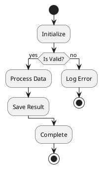
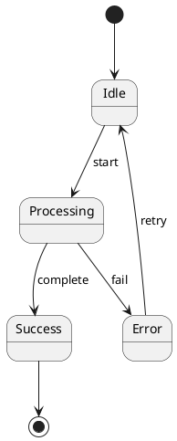
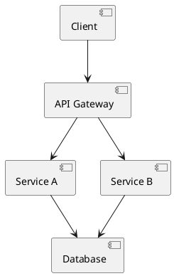
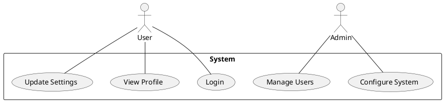
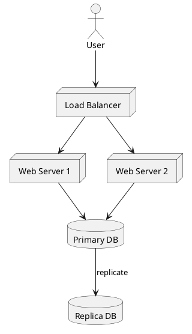

# PlantUML ASCII艺术图生成器

## 概述

使用PlantUML创建基于文本的ASCII艺术图。非常适合终端环境中的文档、README文件、电子邮件或任何不适合图形图表的场景。

## 什么是PlantUML ASCII艺术？

PlantUML可以将图表生成纯文本（ASCII艺术），而不是图像。这适用于：

- 基于终端的工作流程
- 没有图像支持的Git提交/PR
- 需要版本控制的文档
- 没有图形工具的环境

## 安装

```bash
# macOS
brew install plantuml

# Linux (因发行版而异)
sudo apt-get install plantuml  # Ubuntu/Debian
sudo yum install plantuml      # RHEL/CentOS

# 或直接下载JAR文件
wget https://github.com/plantuml/plantuml/releases/download/v1.2024.0/plantuml-1.2024.0.jar
```

## 输出格式

| 标志    | 格式        | 描述                          |
| ------- | ------------- | ------------------------------------ |
| `-txt`  | ASCII         | 纯ASCII字符                |
| `-utxt` | Unicode ASCII | 使用框线字符增强            |

## 基本工作流程

### 1. 创建PlantUML图表文件



### 2. 生成ASCII艺术

```bash
# 标准ASCII输出
plantuml -txt diagram.puml

# Unicode增强输出（更好看）
plantuml -utxt diagram.puml

# 直接使用JAR文件
java -jar plantuml.jar -txt diagram.puml
java -jar plantuml.jar -utxt diagram.puml
```

### 3. 查看输出

输出保存为`diagram.atxt`（ASCII）或`diagram.utxt`（Unicode）。

## 支持的图表类型

### 序列图



### 类图



### 活动图



### 状态图



### 组件图



### 用例图



### 部署图



## 命令行选项

```bash
# 指定输出目录
plantuml -txt -o ./output diagram.puml

# 处理目录中的所有文件
plantuml -txt ./diagrams/

# 包含隐藏文件（点文件）
plantuml -txt -includeDot diagrams/

# 详细输出
plantuml -txt -v diagram.puml

# 指定字符集
plantuml -txt -charset UTF-8 diagram.puml
```

## Ant任务集成

```xml
<target name="generate-ascii">
  <plantuml dir="./src" format="txt" />
</target>

<target name="generate-unicode-ascii">
  <plantuml dir="./src" format="utxt" />
</target>
```

## 更好的ASCII图表技巧

1. **保持简单**：复杂的图表在ASCII中渲染效果不佳
2. **简短标签**：长文本会破坏ASCII对齐
3. **使用Unicode (`-utxt`)**：使用框线字符可提高视觉质量
4. **分享前测试**：使用固定宽度字体在终端中验证
5. **考虑替代方案**：对于复杂图表，使用Mermaid.js或graphviz

## 示例输出对比

**标准ASCII (`-txt`)**：

```
     ,---.          ,---.
     |Bob|          |Alice|
     `---'          `---'
      |   hello      |
      |------------->|
      |              |
      |  Is it ok?   |
      |<-------------|
      |              |
```

**Unicode ASCII (`-utxt`)**：

```
┌─────┐        ┌─────┐
│ Bob │        │Alice│
└─────┘        └─────┘
  │   hello      │
  │─────────────>│
  │              │
  │  Is it ok?   │
  │<─────────────│
  │              │
```

## 快速参考

```bash
# 创建ASCII序列图
cat > seq.puml << 'EOF'
@startuml
Alice -> Bob: Request
Bob --> Alice: Response
@enduml
EOF

plantuml -txt seq.puml
cat seq.atxt

# 创建Unicode版本
plantuml -utxt seq.puml
cat seq.utxt
```

## 故障排除

**问题**：乱码的Unicode字符

- **解决方案**：确保终端支持UTF-8并使用合适的字体

**问题**：图表对齐错误

- **解决方案**：使用固定宽度字体（Courier、Monaco、Consolas）

**问题**：命令未找到

- **解决方案**：安装PlantUML或直接使用Java JAR文件

**问题**：未创建输出文件

- **解决方案**：检查文件权限，确保PlantUML有写入权限
