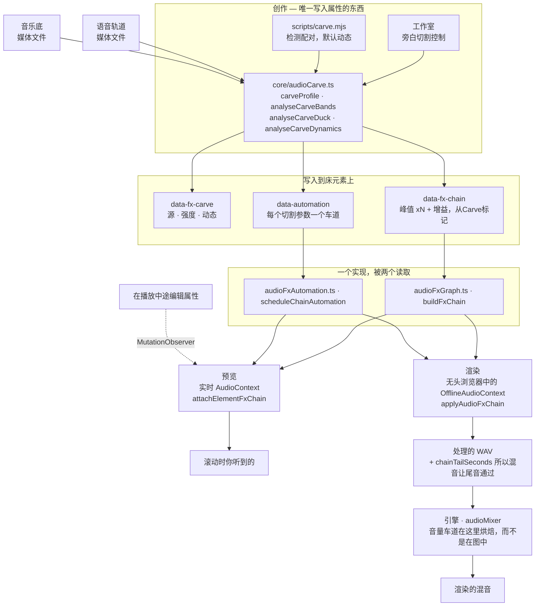
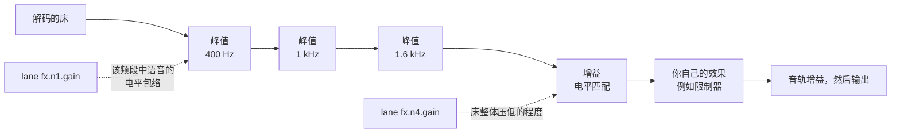

**插件安装：** 在设置或新鲜命令之前，当此技能位于 HyperFrames 插件内时，请遵循 [插件执行规则](../hyperframes/references/plugin-installation.md)。独立安装保留以下更新说明。

# HyperFrames 音频

一个混音是一组关系，而不是一堆处理器。两个单独听起来都正确的音轨放在一起可能令人难以忍受，而解决方法几乎从来不是“调低一个”，而是找到它们争夺的东西，并将其交给需要的一方。这里的每个工具都用于表达其中一种关系。

效果存在于元素上作为 `data-fx-chain`，预览和渲染运行相同的 Web Audio 图——在直播环境中是工作室，在浏览器内部的离线环境中是引擎。每个效果只有一个实现，所以在滚动时你听到的就是写入的内容。你永远不会调两次。

剪辑时间保持 `/hyperframes-core`：音频/视频修剪和源范围使用 `data-start`、`data-duration` 和 `data-media-start`，交叉淡入淡出会重叠不同音轨上的剪辑。此技能拥有放置音轨的淡入/淡出、交叉淡入淡出包络、音轨增益/音轨音量、音量和效果自动化、压低/旁白切割以及效果链。`/media-use` 拥有 sourcing、生成和预处理。

常量 `data-playback-rate` (`0.1..10`) 在匹配的音频/视频元素使用相同的计时、源偏移和速率时，对图片和保留音调的声音是渲染安全的。速度斜坡是 `data-automation` 中的 `rate` 轨（见 `docs/reference/speed-ramps`）；它优先于常量并保持预览和渲染中的音调。HyperFrames 不提供自动波形同步或漂移校正。对于可复制的切割/交叉淡入淡出/重时配方，使用 `/hyperframes-core` → `references/creator-editing-recipes.md`。

三个属性承载所有内容，在音频/视频元素本身上——或者对于前两个，在 `<hf-audio-group>` 总线上（见“一个总线用于多个音轨”）：

| 属性         | 包含内容                                                     |
| ------------ | --------------------------------------------------------- |
| `data-fx-chain`   | 效果，按信号顺序                                             |
| `data-automation` | 此音轨的音量或其效果参数上的包络                             |
| `data-fx-carve`   | 切割自身的设置，以便它可以重新导出                         |

提供的效应家族是增益、均衡器（高通、低通、峰值、搁架）、压缩器、限制器、门、饱和、延迟、混响、合唱、相位器和位压碎。

每个的确切 JSON 以及车道必须满足的规则：`references/attributes.md`。
每个效果及其参数、范围和单位：`references/fx-registry.md`。
如何弄清楚你听不到的文件出错了什么：
`references/diagnosis.md`。
**预设、命名任务和单旋钮配置文件，以及症状到修复表：
`references/presets.md`** — 在构建链之前阅读它，因为其中一个预设或命名任务通常已经命名了问题。

## 它们如何组合在一起

两个创作表面写入这些属性；两个运行时通过相同的构建器读取它们。共享的中间层是为什么预览会预测渲染。



切割自身的设置在播放时永远不会被读取——播放的是它产生的链和车道。`data-fx-carve` 存在的原因是可以在现有的切割上改变强度，而不是从过滤器中猜测出来。

在切割的床中，信号首先通过凹陷，然后是电平匹配，然后是你自己构建的任何东西——这就是为什么你添加的限制器仍然作为最后一个上限起作用：



一个静态切割是具有固定值且没有任何车道的相同图。

## 首先，弄清楚出错了什么

下表从“听起来很混响”——这假定有人已经听了并说这样。拿到文件并“修复它”，你没有这样的句子，而且你无法听，所以你必须测量。一条规则统治了所有这一切：

> **单个未知语音的绝对频谱无法诊断。**
> 共振峰是 ±10 dB，基频在 85–255 Hz 之间，句子在结束时下降 5–6 dB。它们中的每一个单独看起来都是缺陷，而它们中的每一个都是说话者。

所以比较，并与文件内部的东西比较：如果存在，则干净的原版，否则是停顿——在间隙中可听到的任何东西都是加性的，而间隙的频谱是通道而不是语音。与已发布的平均频谱或合成的控制语音比较不起作用：两个说话者之间的差异大于大多数缺陷，而且这个指导背后的评估中的两个错误答案都来自这一点。

当没有原始版本且没有可用的静默时，静态的音调缺陷确实未确定。如实说并提供建模的读数，而不是挑选一个并基于它构建链。

命令、陷阱和工作配方：**`references/diagnosis.md`**。在诊断一个没有人描述的文件之前阅读它。

## 从症状开始

一旦你知道了频段和种类，就说出音频出错了什么。大多数糟糕的音频是一个或两个这些，每个都有一个已提供的答案：

| 听起来像                     | 寻求                                          |
| -------------------------- | ------------------------------------------- |
| 下方有嗡嗡声或重击声        | `rumble-cut`，或 80 Hz 的 `高通`             |
| 混响、胸腔感                | **压制混响** 任务 (200 Hz)                    |
| 模糊、像纸板后面            | **减少混浊** 任务 (250 Hz)                    |
| 难以听清单词                | **增加清晰度** 任务 (3 kHz)，或切割床      |
| 刺耳、令人疲惫              | **柔和刺耳感** 任务 (3.2 kHz)                 |
| 某些单词比其他单词响得多    | 压缩器上的 **均衡**，或均衡电平             |
| 句子之间有房间音            | `room-gate`                                  |
| 语音和音乐相互竞争          | **旁白切割**——不是对任何一方进行 EQ          |
| 干燥、录制在无处            | `room-tight` 或 `room-natural`               |
| 只是“业余”                  | `voice-clean`，这是以上四个按顺序的         |

完整目录，每个预设包含的内容，频段词汇，以及故意不涵盖的内容（去咝声、降噪、音调匹配）：
`references/presets.md`。

在添加之前减去，过滤后调整电平，关系是在电平之后，特征和上限是最后。每一步都会改变下一步听到的内容——在高通之前设置的压缩器会花费时间追逐嗡嗡声。

## 根据问题而不是名称寻求一个家族

**滤波器** (`highpass`、`lowpass`、`peaking`、`lowshelf`、`highshelf`) 决定音轨允许占据哪些频率。这是两个来源冲突时的第一个工具，因为冲突发生在频段中：床和语音都想要 1–3 kHz，而从中获取成本远低于降低整个东西对混音的成本。在语音上使用高通是解决嗡嗡声的标准方法；低通会故意变暗或变模糊。

**动态** (`gain`、`compressor`、`limiter`、`gate`) 决定音轨电平随时间的行为。压缩器缩小响亮和安静之间的距离，以便安静的部分可以升高。限制器是一个上限——它不会塑造任何东西，它保证不会有任何东西超过它。门会移除低于阈值的任何东西，这就是你如何在短语之间沉默房间音的方式。`gain` 是一个普通的电平阶段，当音轨必须让路时，自动化车道会骑乘它。

**非线性** (`saturate`、`bitcrush`) 改变波形形状，这会添加原本不存在的谐波。当音轨需要特征或粗糙而不是校正时寻求它——并记住它是生成性的：它使瘦源更密集，而不是更干净。

**时间** (`delay`、`reverb`、`chorus`、`phaser`) 将音轨置于空间中或给予它宽度。这些是最容易破坏混音的，因为尾音或失谐副本占据着语音需要的相同空间。在应该位于其他东西后面的东西上使用它们，并保持湿声量低于单独听起来正确的量。

链是串行的：每个效果处理前一个效果产生的内容。所以校正性滤波器会放在早期，特征会在中间，限制器会放在最后，它实际上可以作为上限起作用。

## 旁白切割

**它解决的问题。** 床在语音下方使得语音难以跟随。反射是整个床压低，这有效，但代价是床失去了所有的存在感——音乐在整个旁白期间都变得迟钝。但语音不需要整个频谱。它只需要它实际占据的几个频段。切割只取这些，床保留其低端和顶端，所以它仍然是音乐，而语音仍然是可理解的。

**这是一种关系，而不是一个效果。** 设置存在于被处理的轨道上——即床——它们命名要听的语音，就像侧链压缩器一样：你选择变得更安静的轨道并选择使其变安静的东西。**永远不要在语音轨道上放置切割。** 语音对自己进行切割是一个错误，而不是一个微妙的混音选择。

**每个语音，而不是其中一个。** `sources` 是一个列表，因为床通常在一系列下运行——一个解说员、一个采访回答、一个第二主持人。它们在测量之前（`mixCarveSources`）叠加到床的自己的时钟上，所以一个分析涵盖所有它们：频段来自所有语音，并且当任何东西发生时，包络都会上升。在床播放时从未播放的语音被排除在外；它们无法掩盖它。

**对一个以上的剪辑 ID 进行切割是错误的。对剪辑进行分组并对分组进行切割。** 这是一个不变量，而不是一个提示。逐个命名剪辑必须完全正确，并且只有在编辑后才会保持正确——稍后添加的第四个解说员剪辑在切割意识之外播放，床无法在它下面无声地压低。相反，命名组可以在分析时解决成员资格，因此稍后添加到组中的剪辑会被涵盖，而无需触摸 `sources` 任何东西：

```html
<!-- 分组解说，然后对床进行切割 -->
<audio id="vo-intro" data-audio-group="voiceover" …></audio>
<audio id="vo-middle" data-audio-group="voiceover" …></audio>
<audio id="vo-outro" data-audio-group="voiceover" …></audio>

<audio id="music" data-fx-carve='{"enabled":true,"sources":["voiceover"],"strength":0.8}' …></audio>
```

`sources` 列表命名两个或多个普通的剪辑 ID 而不是组会被 `audio_carve_ungrouped_sources` lint 规则捕获——它仍然有效，但它会在剪辑添加时无声地腐烂。

**保持切割组是一个语音组：没有床，没有 SFX，没有音乐。** `sources` 中的组 ID 在每个分析时解析为每个当前成员，所以你命名的组就是你得到的组——不是写入它时测量的轨道。有两种方法会咬人：

- **床在自己的源组中。** 它被自己作为语音传递并被切割对其自己的内容——这是“永远不要切割轨道对自己”规则的延迟分析。
- **SFX 或音乐剪辑在语音组中。** 它在下一个分析时进入侧链，床开始压低一个呼啸声，即使写入属性的运行从未测量过它。

这两个在切割写入时都是不可见的：分析总结了它检测到的语音，并且永远不会通过组解析进行往返，所以第一次通过是真正正确的，只有下一次才是错误的。所以给每个角色自己的组——`music` 用于床，`voiceover` 用于解说，`sfx` 用于打击——并保持组命名的 `sources` 中只包含语音。

`carve.mjs` 在看到这两种情况时拒绝写入组形式，记录剪辑 ID，并在 stderr 上报告哪个成员阻止了它。然后 `audio_carve_ungrouped_sources` 规则指向安排而不是 CLI 安静地持久化比它测量的更宽的切割。

此运行排除的语音**不是**这些情况之一，并且不会阻止组形式：`carve.mjs` 只分析与床重叠的语音，并且在不编辑 `sources` 的情况下拾取稍后播放的剪辑是整个原因来命名组。

### 一个总线用于多个轨道

仅成员资格就足够进行切割，如上所述——但添加一个 `<hf-audio-group>` 元素并使用该 ID，组就变成了一个真正的子混音总线：每个成员一个链、一个推子、一个自动化时钟。

```html
<hf-audio-group
  id="voiceover"
  data-label="Voiceover"
  data-volume="0.9"
  data-fx-chain='{"version":1,"nodes":[
    {"type":"compressor","id":"g1","params":{"threshold":-18,"ratio":3}},
    {"type":"peaking","id":"g2","params":{"frequency":3000,"gain":2,"q":1}}]}'
></hf-audio-group>

<audio id="vo-intro" data-audio-group="voiceover" …></audio>
<audio id="vo-middle" data-audio-group="voiceover" …></audio>
```

**当多个轨道属于同一处理时寻求总线。** 四个解说员剪辑每个都需要相同的压缩器是四个链来保持同步，一旦编辑就会漂移；在总线上是一个链，压缩器看到整个语音而不是每个剪辑单独——这是重点，因为压缩器不能骑乘它只听到三分之一的序列。
每个剪辑的链对于真正每个剪辑的东西仍然是正确的：一个嘈杂的片段需要它自己的去咝声。

| 在公交车上        | 会                                      |
| ----------------- | ----------------------------------------- |
| `data-fx-chain`   | 一个链覆盖所有成员                      |
| `data-automation` | 在公交车上，在 COMPOSITION 时间           |
| `data-volume`     | 每个成员一个推子（默认为 1）            |
| `data-label`      | 显示名称；回退到 ID                    |
| `data-hidden`     | 从混音中删除每个成员                    |

**群组自动化是 COMPOSITION 时间，不是片段时间。** 公交车没有
`data-start` — 成员到达公交车时已经处于它们的 COMPOSITION 位置 — 所以群组轨道中的 `t: 0` 是 COMPOSITION 的开始，而不是任何片段的开始。片段上的轨道是片段本地的；相同的数字在两者上代表不同的瞬间，这是在将包络从片段移动到其公交车时需要正确处理的一件事。

**一个切割保持在其片段上。** `data-fx-carve` 不是群组属性。被切割的床是一个单轨道，并且是那个轨道携带
`data-fx-carve` — 根据上面的规则指向一个群组。群组和切割在
`sources` 中相遇，而不是在一个元素上。在公交车上写入的切割是应用两次效果的一半：电平的一半测量床的音频，而公交车没有，所以只有滤波器幸存 — 并且公交车及其成员是一个信号路径，所以床随后通过公交车的滤波器并通过其自己的。`audio_group_carve_attr` 检查规则捕获它。

**一个片段不是公交车。** 群组的存在是为了给多个轨道一个链、一个推子和一个时钟。将单个片段包裹在公交车上不会提供片段自己的
`data-fx-chain` 已经做的事情，并且会加倍后期编辑必须落地的位置。无论如何做它的一个原因：公交车的自动化时钟是 COMPOSITION 时间，所以一个单成员公交车是片段上轨道如何获得 COMPOSITION 时间计时的一种方式。

**一个旋钮。** `strength` 是 0..1 并且派生一切：切割深度如何，频段数量如何，宽度如何，如何远地偏向清晰度而不是原始语音能量，电平可以下降多远，如何远地瞄准语音下方。这六个在真实的混音中一起移动 — 一个轻柔的切割是浅切割在少数频段中，ducking 很少，一个硬切割是更深在更多频段中，更多 — 所以它们是一个关系，一次写入在 `carveProfile` 中。`carve.mjs` 默认为 `0.8` — 六个频段从 250 Hz 到 2.5 kHz 每个切割约 7 dB，在 1.6 kHz 处切割 15 dB，有 19 dB 的电平空间 — 因为床在旁白下必须首先让路，然后才是音乐；`0.25`（三个频段中的 6 dB 倾斜，6 dB 的空间）使床仍然存在但仍然允许它与语音竞争，并且在实践中被认为是太弱。在 `0.5` 时，倾斜达到 10 dB，这是切割开始被感知为效果而不是语音空间的地方。当床是重点而语音稀疏时降低强度。`0` 是频谱的 — 一个频段，没有任何电平匹配。

**默认情况下切割 — 在音乐在语音下播放时需要。** 任何语音轨道（旁白、头像语音、采访、旁白）下的床作为完成混音的一部分获得切割，而不是作为有时间就进行的光泽步骤。将两个轨道放置在一起，运行下面的命令（默认强度 `0.8`；当检测错误时添加 `--bed` / `--voice`），使用 `npx hyperframes check` 确认写入的
`data-fx-carve`，
`data-fx-chain` 和
`data-automation`，然后才渲染。单独的音量 duck 不是完成的混音：它使语音和床在 1–3 kHz 带中竞争，并且使床在整个旁白期间失去所有存在感。只有在没有语音供音乐坐下时才跳过切割 — 音乐视频、标题卡、蒙太奇切割到轨道。

**它始终跟随语音。** 没有静态模式：固定的深度通过每个停顿使床变薄，一旦你听到两者就没有理由想要它。每个值都成为语音自身电平的包络 — 沉默使床保持不变，响亮的段落将切割推到最大深度 — 写作普通的自动化，这就是为什么轨道显示在时间轴上并且可以在之后编辑。

**电平匹配是其中一部分。** 频谱切割不能修复床简单地比语音更响。所以切割还测量床位于语音上方的距离并写入一个 `gain` 阶段：对于静态切割保持一个值，对于动态切割由包络驱动。该包络故意缓慢释放 — 音乐在单词结束时立即恢复到完全状态听起来像机器在操作。

**运行它。** 在工作室中，切割是轨道效果架顶部的一个模块 — 语音、强度、动态以及它产生的分析，在一个卡片中。它存在于另一个轨道可能是语音时，并且一个正好**一个**候选者在其上方的床默认动态地以默认强度切割：这就是旁白下的床需要的，并且模块是你可以更改或关闭它的地方。多个候选者使选择器等待而不是猜测。无头 —
这是当你创作一个作品而不是编辑一个作品时的路径：

```bash
node <SKILL_DIR>/scripts/carve.mjs --comp index.html
```

这就是整个命令。它找到语音和床本身，以默认强度动态切割，并打印它决定的内容：

```
bed    music-bed (名称看起来像音乐)
voice  narration (剩下的唯一轨道)
carve  strength 0.8 dynamic
bands  250Hz -7.4dB q2.06, 400Hz -7.4dB q2.06, 630Hz -7.4dB q2.06, 1000Hz -7.4dB q2.06, 1600Hz -14.8dB q2.06, 2500Hz -7.4dB q2.06
level  273点包络，底部 -19.2 dB
```

当自动选择错误时，使用 `--bed` / `--voice`（可重复）命名轨道，使用 `--strength` 推动它，使用 `--dry-run` 查看该报告并写入任何内容。

**它是如何选择轨道的。** 首先是名称，因为这是你已经告诉它的并且答案是可解释的 — `classifyAudioName` 在核心中，使用与工作室自己的选择器相同的分类器，所以两者不能不一致。一个 id 或文件名看起来像音乐（`music`，`bgm`，`bed`，`score`…）的轨道是床；所有其他在其上播放且不是 SFX 形状的都将是语音。音频元素是首选的：视频仅在没有任何音频轨道剩下作为语音时计算，或者组成中的每个 B-roll 片段都会读作有人在说话。**当它无法确定哪个轨道是床**而不是切割错误的轨道 — 输入一个 id 是便宜的。

与面板相同的分析函数，所以结果是相同的。需要 `ffmpeg` 在 PATH 上并且 `@hyperframes/core` 在项目中安装（`npm i -D
@hyperframes/core`）— CLI 内联核心而不是将其发送，所以它不能从那里借用。

**它写入的**是一个普通的峰值滤波器链加上一个增益阶段，标记为 `fromCarve`。这个标记是整个技巧：重新运行会替换以前的切割并且保留你手工构建的每个效果 — 并且你手工绘制的每个轨道 — 恰好在其位置。所以在新强度下重新切割是安全和可重复的，并且 `data-fx-carve` 存在以便设置可以读取而不是从滤波器猜测。

## 自动化

一个轨道是一组一个参数上的断点：`{t, v}` 在片段本地的秒和参数自己的单位中。目标是 `volume` 对于轨道的电平，或者 `fx.<nodeId>.<param>` 对于效果的旋钮。

**只有一些参数可以自动化，并且其他轨道的轨道是沉默的惰性。** 当一个 Web Audio `AudioParam` 支持它时，旋钮是可自动化的。四个基于 worklet 的效果 — `compressor`，`limiter`，`gate`，`bitcrush` — 完全不暴露任何，所以任何它们的参数上的轨道永远不会移动：要使压缩器的行为随时间变化，在它之前自动化一个 `gain` 阶段。`references/fx-registry.md` 标记了每个参数。

## 验证

几乎没有任何静态门覆盖混音。检查器读取 `data-automation` 以确保只有一个冲突 — `audio_volume_double_automation`，一个在具有 `volume` 上的 GSAP 补间效果的轨道上的音量轨道，其中轨道获胜并且补间被忽略 — 加上 `audio_volume_tween_overrides_gain`，一个在 `volume` 被补间的轨道上的授权 `data-volume`，其中补间的值是绝对的并且替换增益而不是缩放它。什么验证链或效果轨道：渲染 — 它无法解析的链会导致整个混音失败而不是安静地写入干信号，因为听起来合理但错误的混音比拒绝更糟。预览在设计上是相反的：一个无法读取的链播放干信号，所以作品保持可工作。

指向链没有的节点的轨道在读取时被修剪，而不是错误 — 所以一个拼错的 `nodeId` 会让你无声地失去包络。从链中读出 id 而不是假设它是什么。

具有尾巴的效果（`reverb`，`delay`）使渲染的轨道**比其源更长**，混音通过链告诉它多少。所以带有混响的床不再正好在其 `data-duration` 结束；这是预期的，而不是一个错误。

除此之外，混音通过渲染和聆听进行验证。对于切割：语音应该在没有床听起来空洞的情况下可读，并且使用 `dynamic` 时床应该在短语之间恢复而不是保持平坦。如果床在语音下听起来不均匀而不是简单地更安静，强度太高 — 这是唯一有明确声音的故障模式。
