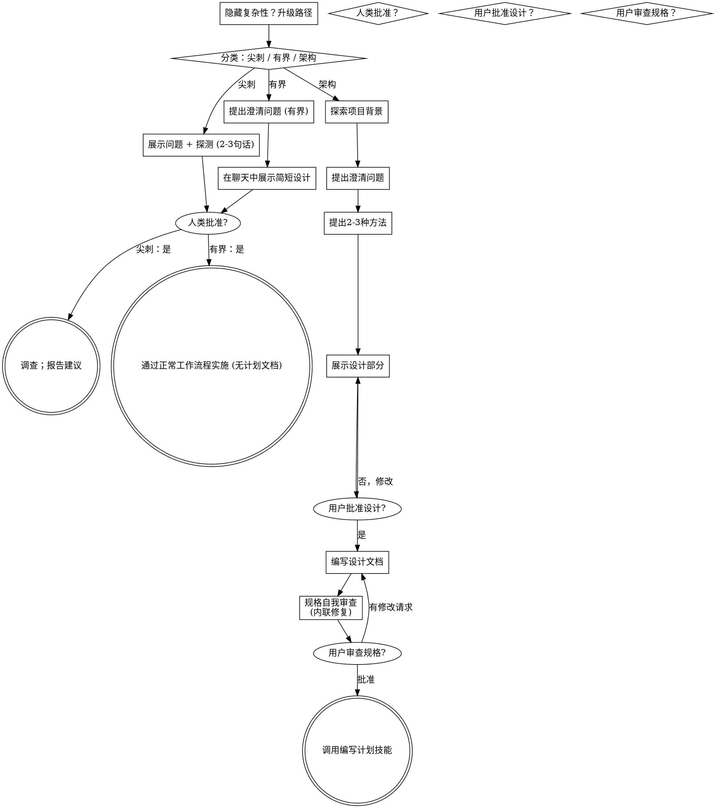

# 将想法转化为设计方案

通过自然协作对话，帮助将想法转化为完整的设计方案和规格说明。

首先，根据请求所需的流程程度进行分类，然后按照你的路径进行工作：理解背景，完善想法，展示设计方案，并获得你的人类合作伙伴的批准。

## 建立共同理解

头脑风暴的成果是人类合作伙伴能够识别和纠正的理解，它基于他们想要实现的目标。

1. **发现意图。** 使用请求和可用背景信息来确定预期结果、目标受众以及成功标准。当这些信息缺失时，在提出功能或方法之前，先就目的或预期用途提出一个专注的问题。了解应用程序类型并不能告诉你你的合作伙伴为什么想要它。收集缺失的需求并不会让他们重新授权任务。
2. **记录你的理解。** 将预期结果、相关约束条件和成功标准总结成一条你的合作伙伴可以评估的简短笔记。将他们所说的话与假设分开。邀请纠正，并在将其视为设计简报之前纳入他们的答案。
3. **将意图融入设计。** 在所选路径的设计工件中保留达成的理解：用于架构工作的书面规格，或用于有界工作和尖刺的聊天中的设计/探测。对照该理解检查拟议的功能和技术选择。

当请求已经提供目的和约束条件时，反映这种理解，而不是再次提出相同的问题。保持笔记简洁；其准确性和纠正的机会很重要。

<HARD-GATE>
在采取任何实施行动之前，包括调用实施技能、编写产品代码、搭建框架、安装产品依赖项或创建外部项目，请完成所选路径的先决条件：

- 尖刺：人类合作伙伴批准问题和探测。
- 有界：人类合作伙伴批准简短的聊天设计。
- 架构：人类合作伙伴审查并批准书面规格，然后审查书面实施计划并选择其执行方法。对话设计批准仅允许编写规格；书面规格批准仅允许调用编写计划。

回复批准实际呈现的阶段。对想法或功能范围的批准并不批准尚不存在的工件。从最早未完成的阶段开始；不要将一个批准变成跳过所选路径其余部分的许可。在先决条件未完成时，允许只读项目探索。
</HARD-GATE>

## 三种路径

在你提出第一个问题之前，对请求进行分类并大声说出分类——"这看起来是有界的，所以我将在这里展示一个简短的设计，而不是编写规格"——这样你的合作伙伴可以覆盖它：

- **尖刺**——一个可行性问题（"我们能..."、"这是否可能..."、"快速脏活也可以"），其输出是一个答案，而不是你保留的代码。用2-3句话提出问题和你要尝试的内容，获得点头，然后以正确性允许的最便宜的方式找出答案。没有设计文档，没有规格文件。报告发现结果作为建议；你构建的任何东西都应标记为一次性。
- **有界**——对存储在此存储库中已存在的代码的良好范围更改：一个新的标志、一个小端点、一个单文件修复。
  了解应用程序类型是不够的——有界意味着你要更改的流程已经在这里供阅读。如果没有现有的流程要更改，任务就不是有界的。问与澄清相关的关键问题，在聊天中展示简短的设计（几句话到几段简短段落），然后停止。只有在你的合作伙伴对设计说"是"之后，实施才开始——有界任务的批准与架构任务一样困难。没有规格文件，没有实施计划文档。
- **架构**——新项目、新子系统、更改组件如何组合的结构或更改其他依赖的接口。遵循完整的过程：问题、方法、分节设计、书面规格，然后是编写计划技能。

当你在两个路径之间不确定时，选择更重的路径。棘轮是单向的：在任务中途发现的隐藏复杂性会升级路径——停止，说出来，并升级。中途不会降级。

## 反模式："太简单不需要批准"

每个路径都以你的合作伙伴在实施之前批准所需的设汁而结束。有界更改可能只需要聊天中的两句话。一个新的待办事项列表项目是有架构的，需要书面规格和计划交接。根据所选路径调整工件大小；在实施之前完成该路径的审查。

## 信号灯

| 思考 | 现实 |
|------|------|
| "这太简单了，不需要设计" | 遵循所选路径：有界更改获得简短的聊天设计；架构更改获得书面规格和计划交接。 |
| "我会称它为有界的，并跳过规格" | 伸手去标签以跳过工作就是怀疑——选择更重的路径。 |
| "它是有界的，设计是显而易见的——我会在他们阅读时开始" | 门槛是批准，不是设计的长度。展示，然后在听到"是"之前停止。 |
| "我了解这种类型的应用，所以它是有界的" | 有界衡量的是存储库，而不是你的熟悉程度。新项目没有现有的流程——它是架构的。 |
| "尖刺有效，所以我会保留代码" | 尖刺的输出是一个答案。保留代码是一个新请求——进行分类。 |
| "它长大了，但我几乎完成了——不需要重新分类" | 隐藏的复杂性中途升级路径。停止并说出来。 |
| "他们批准了尖刺，所以后续更改也获得了批准" | 每个任务都有自己的分类和自己的批准。 |

## 清单

首先分类，宣布路径，然后为你的路径上的每个项目创建一个任务，并按顺序完成它们。

**尖刺：**
1. **探索项目背景**——足以构建探测
2. **展示问题 + 探测计划**——2-3句话
3. **获得批准**——点头就足够了
4. **调查**——以正确性允许的最便宜的方式
5. **报告发现结果**——一个建议；将构建的任何东西标记为一次性

**有界：**
1. **探索项目背景**——检查文件、文档、最近的提交
2. **提出澄清问题**——一次一个，与重要相关的
3. **在聊天中展示简短设计**——几句话到几段简短段落
4. **获得批准**——停止并等待明确的"是"；在展示设计和开始之间进行是跳过门槛
5. **实施**——继续正常的开发工作流程（TDD适用）；没有计划文档

**架构：**
1. **探索项目背景**——检查文件、文档、最近的提交
2. **适时提供视觉伴侣**——不是提前。第一次一个问题在展示比描述更清楚时，提供它（它自己的消息）；在批准后，它的浏览器标签为你打开。如果没有视觉问题出现，永远不要提供它。见下文的视觉伴侣部分。
3. **提出澄清问题**——一次一个，理解目的/约束/成功标准
4. **提出2-3种方法**——包括权衡和你的建议
5. **展示设计**——按其复杂性分节，在用户批准每个部分后获得用户批准
6. **编写设计文档**——保存到`docs/superpowers/specs/YYYY-MM-DD-<主题>-设计.md`并提交
7. **规格自我审查**——快速内联检查占位符、矛盾、歧义、范围（见下文）
8. **用户审查书面规格**——在继续之前要求用户审查规格文件
9. **过渡到实施**——调用编写计划技能以创建实施计划

## 流程图

**终端状态是路径绑定的。** 架构：头脑风暴后你调用的唯一技能是编写计划——永远不要前端设计、mcp-builder或任何其他实施技能。有界：在批准后，实施直接通过正常开发工作流程进行；没有计划文档。尖刺：终端状态是报告建议。

## 流程

下方的子部分服务于有界和架构路径（尖刺在"展示探测，获得点头"时停止）。从**探索方法**开始的各部分是架构路径深度——对于有界工作，背景加上几个问题加上简短的聊天设计就是整个流程。

**理解想法：**

- 首先检查当前项目状态（文件、文档、最近的提交）
- 在提出详细问题之前，评估范围：如果请求描述了多个独立的子系统（例如，"构建一个具有聊天、文件存储、计费和分析的平台"），立即标记。不要在需要首先分解的项目上花费问题来完善细节。
- 如果项目太大，无法用一个规格来描述，帮助用户将其分解为子项目：独立的部分是什么，它们如何相关，应该按什么顺序构建？然后通过正常设计流程对第一个子项目进行头脑风暴。每个子项目都有自己的规格→计划→实施周期。
- 对于适当范围的项目，一次一个问题来完善想法
- 尽可能使用多项选择题，开放式问题也可以
- 每条消息只问一个问题——如果一个主题需要更多探索，将其分成多个问题
- 专注于理解：目的、约束、成功标准

**探索方法：**

- 提出具有权衡的2-3种不同方法
- 以对话方式展示选项，包括你的建议和推理
- 首先推荐你的选项并解释原因
- 严格遵循YAGNI原则——从每个方法和设计中删除不必要的功能

**展示设计：**

- 一旦你认为你理解了你要构建的内容，就展示设计
- 按复杂性调整每个部分的大小：如果是简单的，几句话；如果是复杂的，最多200-300字
- 询问到目前为止是否看起来正确
- 涵盖：架构、组件、数据流、错误处理、测试
- 如果不清楚，准备好回去澄清

**设计以隔离和清晰为目标：**

- 将系统分解为更小的单元，每个单元都有一个明确的目的，通过定义良好的接口进行通信，并且可以独立理解和测试
- 对于每个单元，你应该能够回答：它做什么，如何使用它，以及它依赖什么？
- 是否有人可以在不阅读其内部的情况下理解一个单元做什么？你是否可以在不破坏消费者的情况下更改其内部？如果不是，边界需要工作。
- 较小、良好边界化的单元也更容易与你一起工作——你可以更好地推理你可以在一次操作中持有的上下文中的代码，并且当文件集中时，你的编辑更可靠。当文件变长时，这通常是它做太多工作的信号。

**在现有代码库中工作：**

- 在提出更改之前探索当前结构。遵循现有模式。
- 如果现有代码存在问题会影响工作（例如，一个文件变得太大、边界不明确、职责纠缠），将有针对性的改进作为设计的一部分包括在内——这是优秀开发者在他们正在工作的代码中改进代码的方式。
- 不要提出无关的重构。专注于当前目标。

**提供辅助（即时）：** 不要一开始就提供。等待一个问题出现，通过展示比文字描述更清晰的情况时——一个真正的模型/布局/图表问题，而不仅仅是UI*主题*。第一次出现这种情况时，以单独消息的形式提供它：
> “接下来的部分，如果我能展示给你看可能会更容易——我可以在浏览器标签页中实时制作模型、图表和对比。这仍然比较新，可能会消耗较多资源。要我这样做吗？我会为你打开。”

**这个提议必须是单独的消息。** 只有提议本身——没有澄清问题、摘要或其他内容。等待用户的回应。如果他们接受，使用 `--open` 参数启动服务器，以便他们的浏览器自动打开到第一个屏幕。如果他们拒绝，继续纯文本模式，并且除非他们再次提出，否则不再提供。

**按问题决策：** 即使用户接受了，也要为每个问题决定是使用浏览器还是终端。测试标准：**用户通过观看是否比阅读更能理解这个问题？**

- **使用浏览器** 对于视觉内容——模型、线框图、布局对比、架构图表、并排视觉设计
- **使用终端** 对于文本内容——需求问题、概念选择、权衡列表、A/B/C/D文本选项、范围决策

关于UI主题的问题不一定是视觉问题。“在这个上下文中，个性意味着什么？”是一个概念问题——使用终端。“哪个向导布局效果更好？”是一个视觉问题——使用浏览器。

如果他们同意使用辅助工具，请先阅读详细指南再进行：
`skills/brainstorming/visual-companion.md`
