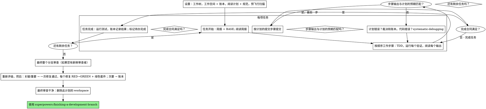

# 执行计划

在本会话中，您亲自逐项执行计划：每个任务不设实施者子代理，每个任务不设审查者。最后对整个分支进行一次新鲜上下文的审查。

**为何内联执行：** 子代理驱动开发为每个任务支付一个新鲜的实施者和审查者，每个任务都从零开始重读代码库。内联执行支付一个上下文（您的）加上一个最后的审查者。它放弃的是每个任务的新鲜上下文和每个任务的第二双眼睛。这项技能通过其他方式保留了两件事的成果：简报是规范，账本是你的记忆，TDD是每项任务的门禁，最后的审查者是第二双眼睛。

**核心原则：** 计划已经完成了思考。精确执行它，用您目睹失败的测试并随后通过的测试来证明每一步，并留下一个在您遗忘后仍然存在的记录。

**叙述：** 在工具调用之间，最多叙述一行短句——账本和工具结果承载着记录。

**持续执行：** 在任务之间不要暂停以与您的人类伙伴确认。他们选择内联执行是为了节省时间，而不是在每项任务之后回答“我是否应该继续”。从计划中执行所有任务，不要停止。

**裁决，而非停滞。** 冲突、歧义、计划缺陷——决定它们。规范是约束性权威，计划是其论据，而您的判断决定了两者都无法回答的内容。将每个裁决记录在账本中，格式为 `裁决：<您决定的内容> — <原因> — <如果错误将付出的代价>`，然后继续。没有账本裁决的偏离计划是一个秘密中的决定。

阻止你的有四件事，也只有这些：不可逆或破坏性操作；安全敏感操作；超出此工作树的范围的副作用，规范说你应该首先询问（合并、向共享分支推送、发布）；以及计划如此破损以至于每条前进的路径都是猜测。对于这些，停止并询问。

## 使用时机

- 您有一个来自 superpowers:writing-plans 的计划，并且您的人类伙伴在交接时选择了内联执行。
- 您的 harness 没有子代理工具（参见 `../using-superpowers/references/` 中的平台特定参考）。永远不要编造派遣；在这里运行计划。
- 任务大多是独立的——与 superpowers:subagent-driven-development 相同的前置条件。

一个完全规范化的计划使内联执行成为转录加测试：它在中端会话模型上运行良好，并且最强大的模型赚取其成本的地方是最终审查，这项技能将其单独派遣。当您的人类伙伴选择内联时，告诉他们这一点。

当您的人类伙伴想要每项任务都有一个审查门禁，或者当计划足够长以至于其后续任务会在压缩的上下文中运行时，优先选择 superpowers:subagent-driven-development。在长计划上的内联执行仍然有效——账本是使其可恢复的东西——但最后一项任务得到的最少。

## 流程



## 设置

确保在工作空间中隔离工作：使用 superpowers:using-git-worktrees 创建一个或验证现有的工作空间。未经您人类伙伴的明确同意，切勿在 main/master 分支上开始实施。

会话记忆不会在压缩时存活。一个丢失位置的内联执行者会重新实施已经存在的提交的任務——这与控制器重新派遣它们相同，但代价是您自己的上下文。在账本文件中跟踪进度，而不仅仅是在待办事项中。Harness 待办事项是实时视图；账本是记录。

工作空间和账本与 superpowers:subagent-driven-development 共享——相同的目录，相同的格式——因此计划可以在飞行中途更改执行者，新的执行者可以从相同的账本中恢复。

- 每个计划拥有一个工作空间：技能开始时，运行 `../subagent-driven-development/scripts/sdd-workspace PLAN_FILE` — 它会打印计划的 git 忽略目录（`<repo-root>/.superpowers/sdd/<plan-basename>/`），其中包含此计划的所有工件：账本、简报、审查包。另一个计划的目录永远不会是您阅读或写入的。
- 检查此计划的账本位于 `<workspace>/progress.md`。如果其第一行命名了您的计划文件，则带有 `Task <N>: complete` 行的任务已完成——不要重做它们；从没有该行的第一个任务开始。即使您的上下文不再记得创建它们，它们的提交也存在于 git 中：压缩后，信任账本和 `git log` 而不是您自己的记忆。一个第一行命名了不同计划文件的账本是另一个计划的进度：保留它并开始您自己的，新鲜的。
- 用其身份作为第一行创建账本：`# SDD 账本 — 计划: <计划文件路径>`。
- `git clean -fdx` 将销毁工作空间（它是 git 忽略的草稿）；如果发生这种情况，从 `git log` 中恢复。

阅读计划一次，注意其上下文和全局约束，并为每项任务创建一个待办事项。如果计划命名了规范，也阅读它：规范是计划论证的权威，计划内部的冲突根据它解决。一个没有可到达规范的计划会得到一个账本注释说明——没有它的裁决是临时的。

**必需子技能：** 现在在 Task 1 之前加载 superpowers:test-driven-development，它管辖每项任务的每一步；一个步骤已经说“首先编写失败的测试”的计划不会使您免除阅读它。

在 Task 1 之前，扫描计划中任务之间的冲突。计划的 Interfaces 块告诉您在哪里查找：对于每个消耗早期任务产生的任务的任务，一行账本——两个任务，一个产生的内容与另一个消耗的内容，以及您发现的内容。没有共享内容的任务没有行；任务的计划没有共享内容的任务得到单行 `预飞行：没有共享接口`。根据规范作为约束性权威裁决每一行冲突，在每行的旁边记录裁决，并开始 Task 1。当您阅读其简报时检查每个任务的自己的文本，而不是在这里。

## 任务循环

您打印的每一项，以及每个工具结果，都保留在您的上下文中，直到会话结束。将长测试输出重定向到工作空间中的文件，并读取其尾部；阅读简报，而不是整个计划。

### 1. 接收任务

- 运行此技能的 `scripts/task-start PLAN_FILE N`。它在一次调用中打印简报路径和 BASE（任务的范围是从哪个提交切分的）。为每个任务阅读简报，包括您在设置中记住的任务：您记住的是摘要，简报包含确切的值、签名和测试用例。
- 将任务的待办事项标记为 in_progress。

每个工具调用都是重新读取您整个上下文的回合。账本记录沿着工作一起进行——在提交的同一调用中进行账本追加，永远不会在自己的调用中进行。

### 2. 工作步骤

计划的步骤已经按 RED-GREEN 顺序排列；在 superpowers:test-driven-development 下按该顺序执行，加载在设置时。测试步骤的代码首先编写，然后首先运行。看到它失败是一个步骤，而不是一种形式——在实现存在之前就通过的测试是关于测试的发现。

运行命令的每个步骤都有一个 `Expected:` 行。运行命令，阅读其输出，并进行比较。三种结果：

- **匹配。** 下一步。
- **代码错误。** 使用 superpowers:systematic-debugging。找到原因；永远不要为了使步骤的输出匹配而修补症状。
- **计划错误**——一个步骤与规范矛盾，来自早期任务的接口与当前任务消耗的内容不匹配，一个无法工作的命令。根据满足规范的最小更改进行裁决，账本记录为 `Task <N>: 裁决: <发现> — <您决定的内容和原因>`，然后继续。裁决被携带，而不是被记住：接触相同接口的后续任务从账本中读取它。

按计划的提交步骤提交。跨越多个提交的任务很好；BASE 是审查范围从中切分的，永远不会是 `HEAD~1`。

### 3. 完成合同

在任务账本行之前，以下全部为真，有本会话的证据——不是从看起来正确的 diff 推断的：

- 简报命名的每个测试都存在于本任务中并运行，并且您阅读了输出。
- 任务运行的最终测试通过——`task-done` 是那个运行，并且它将命令和结果写入账本行。
- 简报中的每个 `Expected:` 行都与实际输出进行了比较。
- 简报的每个偏离都有一个账本中的 `Ruling:` 行。

**必需子技能：** superpowers:verification-before-completion 政府该主张。如果任何项目缺失，任务不完整：完成它。

### 4. 完成任务

运行此技能的 `scripts/task-done PLAN_FILE N BASE -- <测试命令>`，使用简报为整个任务命名的测试命令。它运行测试，将完整输出保留在工作空间中，打印尾部，并且——只有在它们通过时——将完成行追加到账本：

`Task <N>: complete (commits <base7>..<head7>, tests: <命令> → <结果>)`

运行失败不记录任何内容；任务不完整。当它记录时，标记待办事项完成并接收下一个任务。

## 最终审查

运行 `../subagent-driven-development/scripts/review-package PLAN_FILE MERGE_BASE HEAD`（MERGE_BASE = 分支开始的提交，例如 `git merge-base main HEAD`）并审查它打印的文件。

**有子代理工具：** 使用 superpowers:requesting-code-review 的
[code-reviewer.md](../requesting-code-review/code-reviewer.md)，使用包路径、计划规范路径、如果计划有的话，计划 Review Focus 部分的逐字复制（计划测试没有执行的输入类和失败模式——审查者故意检查每个），以及指向账本 `Ruling:` 行的指针，以便它可以权衡您做出的裁决。明确指定模型；省略模型继承了会话的模型，这可能不是最强大的。这是整个运行买到的唯一新鲜上下文。不要跳过它，也不要用您自己的 diff 阅读替换它。

**没有子代理工具：** 阅读代码-reviewer.md 并自己针对包进行该审查，作为最后一个任务的账本行之后的单独通过。在账本中写入 `Final review: self-review (no subagent tool)`，并在您的最后消息中说明这一点：作者的自审比新鲜审查者弱，您的人类伙伴决定这是否足够再合并。

在采取任何行动之前对发现进行排序。审查者的严重性标签是建议；门禁是您的。它的“拒绝判断”列表也是您的：每行那里都是您做出并记录的裁决，就像计划冲突一样——`Final: 裁决: <审查者搁置的行为> — <一个合理使用此软件的人得到的内容，以及为什么它成立或为什么现在是发现> — <如果错误将付出的代价>`。首先重新评级，按效果：规范是一份愿景文件，发现的评级是如果它发布，一个合理使用此软件的人得到的内容，而不是规范是否命名了触发它的输入——一个因为规范沉默而将发现设置为次要的审查者对规范进行了评级，而不是效果。然后：

- **关键和重要** 进入修复通过。
- **次要** 账本记录为 `Final: minor (deferred): <一句话>` 并在您的最后消息的“延迟次要”下记录。次要永远不会进入修复通过，也不会成为裁决——裁决是一个关于冲突的决定，而不是一个您拒绝的抛光建议。

您自己修复关键和重要的发现——您是这里的实施者——在 ONE 轮次中。每个修复都由 TDD 验证，而不是由第二个审查者验证：编写一个重现发现的测试，看到它失败，使其通过，然后运行整个套件。在账本中记录每个，格式为 `Final: fixed <发现> — <测试名称> RED→GREEN, 套件 <N>/<N>`。没有首先失败的测试的修复不是验证的；通过后套件不是绿色的套件意味着通过没有结束。不要派遣重新审查：它将重新读取一个 diff，其覆盖测试已经回答了“已解决”，其套件运行已经回答了“没有破坏任何东西”。

您决定不修复的发现是一个裁决——`Final: 裁决: <发现> — <代码成立的原因> — <如果错误将付出的代价>`——它通过裁决列表到达您的人类伙伴。没有第二个修复通过。

## 完成

在您删除任何东西之前，将包含 `Ruling:` 的每个账本行收集到您的最后消息的“我做出的裁决”下，按您做出的顺序，每个都附上如果错误将付出的代价，以及每个 `minor (deferred)` 行在“延迟次要”下。两个列表都是详尽的。您的最后消息是唯一一个将您在您人类伙伴名义下做出的决定——以及您选择不采取行动的发现——传达给他们的地方。

当最终审查干净并且其修复已提交时，删除此计划的 workspace 目录——git 历史是记录。兄弟目录属于其他计划；不要碰它们。

使用 superpowers:finishing-a-development-branch。

|借口|现实|
|----|----|
|“我记得任务N的内容”|你记得一个摘要。简报中有确切值。读一读。|
|“计划的代码是对的，跳过看测试失败”|一个你从未见过失败的测试证明不了什么。这是一步。运行它。|
|“我会在最后一次性运行整个套件，而不是每一步都运行”|每步运行才是你学习哪个步骤出问题的方法。任务末尾的运行是合同，不是替代品。|
|“计划在这里是错的，我就直接做正确的事”|做正确的事并记录裁决。未记录的偏差是秘密做出的决定。|
|“我会在几个任务之后记录账目行”|压缩不会等待方便的时刻。每个任务一条行，与提交消息相同。|
|“我会在下一个任务之前签入”|他们选择内联是为了节省时间。进度提示会花时间。只有四个停止点会阻止你。|
|“我仔细看了自己的diff；最终审查者是多余的”|同一作者，同一盲点。审查者是这次运行唯一的新上下文。|
|“测试应该通过，改动很小”|“应该”不是证据。合同要求命令及其输出。|
|“子代理很慢很贵，我也要跳过最终审查”|内联已经移除了每步审查者。整个分支的一次审查是底线，不是上限。|
|“审查者说次要，所以它是次要的”|标签评判了规范的沉默。评判人们得到的东西。重新评级，然后放行。|
|“修复很明显，不需要先有一个失败的测试”|失败的测试是唯一证明发现真实且现在已消失的证据。没有它你只有diff和希望。|
|“我会在那里的时候修复次要问题”|你修复的每个次要问题都是一个测试、一个修复，以及你的搭档没有要求的套件运行。记录它们；你的搭档决定。|

## 示例工作流

```
你：我正在使用执行计划技能来内联实现这个计划。

[设置：工作树已验证]
[读取计划一次：docs/superpowers/plans/feature-plan.md；规范已读]
[解决工作区：sdd-workspace docs/superpowers/plans/feature-plan.md — 内部没有账目，重新开始]
[预飞行扫描：2个共享接口行，4个自洽行，干净；写入账目]
[为所有任务创建待办事项]

任务1：钩子安装脚本

[任务开始计划 1 → 简报阅读；BASE a1b2c3d]
[步骤1：编写失败的测试 — 已编写]
[步骤2：运行它 — 失败：install_hook未定义。匹配预期。]
[步骤3：实现 — 已编写]
[步骤4：运行它 — 通过 1/1。匹配预期。]
[步骤5：提交 — d4e5f6a]
[合同：测试运行，输出读取，无偏差]
[任务完成计划 1 a1b2c3d -- npm test -- hooks → 账目：任务 1：完成（提交 a1b2c3d..d4e5f6a，测试：npm test -- hooks → 1/1 通过)]

任务2：恢复模式

[任务开始计划 2 → 简报阅读；BASE d4e5f6a]
[步骤2：运行失败的测试 — 失败，但在导入错误：任务 1导出了
 installHook，简报消耗install_hook]
[裁决：简报的消费者名称是任务 1 的 Produces 块中的一个拼写错误；
使用installHook — 账目：任务 2：裁决：install_hook → installHook — 匹配任务 1 Produces — 如果错误：一个重命名]
[步骤2-5按计划进行；提交 b7c8d9e]
[任务完成计划 2 d4e5f6a -- npm test -- recovery → 账目：任务 2：完成（提交 d4e5f6a..b7c8d9e，测试：npm test -- recovery → 8/8 通过)]

...

[所有任务后：review-package计划MERGE_BASE HEAD；派发代码审查者，最强大的模型]
审查者：一个重要发现 — 进度报告间隔硬编码。两个次要。
[重新评级：重要成立；次要 → 账目为延迟]
[修复通过：test_progress_interval_configurable RED → 提取 PROGRESS_INTERVAL → GREEN；套件 12/12；提交]
[账目：最终：修复了硬编码间隔 — test_progress_interval_configurable RED→GREEN，套件 12/12]

我做出的裁决：
- 任务 2：install_hook → installHook（简报拼写错误；如果错误：一个重命名）

延迟的次要问题：
- README缺少一个使用示例
- recovery.js可以将verify/repair分成两个文件

[删除此计划的工区 — 记录现在存储在git中]

使用超能力：finishing-a-development-branch。
```
