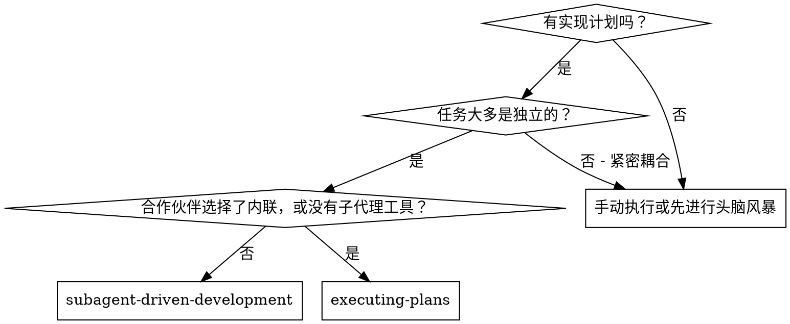

# 基于子代理的开发

通过为每个任务分派一个新的实现子代理来执行计划，在每次任务后进行任务审查（规范符合性+代码质量），并在最后进行广泛的整个分支审查。

**为何使用子代理：** 你将任务委托给具有隔离上下文的专用代理。通过精确设计它们的指令和上下文，你确保它们保持专注并成功完成任务。它们绝不应继承你的会话上下文或历史记录——你将构建它们所需的确切内容。这也保留了你的上下文以进行协调工作。

**核心原则：** 每个任务一个新鲜的子代理 + 任务审查（规范+质量）+ 广泛的最终审查 = 高质量，快速迭代

**旁白：** 在工具调用之间，最多叙述一行短句——账本和工具结果承载着记录。

**持续执行：** 在任务之间不要暂停以与你的人类合作伙伴确认。从计划中执行所有任务，不要停止。唯一停止的原因是下面列出的四个原因，或者所有任务完成。"我应该继续吗？"提示和进度摘要浪费他们的时间——他们让你执行计划，所以执行它。

**裁决，而非停滞。** 运行的计划不会等待人类。冲突、歧义、计划缺陷、你本会要求超越的限制——决定它们。规范是具有约束力的权威，计划是其论据，你的判断决定两者都不回答的内容。将每个裁决记录在账本中，格式为`裁决：<你决定的内容> — <原因> — <如果错误会付出什么代价>`，然后继续进行。错误的裁决会导致你的合作伙伴可以看到并撤销的重工；会话停滞在一个问题上会浪费他们一整天，并且毫无收获。

只有四件事会阻止你，也只有这些：不可逆或破坏性操作；安全敏感操作；工作树外部的副作用，规范说你首先应该询问（合并、向共享分支推送、发布）；以及计划如此破败以至于每条前进的路径都是猜测。对于这些，停止并询问。

## 使用场景



**与内联执行计划（inline）对比：**
- 每个任务一个新鲜的子代理（无上下文污染），而不是一个上下文执行每个任务
- 每个任务后进行审查（规范符合性+代码质量），而不是只在最后审查
- 每个任务和每个审查都产生一个新的上下文成本；内联产生一个上下文加上一个最终审查者成本
- 两者都在此会话中运行，共享同一个计划工作空间和账本，并且在任务之间永不暂停

## 流程

```dot
digraph process {
    rankdir=TB;

    subgraph cluster_per_task {
        label="每个任务";
        "分派实现子代理 (./implementer-prompt.md)" [shape=box];
        "实现者提问？" [shape=diamond];
        "回答问题，提供上下文" [shape=box];
        "实现者实现、测试、提交、自我审查" [shape=box];
        "生成审查包，分派任务审查者 (./task-reviewer-prompt.md)" [shape=box];
        "规范 ✅ 和质量批准？" [shape=diamond];
        "发现与计划文本冲突？" [shape=diamond];
        "裁决冲突，账本记录裁决" [shape=box];
        "第 R 轮修复 R≤3 重新分派实现者；R≥4 新鲜实现者，更强大的模型" [shape=box];
        "分派范围重新审查 (./re-review-prompt.md)" [shape=box];
        "所有发现都解决了？" [shape=diamond];
        "R = 5？" [shape=diamond];
        "裁决每个开放发现" [shape=box];
        "有任何承重发现？" [shape=diamond];
        "裁决并继续；只有当每条前进的路径都是猜测时才停止" [shape=box];
        "将发现与裁决记录在账本中" [shape=box];
        "在账本中追加完成记录，标记待办完成" [shape=box];
    }

    "设置：工作树、账本检查、阅读计划、预飞行审查" [shape=box];
    "还有更多任务吗？" [shape=diamond];
    "分派最终代码审查者 (../requesting-code-review/code-reviewer.md)" [shape=box];
    "最终发现？一个修复分派，一个范围重新审查，裁决残余" [shape=box];
    "最终审查干净：删除此计划的工作空间" [shape=box];
    "使用超能力：完成开发分支" [shape=box style=filled fillcolor=lightgreen];

    "设置：工作树、账本检查、阅读计划、预飞行审查" -> "分派实现子代理 (./implementer-prompt.md)";
    "分派实现子代理 (./implementer-prompt.md)" -> "实现者提问?";
    "实现者提问?" -> "回答问题，提供上下文" [label="是"];
    "回答问题，提供上下文" -> "实现者实现、测试、提交、自我审查";
    "实现者提问?" -> "实现者实现、测试、提交、自我审查" [label="否"];
    "实现者实现、测试、提交、自我审查" -> "生成审查包，分派任务审查者 (./task-reviewer-prompt.md)";
    "生成审查包，分派任务审查者 (./task-reviewer-prompt.md)" -> "规范 ✅ 和质量批准?";
    "规范 ✅ 和质量批准?" -> "在账本中追加完成记录，标记待办完成" [label="是"];
    "规范 ✅ 和质量批准?" -> "发现与计划文本冲突?" [label="否"];
    "发现与计划文本冲突?" -> "裁决冲突，账本记录裁决" [label="是"];
    "裁决冲突，账本记录裁决" -> "第 R 轮修复 R≤3 重新分派实现者；R≥4 新鲜实现者，更强大的模型";
    "发现与计划文本冲突?" -> "第 R 轮修复 R≤3 重新分派实现者；R≥4 新鲜实现者，更强大的模型" [label="否"];
    "第 R 轮修复 R≤3 重新分派实现者；R≥4 新鲜实现者，更强大的模型" -> "分派范围重新审查 (./re-review-prompt.md)";
    "分派范围重新审查 (./re-review-prompt.md)" -> "所有发现都解决了?";
    "所有发现都解决了?" -> "在账本中追加完成记录，标记待办完成" [label="是"];
    "所有发现都解决了?" -> "R = 5?" [label="否"];
    "R = 5?" -> "第 R 轮修复 R≤3 重新分派实现者；R≥4 新鲜实现者，更强大的模型" [label="否 - 下轮"];
    "R = 5?" -> "裁决每个开放发现" [label="是 - 断路器触发"];
    "裁决每个开放发现" -> "有任何承重发现?";
    "有任何承重发现?" -> "裁决并继续；只有当每条前进的路径都是猜测时才停止" [label="是"];
    "有任何承重发现?" -> "将发现与裁决记录在账本中" [label="否"];
    "将发现与裁决记录在账本中" -> "在账本中追加完成记录，标记待办完成";
    "在账本中追加完成记录，标记待办完成" -> "还有更多任务吗?";
    "还有更多任务吗?" -> "分派实现子代理 (./implementer-prompt.md)" [label="是"];
    "还有更多任务吗?" -> "分派最终代码审查者 (../requesting-code-review/code-reviewer.md)" [label="否"];
    "分派最终代码审查者 (../requesting-code-review/code-reviewer.md)" -> "最终发现？一个修复分派，一个范围重新审查，裁决残余";
    "最终发现？一个修复分派，一个范围重新审查，裁决残余" -> "最终审查干净：删除此计划的工作空间";
    "最终审查干净：删除此计划的工作空间" -> "使用超能力：完成开发分支";
}
```



## 设置

确保工作在隔离的工作空间中进行：使用
超能力：使用 git 工作树创建一个或验证现有的工作树。
在没有你的人类合作伙伴明确同意的情况下，永远不要在 main/master 分支上开始实现。

会话记忆在压缩后不会保留。在真实会话中，丢失位置的控制器已经重新分派了整个完成的任务序列——观察到的最昂贵的失败。在账本文件中跟踪进度，而不仅仅是在待办事项中。

- 每个计划拥有一个工作空间：在技能开始时，运行此技能的
  `bash scripts/sdd-workspace PLAN_FILE`——它将打印计划的 git 忽略目录（在 `<repo-root>/.superpowers/sdd/` 下），其中包含此计划的所有工件：账本、简报、报告、审查包。
  另一个计划的目录永远不会是你的阅读或写入对象。
- 检查此计划的账本位于 `<工作空间>/progress.md`。如果其第一行命名了你的计划文件，具有 `Task <N>: complete` 行的任务已完成——不要重新分派它们；在第一个没有该行的任务处继续。一个最后一行是修复轮的任务处于循环中：在下一轮继续循环。一个第一行命名了不同计划文件的账本——或者一个在旧扁平路径 `.superpowers/sdd/progress.md` 中的流浪账本——是另一个计划的进度：将其保留原位并开始你自己的，新鲜的。
- 使用其身份作为第一行创建账本：
  `# SDD 账本 — 计划：<计划文件路径>`。
- 账本是你的恢复地图：它命名的提交即使在你的上下文不再记得创建它们时也存在于 git 中。压缩后，信任账本和 `git log` 而不是你自己的记忆。
- `git clean -fdx` 将销毁工作空间（它是 git 忽略的草稿）；如果发生这种情况，从 `git log` 中恢复。

阅读计划一次，记下其上下文和全局约束，并为每个任务创建一个待办事项。如果计划命名了规范，也阅读它：规范是计划论证的权威，计划内的冲突根据它解决。没有可访问规范的计划会得到账本注释说明——没有它的裁决是临时的。

在分派任务 1 之前，扫描计划一次以查找冲突，并在检查时写下你检查的内容：

- 与彼此或计划的全球约束相矛盾的任务
- 计划明确要求审查标准将其视为缺陷的内容（一个断言无内容的测试，逻辑块的逐字复制）

扫描的输出是一个表格，而不是一个裁决。每对共享文件或接口的任务一行：两个任务，一个产生的内容与另一个消耗的内容，以及你发现的内容。每个任务一行：它的文本是否与自身一致——它指定的测试与它指定的代码，它创建的文件与它稍后触摸的文件。"扫描干净"而没有这些行不是你运行的扫描。

将表格写入账本。在执行开始之前裁决你发现的所有内容——每个与计划文本冲突的发现——并将每个裁决记录在账本中。如果扫描干净，则无需评论继续。裁决它表面上的每个冲突——规范是具有约束力的权威，计划是其论据——在账本中记录裁决，并分派任务 1。审查循环仍然是捕获仅在实现中出现的冲突的网。

## 模型选择

使用能够处理每个角色的最弱模型以节省成本并提高速度。

**机械实现任务**（隔离函数，明确的规范，1-2 个文件）：使用一个快速、廉价的模型。当计划规范良好时，大多数实现任务都是机械的。

**集成和判断任务**（多文件协调，模式匹配，调试）：使用标准模型。

**架构和设计任务**：使用最强大的可用模型。
最终的整个分支审查是其中之一——使用最强大的可用模型，而不是会话默认值分派它。

**审查任务**：选择具有相同判断的模型，根据差异的大小、复杂性和风险进行缩放。一个小机械差异不需要最强大的模型；一个微妙的并发更改需要。小修复差异的范围重新审查采用廉价到中等等级。

**修复循环升级（第 4-5 轮）**：使用至少比卡住的实现者高一个等级的模型。

**在分派子代理时始终明确指定模型。** 省略模型会继承你的会话模型——通常是最高能力和最昂贵的——这会无声地击败本节。

**轮次数量比代币价格更重要。** 墙上时间和上下文成本与子代理执行的轮次数量成比例，并且最便宜的模型通常在多步工作上需要 2-3 倍的轮次——总体成本更高。将中等级别的模型作为审查者和从文本描述中工作的实现者的底线。当任务的计划文本包含要写入的完整代码时，实现是转录加测试：使用最便宜的等级来实现者。单文件机械修复也使用最便宜的等级。

**任务复杂性信号（实现任务）：**
- 触摸 1-2 个文件，具有完整规范 → 廉价模型
- 触摸多个文件，具有集成问题 → 标准模型
- 需要设计判断或广泛代码库理解 → 最强大的模型

## 任务循环

**批量小同形状的工作。** 当计划列出多个任务，每个任务都是同一类型的相同小独立编辑时——相同的单行修复、常量更改或跨文件的字段添加——不要为每个任务分派一个子代理。编写一个分派简报，列出每个文件及其更改，将整个批量发送给一个子代理，并将其差异作为一个单元审查。为需要自己的判断、自己的测试或自己的审查界面的工作保留每个任务一个分派。

你粘贴到分派提示中的所有内容——以及子代理打印回的所有内容——都会在会话的其余时间内驻留在你的上下文中，并在每个后续轮次中重新读取。将工件作为文件传递。

**等待已分派的子代理：** 永远不要使用短超时轮询等待界面，也永远不要坐在一个无声的开放式等待中。在你有本地工作——账本更新、打包下一个审查、阅读报告——时继续工作；子结果会自行到达。
当你确实空闲时，在受限的间隔内等待（五到十分钟，如果你的平台允许），并在间隔之间发布一行状态并协调你的活动子：列出它们，并追踪那些未报告完成的任何子任务。受限的间隔几乎保持了长等待的大部分效率，同时保证在会话结束时注意到卡住或丢失的子任务。

### 1. 分派实现者

在分派之前记录 BASE (`git rev-parse HEAD`) ——审查包和修复轮差异需要它。

- **任务简报**：在派遣执行者之前，运行此技能的 `bash scripts/task-brief PLAN_FILE N` — 它将任务的全文提取到唯一命名的文件中，并打印路径。编写派遣时，使简报成为需求的单一来源。您的派遣应包含：(1) 一行说明此任务在项目中的位置；(2) 简报路径，以“先阅读此内容——它是您的需求，请逐字使用确切值”引入；(3) 早期任务中来自接口和决策（简报无法知道）；(4) 您在简报中发现的任何歧义的解释；(5) 报告文件路径和报告合同。确切值（数字、魔法字符串、签名、测试用例）仅在简报中出现。切勿让子代理读取整个计划文件。
- **报告文件**：以简报命名执行者的报告文件（简报 `…/task-N-brief.md` → 报告 `…/task-N-report.md`），并将其放入派遣提示中。执行者在其中编写完整报告，并仅返回状态、提交、一行测试摘要和关注点。
- 派遣提示描述一个任务，而不是会话的历史。不要将累积的先前任务摘要（“任务 1-3 后的状态”）粘贴到后续派遣中——真实会话的派遣包含 42k 字符，其中 99% 是粘贴的历史记录。需要的新子代理需要其任务、它所触及的接口和全局约束。其他任何东西都不需要。
- 派遣包含无子代理合同（它在执行者模板中）：执行者永远不会派遣子代理——不是助手，也永远不会派遣审查者。审查来自您，在报告之后。在真实会话中，每个工人生成的审查者都重复了控制器派遣的任务审查——每个任务一个完整的额外审查座位。
- 如果早期任务在此任务触及的区域中停放了一个发现，请在派遣中携带指向该账本条目的指针。
- 从派遣结果中记录执行者的代理身份——修复循环的第 1-3 轮恢复此代理。
- 不要并行派遣多个实施子代理（冲突）。

模板：[implementer-prompt.md](implementer-prompt.md)

### 2. 处理报告

执行者子代理报告四种状态之一。适当处理每种状态：

**DONE**：生成审查包（`bash scripts/review-package PLAN_FILE BASE HEAD`，从此技能的目录——它打印它写入的唯一文件路径；BASE 是在派遣执行者之前记录的提交——永远不会 `HEAD~1`，这会静默地丢弃多提交任务的所有提交但最后一个提交），然后派遣任务审查者，使用打印的路径。

**DONE_WITH_CONCERNS**：执行者完成了工作但标记了疑问。在继续之前阅读关注点。如果关注点涉及正确性或范围，则在审查之前解决它们。如果它们是观察结果（例如，“这个文件变得很大”），请记录它们并继续审查。

**NEEDS_CONTEXT**：执行者需要未提供的信息。提供缺失的上下文并重新派遣。

**BLOCKED**：执行者无法完成任务。评估阻塞：
1. 如果它是上下文问题，提供更多上下文并使用相同的模型重新派遣
2. 如果任务需要更多推理，使用更强大的模型重新派遣
3. 如果任务太大，将其拆分为更小的部分
4. 如果计划本身是错误的，做出裁决，记录账本，并携带裁决重新派遣

**永远**不要忽略升级或强制相同的模型在不更改的情况下重试。如果执行者说它卡住了，需要改变。

如果执行者在开始之前或任务中途提问——回答要清晰完整，如果需要提供额外的上下文，不要急于实施。

### 3. 审查任务

每个任务的审查是任务范围内的门。广泛的审查在最终整个分支审查时发生一次。永远不要跳过任务审查，并且永远不要接受缺少任何裁决的报告——规范合规性和任务质量都是必需的。执行者自我审查永远不会取代任务审查；两者都需要。

- 将审查者的 diff 作为文件交给审查者：运行此技能的 `bash scripts/review-package PLAN_FILE BASE HEAD` 并将审查者传递它打印的文件路径（或者，不使用 bash：`git log --oneline`，`git diff --stat`，以及 `git diff -U10` 用于范围，重定向到一个唯一命名的文件）。输出永远不会进入您自己的上下文，并且审查者在一个 Read 调用中看到提交列表、统计摘要和带上下文的完整 diff。使用您在派遣执行者之前记录的 BASE——永远不会 `HEAD~1`，这会静默地截断多提交任务。永远不要在没有 diff 文件的情况下派遣任务审查者。
- **审查者输入**：任务审查者获得三个路径——相同的简报文件、报告文件和审查包——加上绑定任务的全球约束。
- 您交给审查者的全局约束块是其注意力透镜。从计划的“全局约束”部分或规范中逐字复制绑定要求——确切值、确切格式以及组件之间的声明关系（“与 X 布局相同”，“匹配 Y”）。审查者的模板已经包含流程规则（YAGNI、测试卫生、审查方法）——约束块是为此项目的规范要求的。
- 不要在没有具体、特定于任务的原因的情况下添加开放式指令，如“检查所有使用”或“如果有用则运行竞争测试”
- 不要要求审查者在执行者已经在相同代码上运行的测试上重新运行测试——执行者的报告包含测试证据
- 不要预先判断审查者的发现——永远不要指示审查者忽略或不要标记特定问题。如果您认为一个发现会是误报，让审查者提出并审查循环中的裁决。如果您正在编写的提示包含“不要标记”、“不要将 X 视为缺陷”、“最多轻微”或“计划选择”——停止：您是在预先判断，通常是为了避免审查循环。
任务审查者可能会报告“⚠️ 从 diff 无法验证”的项目——存在于未更改的代码或跨任务的要求。这些不会阻止其余的审查，但您必须在标记任务完成之前自行解决每一个：您持有计划，而审查者缺乏跨任务的上下文。如果您确认一个项目是真正的差距，将其视为失败的规范审查——它将与其他发现一起进入修复循环。

模板：[task-reviewer-prompt.md](task-reviewer-prompt.md)

### 4. 修复循环

当审查报告规范 ❌、任何关键或重要发现，或您确认是真正差距的 ⚠️ 项目时，循环触发。

在循环开始之前，两条路线会立即离开它：

- 将次要发现记录在进度账本中（`Task <N>: 次要（延迟）：<一句话>`），并将最终整个分支审查指向该列表，以便它可以筛选出在合并之前必须修复哪些。无人阅读的汇总是无声的丢弃。次要发现永远不会进入循环。
- 标记为计划强制的发现——或任何与计划文本要求冲突的发现——是您裁决的：权衡发现与计划文本，以规范作为约束权威做出决定，并在您采取行动之前记录裁决。不要因为计划强制就忽略发现，并且不要在没有记录裁决的情况下派遣与计划矛盾的修复。

其他所有内容都会进入循环。修复轮次是一次修复派遣加上一次范围重新审查。每个任务最多五轮：

**第 1-3 轮——恢复原始执行者。** 将打开的发现逐字发送给它。它的上下文是完整的：它知道任务、代码和它自己的选择。如果您无法将另一个消息发送给活动的子代理，派遣一个携带简报路径、报告文件路径和发现的全新执行者——无论哪种方式，报告文件都是持久记忆。

**第 4-5 轮——使用更强大的模型（根据模型选择）派遣全新执行者**，携带简报路径、报告文件路径、打开的发现和此框架：“先前执行者尝试此任务 [N] 次；现在由您负责。阅读报告文件了解尝试的内容。” 成功通过三轮的循环通常意味着执行者无法看到它自己的问题——一次性获得新视角和能力提升。

**每一轮，无论哪种方式：** 执行者修复、重新运行涵盖修改后代码的测试、将它的修复报告追加到相同的报告文件中，并返回简短合同。在重新派遣审查者之前，确认修复报告包含涵盖测试、运行的命令和输出；一旦三样东西都存在，就派遣重新审查。在修复消息中命名涵盖测试文件——一行修复不需要整个套件。

**重新审查是范围化的。** 运行 `bash scripts/review-package PLAN_FILE FIX_BASE HEAD`，其中 FIX_BASE 是先前审查看到的头，并派遣 [re-review-prompt.md](re-review-prompt.md) 与发现列表、简报、报告文件和打印的 diff 路径。重新审查者对每个发现裁决 ADDRESSED 或 NOT ADDRESSED，并在修复 diff 中标记新的破坏。修复 diff 中的新关键/重要破坏加入打开的发现列表。超出范围的观察结果作为延迟的次要记录在账本中——它们永远不会延长循环。

**每一轮之后，** 追加到账本：
`Task <N>: 修复轮次 <R>/5 (<X> 已解决，<Y> 打开 — <发现一句话>；提交 <a7>..<b7>)`

永远不要在控制器会话中自行修复发现——您的上下文保持干净以进行协调，并且控制器修复会跳过审查。

**破坏者。** 当第 5 轮的重新审查仍然有发现打开时，停止派遣。自行裁决每个打开的发现——您持有计划，而审查者缺乏跨任务的上下文：

- **审查者错了，或者这一点有争议：** 停放它——
  `Task <N>: 停放 — <发现> — 裁决：<为什么代码成立>`。最终审查会看到双方。
- **真实，但没有下游依赖：** 以相同方式停放它，裁决说明它是真实的并延迟。
- **真实且承重**—— 后续任务依赖它，或它揭示了计划缺陷：裁决解除依赖工作的最小更改，记录裁决为 `Task <N>: 裁决：<发现> — <您决定的内容和原因>`，并将其带入下一个任务的派遣。停放结构性故障是无声地允许每个依赖任务依赖它。只有在缺陷使所有路径前都是猜测时才停止。

只在上限处裁决。提前裁决以结束循环是另一种形式的预先判断。每个裁决都是账本条目——禁止无声丢弃。

### 5. 完成任务

当审查返回干净——或者每个打开的发现都在上限处有裁决——在相同消息中追加完成行到账本，作为您的其他簿记：

- `Task <N>: 完成 (提交 <base7>..<head7>，审查干净)`
- `Task <N>: 完成 (提交 <base7>..<head7>，<K> 停放)` 在触发破坏者之后

然后标记待办事项完成并继续。在审查有未解决的关键/重要问题（既未修复也未在上限处有裁决）时，永远不要转移到下一个任务。

## 最终审查

最终整个分支审查也得到一个包：运行 `bash scripts/review-package PLAN_FILE MERGE_BASE HEAD`（MERGE_BASE = 分支开始的提交，例如 `git merge-base main HEAD`）并将打印的路径包含在最终审查派遣中，以便最终审查者从一个文件中阅读，而不是用 git 命令重新派生分支 diff。使用最强大的可用模型（见模型选择），使用 superpowers:requesting-code-review 的
[code-reviewer.md](../requesting-code-review/code-reviewer.md)。指向账本的延迟次要和停放行，以便它可以筛选出在合并之前必须修复哪些。

如果最终整个分支审查返回发现，派遣一个修复子代理，带有完整的发现列表——不是每个发现一个修复者。每个发现修复者都会重建上下文并重新运行套件；真实会话的最终审查修复波次成本超过其所有任务的总和。然后运行一次范围化的修复重新审查
(`bash scripts/review-package PLAN_FILE FIX_BASE HEAD` 覆盖修复范围，
[re-review-prompt.md](re-review-prompt.md))。按照任务循环的破坏者裁决任何残留发现：停放裁决，或裁决承重发现并记录您决定的内容。只有上述四种情况会阻止您。没有第二次修复波次——残留承重发现会在完成一个开发分支时向您的合作伙伴显示选项。

## 完成

在删除任何东西之前，将包含 `Ruling:` 的每个账本行——预飞行裁决、停放发现、破坏者裁决，全部——收集到您的最终消息“我做出的裁决”下，按您做出的顺序，每个裁决都附上如果错误会花费什么。列表是详尽的：如果账本中有一个裁决，列表中就有它。该列表是唯一将您在人类合作伙伴代表处做出的决定传达给他们的地方——他们阅读它并重新工作您做错的部分。一个随工作空间死亡的裁决是在秘密中做出的决定。

当最终整个分支审查干净并且其修复已合并时，删除此计划的工空间 (`rm -rf <workspace>`) —— git 历史是记录。兄弟目录属于其他计划；不要碰它们。

使用 superpowers:finishing-a-development-branch。

## 常见理由

| 兜辞 | 现实 |
|------|------|
| “规范合规性差不多” | 审查者发现规范差距 = 未完成。修复或触发上限并裁决——那是唯一的出口。 |
| “我自己会修复，派遣是开销” | 控制器修复污染您的上下文并跳过审查。恢复执行者。 |
| “多一轮会收敛” | 超过上限，轮次不会收敛——失败是结构性的。裁决并路由。 |
| “审查者会无论如何发现新东西” | 范围化的重新审查验证修复；它们不能漫游。未触及代码上的新发现进入账本，而不是循环。 |
| “这个发现显然是错的，我会丢弃它” | 您只在上限处裁决，并且每个裁决都是账本条目。禁止无声丢弃。 |
| “修复很小，跳过重新审查” | 未审查的修复是回归的来源。每一轮都以范围化的重新审查结束。 |
| “审查减慢了循环” | 没有审查的循环只是未经验证的重复。审查是循环的刹车和转向。 |
| “账本簿记是开销” | 账本是压缩后存活的。没有账本的控制器重新派遣了整个完成的任务序列。 |
| “执行者生成了自己的审查者——免费的额外保证” | 它是审查相同 diff 的重复座位；任务审查是门。工人生成的审查者是要标记的缺陷，而不是严谨。 |

## 示例工作流

```
你：我正在使用代理驱动开发（Subagent-Driven Development）来执行这个计划。

[设置：工作树已验证]
[读取计划文件一次：docs/superpowers/plans/feature-plan.md]
[解析工作区：bash scripts/sdd-workspace docs/superpowers/plans/feature-plan.md — 无账本，全新开始]
[为所有任务创建待办事项]

任务 1：钩子安装脚本

[运行任务简报 Task 1；分派实现者，附带简报 + 报告路径 + 上下文]

实现者： "在我开始之前 - 钩子应该安装在用户级别还是系统级别？"

你： "用户级别 (~/.config/superpowers/hooks/)"

实现者：[稍后]
  - 实现了 install-hook 命令
  - 添加了测试，5/5 通过
  - 自我审查：发现我遗漏了 --force 标志，已添加
  - 提交

[运行 review-package PLAN_FILE BASE HEAD；分派任务审查者，附带打印路径]
任务审查者：规范 ✅ - 所有要求均已满足，无额外内容。
  优点：良好的测试覆盖率，干净。问题：无。任务质量：批准。

[账本：任务 1：完成（提交 a1b2c3d..d4e5f6a，审查干净）]

任务 2：恢复模式

[运行任务简报 Task 2；分派实现者，附带简报 + 报告路径 + 上下文]

实现者：[无问题]
  - 添加了 verify/repair 模式
  - 8/8 测试通过
  - 提交

[运行 review-package PLAN_FILE BASE HEAD；分派任务审查者，附带打印路径]
任务审查者：规范 ❌：
  - 缺失：进度报告（规范说明 "每 100 项报告一次"）
  问题（重要）：魔法数字（100）

[第一轮修复：与实现者沟通两个发现]
实现者：添加了进度报告，提取了 PROGRESS_INTERVAL 常量。
  重新运行 test/recovery.test.js — 10/10 通过。修复报告已附加。

[运行 review-package PLAN_FILE FIX_BASE HEAD；分派范围重新审查]
重新审查者：缺失进度报告 — 已解决 (src/recovery.js:41)。
  魔法数字 — 已解决 (src/recovery.js:7)。新的破坏：无。
  裁决：所有发现均已解决。

[账本：任务 2：第一轮修复/5（已解决 2 个，0 个未解决；提交 d4e5f6a..b7c8d9e)]
[账本：任务 2：完成（提交 d4e5f6a..b7c8d9e，审查干净）]

...

[所有任务完成后]
[运行 review-package PLAN_FILE MERGE_BASE HEAD；分派最终代码审查者，最强大的模型]
最终审查者：所有要求均已满足。延迟的小问题已处理：无阻塞合并。

[删除此计划的工位 — 记录现在存储在 git 中]

完成！使用 superpowers:finishing-a-development-branch。
```
