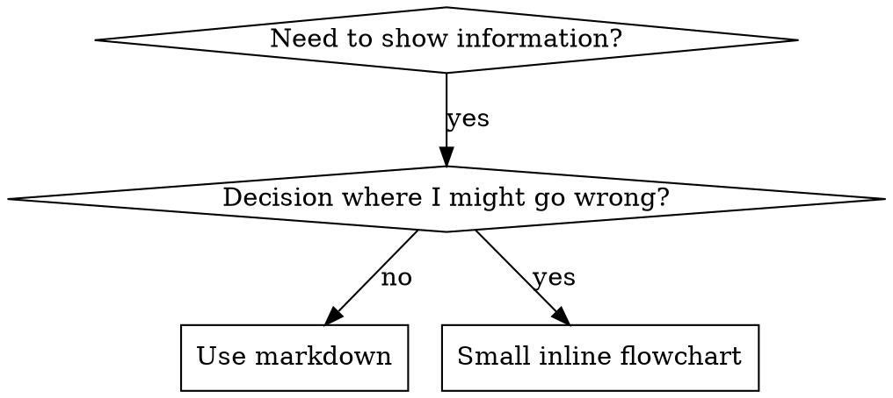

# 写作技巧

## 概述

**写作技巧就是将测试驱动开发应用于流程文档。**

**个人技巧存储在你的运行时技能目录**（在 Claude Code 上是 `~/.claude/skills/`）—有关这些运行时上的路径，请参阅 [codex-tools.md](../using-superpowers/references/codex-tools.md) 或 [gemini-tools.md](../using-superpowers/references/gemini-tools.md)。Codex、Copilot CLI 和 Gemini CLI 也都识别 `~/.agents/skills/` 作为跨运行时别名。

你编写测试用例（使用子代理的压力场景），观察它们失败（基线行为），编写技能（文档），观察测试通过（代理遵守），然后重构（关闭漏洞）。

**核心原则：**如果你没有在缺少技能的情况下观察代理失败，你就不知道这个技能是否教了正确的东西。

**必需背景：**在使用此技能之前，你必须理解 superpowers:test-driven-development。该技能定义了基本的 RED-GREEN-REFACTOR 循环。此技能将 TDD 应用于文档。

**官方指南：**有关 Anthropic 的官方技能创作最佳实践，请参阅 anthropic-best-practices.md。本文档提供了其他模式和指南，以补充此技能中 TDD 聚焦的方法。

## 技能是什么？

**技能**是经过验证的技术、模式或工具的参考指南。技能帮助未来的代理找到并应用有效的方法。

**技能是：**可重用的技术、模式、工具、参考指南

**技能不是：**关于你如何解决一次问题的叙述

## 技能的 TDD 映射

| TDD 概念 | 技能创建 |
|-------------|----------------|
| **测试用例** | 使用子代理的压力场景 |
| **生产代码** | 技能文档 (SKILL.md) |
| **测试失败 (RED)** | 在缺少技能的情况下代理违反规则（基线） |
| **测试通过 (GREEN)** | 技能存在时代理遵守 |
| **重构** | 在保持合规性的同时关闭漏洞 |
| **先编写测试** | 在编写技能之前运行基线场景 |
| **观察它失败** | 记录代理使用的确切推理 |
| **最小代码** | 编写解决这些特定违规的技能 |
| **观察它通过** | 验证代理现在遵守 |
| **重构周期** | 查找新的推理 → 插入 → 重新验证 |

整个技能创建过程遵循 RED-GREEN-REFACTOR。

## 何时创建技能

**创建当：**
- 技巧对你来说不是直观的
- 你会在跨项目时再次参考此内容
- 模式具有广泛的适用性（不是项目特定的）
- 他人会从中受益

**不要创建：**
- 一次性解决方案
- 其他地方有良好文档的标准做法
- 项目特定的约定（放入你的指令文件）
- 机械约束（如果可以通过正则表达式/验证来执行，则自动化它——将文档保留为判断调用）

## 技能类型

### 技术
具有可遵循步骤的具体方法（基于条件的等待、根本原因追踪）

### 模式
思考问题的方法（使用标志展平、测试不变量）

### 参考
API 文档、语法指南、工具文档（办公文档）

## 目录结构

```
skills/
  skill-name/
    SKILL.md              # 主要参考（必需）
    supporting-file.*     # 只需在需要时
```

**扁平命名空间** - 所有技能在一个可搜索的命名空间中

**分离文件：**
1. **重型参考**（100+ 行）- API 文档、综合语法
2. **可重用工具** - 脚本、实用程序、模板

**保留在行内：**
- 原则和概念
- 代码模式（< 50 行）
- 其他所有内容

## SKILL.md 结构

**前文（YAML）：**
- 两个必需字段：`name` 和 `description`（有关所有支持字段的详细信息，请参阅 [agentskills.io/specification](https://agentskills.io/specification)）
- 总计最多 1024 个字符
- `name`：仅使用字母、数字和连字符（不允许括号、特殊字符）
- `description`：第三人称，仅描述何时使用（不描述做什么）
  - 以 "Use when..." 开头，以关注触发条件
  - 包括具体症状、情况和上下文
  - **永远不要总结技能的过程或工作流**（有关原因，请参阅 SDO 部分）
  - 尽可能保持在 500 个字符以内

```markdown
---
name: Skill-Name-With-Hyphens
description: Use when [specific triggering conditions and symptoms]
---

# Skill Name

## 概述
这是什么？核心原则用 1-2 句话概括。

## 何时使用
[如果决策不明显，则包含小型内联流程图]

使用符号和用例的要点列表
何时不使用

## 核心模式（用于技术和模式）
前后代码比较

## 快速参考
表格或要点用于扫描常见操作

## 实现
用于简单模式的行内代码
链接到文件用于重型参考或可重用工具

## 常见错误
出错原因及修复方法

## 真实世界影响（可选）
具体结果
```

## 技能发现优化 (SDO)

**对发现至关重要：**未来的代理需要找到你的技能

### 1. 丰富描述字段

**目的：**你的代理阅读描述以决定为给定任务加载哪些技能。使其回答："我现在应该阅读这个技能吗？"

**格式：**以 "Use when..." 开头，以关注触发条件

**关键：描述 = 何时使用，不是技能做什么**

描述应仅描述触发条件。不要在描述中总结技能的过程或工作流。

**为什么这很重要：**测试表明，当描述总结技能的工作流程时，代理可能会遵循描述而不是阅读完整的技能内容。一个说明"任务之间的代码审查"的描述导致代理执行了一次审查，即使技能的流程图清楚地显示了两次审查（规范符合然后代码质量）。

当描述更改为仅"在当前会话中执行具有独立任务的实施计划"（没有工作流程总结）时，代理正确地阅读了流程图并遵循了两个阶段的审查过程。

**陷阱：**总结工作流程的描述会为代理创建一个捷径。技能正文变成了代理跳过的文档。

```yaml
# ❌ BAD：总结工作流程 - 代理可能会遵循此内容而不是阅读技能
description: Use when executing plans - dispatches subagent per task with code review between tasks

# ❌ BAD：过多的过程细节
description: Use for TDD - write test first, watch it fail, write minimal code, refactor

# ✅ GOOD：仅触发条件，没有工作流程总结
description: Use when executing implementation plans with independent tasks in the current session

# ✅ GOOD：仅触发条件
description: Use when implementing any feature or bugfix, before writing implementation code
```

**内容：**
- 使用具体的触发器、症状和情况，这些情况表明此技能适用
- 描述问题（竞争条件、不一致行为），而不是特定语言的症状（setTimeout、sleep）
- 保持触发器与技能本身的技术无关，除非技能本身是技术特定的
- 如果技能是技术特定的，请在触发器中明确说明
- 以第三人称（注入到系统提示中）
- **永远不要总结技能的过程或工作流**

```yaml
# ❌ BAD：过于抽象、模糊，不包含何时使用
description: For async testing

# ❌ BAD：第一人称
description: I can help you with async tests when they're flaky

# ❌ BAD：提及技术，但技能不是针对该技术的
description: Use when tests use setTimeout/sleep and are flaky

# ✅ GOOD：以 "Use when" 开头，描述问题，没有工作流程
description: Use when tests have race conditions, timing dependencies, or pass/fail inconsistently

# ✅ GOOD：技术特定技能，明确的触发器
description: Use when using React Router and handling authentication redirects
```

### 2. 关键词覆盖

使用代理会搜索的词语：
- 错误消息："Hook timed out"、"ENOTEMPTY"、"竞争条件"
- 症状："不稳定"、"挂起"、"僵尸"、"污染"
- 同义词："timeout/hang/freeze"、"cleanup/teardown/afterEach"
- 工具：实际命令、库名称、文件类型

### 3. 描述性命名

**使用主动语态，动词优先：**
- ✅ `creating-skills` 而不是 `skill-creation`
- ✅ `condition-based-waiting` 而不是 `async-test-helpers`

### 4. 令牌效率（关键）

**问题：**getting-started 和频繁参考的技能加载到每个对话中。每个令牌都很重要。

**目标字数：**
- getting-started 工作流：<150 字每个
- 频繁加载的技能：<200 字总
- 其他技能：<500 字（仍然要简洁）

**技巧：**

**将详细信息移至工具帮助：**
```bash
# ❌ BAD：在 SKILL.md 中记录所有标志
search-conversations supports --text、--both、--after DATE、--before DATE、--limit N

# ✅ GOOD：引用 --help
search-conversations 支持多种模式和过滤器。运行 --help 获取详细信息。
```

**使用交叉引用：**
```markdown
# ❌ BAD：重复工作流程细节
搜索时，使用模板分派子代理...
[20 行重复的说明]

# ✅ GOOD：引用其他技能
始终使用子代理（50-100 倍上下文节省）。必需：使用 [other-skill-name] 进行工作流程。
```

**压缩示例：**
```markdown
# ❌ BAD：冗长的示例（42 字）
你的人类合作伙伴："我们以前如何在 React Router 中处理身份验证错误？"
你："我会搜索过去的对话以查找 React Router 身份验证模式。"
[分派子代理，搜索查询："React Router 身份验证错误处理 401"]

# ✅ GOOD：最小示例（20 字）
合作伙伴："我们如何在 React Router 中处理身份验证错误？"
你："正在搜索..."
[分派子代理 → 综合]
```

**消除冗余：**
- 不要重复交叉引用技能中的内容
- 不要解释从命令中显而易见的内容
- 不要包含多个相同模式的示例

**验证：**
```bash
wc -w skills/path/SKILL.md
# getting-started 工作流：目标是每个 <150 个
# 其他频繁加载的：目标是每个 <200 个
```

**按你做什么或核心见解命名：**
- ✅ `condition-based-waiting` > `async-test-helpers`
- ✅ `using-skills` 而不是 `skill-usage`
- ✅ `flatten-with-flags` > `data-structure-refactoring`
- ✅ `root-cause-tracing` > `debugging-techniques`

**动名词（-ing）非常适合过程：**
- `creating-skills`、`testing-skills`、`debugging-with-logs`
- 主动，描述你正在采取的行动

### 5. 交叉引用其他技能

**编写引用其他技能的文档时：**

仅使用技能名称，并带有明确的要求标记：
- ✅ 好：`**必需子技能：** 使用 superpowers:test-driven-development`
- ✅ 好：`**必需背景：** 你必须理解 superpowers:systematic-debugging`
- ❌ 坏：`See skills/testing/test-driven-development`（不明确是否必需）
- ❌ 坏：`@skills/testing/test-driven-development/SKILL.md`（立即强制加载文件，消耗 200k+ 上下文）

**为什么没有 @ 链接：**`@` 语法立即强制加载文件，在你需要它们之前消耗 200k+ 上下文。

## 流程图使用



**仅用于：**
- 非明显的决策点
- 过程循环，你可能会过早停止
- "A 与 B 何时使用" 的决策

**永远不要用于：**
- 参考材料 → 表格、列表
- 代码示例 → Markdown 块
- 线性指令 → 编号列表
- 没有语义意义的标签（step1、helper2）

有关 graphviz 风格规则的详细信息，请参阅此目录中的 `graphviz-conventions.dot`。

**为你的人类合作伙伴可视化：**使用此目录中的 `render-graphs.js` 将技能的流程图渲染为 SVG：
```bash
node ./render-graphs.js ../some-skill           # 每个图表单独
node ./render-graphs.js ../some-skill --combine # 所有图表在一个 SVG 中
```

## 代码示例

**一个优秀的示例胜过许多平庸的示例**

选择最相关的语言：
- 测试技术 → TypeScript/JavaScript
- 系统调试 → Shell/Python
- 数据处理 → Python

**好的示例：**
- 完整且可运行
- 带有注释，解释原因
- 来自真实场景
- 清晰地显示模式
- 准备好适应（不是通用模板）

**不要：**
- 使用 5+ 种语言实现
- 创建填写空白模板
- 编写虚构的示例

你擅长移植——一个伟大的示例就足够了。

## 文件组织

### 自包含技能
```
defense-in-depth/
  SKILL.md    # 所有内容行内
```
何时：所有内容都适合，不需要重型参考

### 带有可重用工具的技能
```
condition-based-waiting/
  SKILL.md    # 概述 + 模式
  example.ts  # 可工作的帮助程序以供适应
```
何时：工具是可重用的代码，而不仅仅是叙述

### 带有重型参考的技能
```
pptx/
  SKILL.md       # 概述 + 工作流程
  pptxgenjs.md   # 600 行 API 参考
  ooxml.md       # 500 行 XML 结构
  scripts/       # 可执行工具
```
何时：参考材料太大，无法行内

通过其解释器在正文中调用捆绑脚本（`bash scripts/tool.sh`、`node scripts/tool.js`），永远不要通过裸路径：一些 harness 插件打包器会剥离可执行位，并且裸的 `scripts/tool.sh` 在那里会因 "Permission denied" 而失败。

## 铁律（与 TDD 相同）

```
没有失败的测试，就没有技能
```

这适用于新技能和现有技能的编辑。

在测试之前编写技能？删除它。重新开始。
没有测试就编辑技能？相同的违规。

**没有例外：**
- 不是用于"简单的添加"
- 不是用于"只是添加一个部分"
- 不是用于"文档更新"
- 不要将未经测试的更改保留为"参考"
- 不要"在运行测试时适应"
- 删除就是删除

**必需背景：**superpowers:test-driven-development 技能解释了为什么这很重要。相同的原理适用于文档。

## 测试所有技能类型

不同的技能类型需要不同的测试方法：

### 强制纪律技能（规则/要求）

**示例：**TDD、验证完成前、设计前编码

**测试方法：**
- 学术问题：他们是否理解规则？
- 压力场景：他们在压力下是否遵守？
- 多种压力组合：时间 + 沉没成本 + 疲惫不堪
- 识别推理并添加明确的计数器

**成功标准：**代理在最大压力下遵守规则

### 技术技能（如何指南）

**示例：**基于条件的等待、根本原因追踪、防御性编程

**测试方法：**
- 应用场景：他们能否正确应用技术？
- 变化场景：他们是否处理边缘情况？
- 缺少信息测试：说明是否有差距？

**成功标准：**代理成功将技术应用于新场景

### 模式技能（思维模型）

**示例：**减少复杂性、信息隐藏概念

**测试方法：**
- 识别场景：他们是否知道何时应用模式？
- 应用场景：他们能否使用思维模型？
- 反例：他们知道何时不应用吗？

**成功标准：**代理正确识别何时/如何应用模式

### 参考技能（文档/API）

**示例：**API 文档、命令参考、库指南

**测试方法：**
- 检索场景：他们能否找到正确的信息？
- 应用场景：他们能否正确使用他们找到的内容？
- 缺口测试：常见用例是否覆盖？

**成功标准：**代理找到并正确应用参考信息

## 跳过测试的常见推理

| 免责声明 | 现实情况 |
|--------|---------|
| "技能显然很清楚" | 对你清楚 ≠ 对其他代理清楚。测试一下。 |
| "只是一个参考" | 参考资料可能有漏洞，部分内容不明确。测试检索功能。 |
| "测试是过度" | 未测试的技能有问题。总是如此。15分钟测试能节省数小时。 |
| "如果出现问题我会测试" | 问题 = 代理无法使用技能。在部署前测试。 |
| "测试太繁琐" | 测试比在生产环境中调试糟糕的技能更不繁琐。 |
| "我很自信它很好" | 过度自信保证会出现问题。无论如何测试。 |
| "学术评审就足够了" | 阅读 ≠ 使用。测试应用场景。 |
| "没有时间测试" | 部署未经测试的技能会浪费更多时间修复它。 |

**所有这些意思都是：在部署前测试。没有例外。**

## 使形式与失败相匹配

在编写指导方针之前，对基线失败进行分类。使无懈可击的一种失败形式可测量地反作用于另一种。

| 基线失败 | 正确形式 | 错误形式 |
|---|---|---|
| 在压力下跳过/违反规则（知道更好，但还是做了） | 禁止 + 合理化表格 + 警示标志（见下文无懈可击部分） | 柔和指导（“优先考虑...”，“考虑...”） |
| 遵守规则，但输出形状不正确（冗长的提示，隐藏的裁决，重述规范） | 正面配方或合同：说明输出是什么——它的部分，按顺序 | 禁止列表（“不要重述”，“永远不要叙述”） |
| 从他们已经生成的东西中遗漏了必需的元素 | 结构：模板中他们填写的必需字段或插槽 | 模板附近使用散文提醒 |
| 行为应该取决于一个条件 | 以可观察的谓词为键的条件（“如果摘要存在，则参考它”） | 无条件的规则 + 免责条款 |

**为什么禁止会反作用于塑造问题：** 在“使提示自我包含”的竞争激励下，代理会与“不要X”进行谈判。在关于部署提示指导方针的头对头措辞测试中，禁止臂产生了明显更多的不需要的内容，趋势比甚至没有指导方针的控制组更差——微测试你自己的案例，而不是假设，但永远不要默认使用禁止。配方不会留有任何谈判空间：输出与声明的形状匹配或不匹配。

**你选择的任何形式的规则：**
- **没有模糊条款。** “除非重要，否则不要X”重新打开谈判——在相同的措辞测试中，将单个模糊条款附加到获胜配方会使它从一致变为嘈杂。将真实的例外作为可观察谓词的条件表示为自己的条件。
- **免责条款不作用域。** “这个限制不适用于代码块”仍然会抑制代码块。如果输出的一部分必须豁免，请重新结构，以便规则无法触及它。

## 使技能免受合理化

强制纪律的技能（如TDD）需要抵制合理化。代理很聪明，在压力下会找到漏洞。

**范围：** 这个工具包是用于纪律失败的——一个知道规则但在压力下跳过的代理。对于形状不正确的输出或遗漏的元素，基于禁止的无懈可击反作用；改用“使形式与失败相匹配”中的形式。

**心理学笔记：** 了解为什么说服技巧起作用有助于你系统地应用它们。参见persuasion-principles.md，其中包含关于权威、承诺、稀缺性、社会证明和统一原则的研究基础（Cialdini，2021；Meincke等人，2025）。

### 明确关闭每个漏洞

不要只声明规则——禁止特定的规避方法：

<Bad>
```markdown
写代码前测试？删除它。
```
</Bad>

<Good>
```markdown
写代码前测试？删除它。重新开始。

**没有例外：**
- 不要把它当作“参考”
- 不要在写测试时“调整”它
- 不要看它
- 删除就是删除
```
</Good>

### 处理“精神 vs 字面”争论

早期添加基础原则：

```markdown
**违反规则的字面意义就是违反规则的精神。**
```

这切断了整个“我遵循精神”合理化的类别。

### 建立合理化表格

捕获基线测试（见下文测试部分）中的合理化。代理做出的每个借口都进入表格：

```markdown
| 免责声明 | 现实情况 |
|--------|---------|
| "太简单，不需要测试" | 简单代码会出错。测试只需30秒。 |
| "我会稍后测试" | 测试立即通过证明不了什么。 |
| "稍后测试实现相同的目标" | 测试后 = “这个做什么？” 测试前 = “这个应该做什么？” |
```

### 创建警告标志列表

使代理在合理化时容易自我检查：

```markdown
## 警示标志 - 停止并重新开始

- 代码在测试前
- "我已经手动测试过它"
- "稍后测试实现相同的目的"
- "这是关于精神而不是仪式"
- "这不同因为..."

**所有这些意思都是：删除代码。用TDD重新开始。**
```

### 更新SDO以违反违规症状

添加到描述：你即将违反规则的症状：

```yaml
description: 用于实现任何功能或错误修复，在编写实现代码之前使用
```

## RED-GREEN-REFACTOR用于技能

遵循TDD周期：

### RED：编写失败的测试（基线）

使用子代理运行压力场景，而**没有**技能。记录确切行为：
- 他们做了哪些选择？
- 他们使用了哪些合理化（逐字）？
- 哪些压力触发了违规？

这是“观察测试失败”——你必须看到代理在编写技能之前自然做什么。

### GREEN：编写最小技能

编写解决这些特定合理化的技能。不要为假设案例添加额外内容。

使用相同的场景**使用**技能。代理现在应该遵守。

### REFACTOR：关闭漏洞

代理发现了新的合理化？添加明确的反制措施。重新测试，直到无懈可击。

### 在完整场景之前微测试措辞

完整压力场景运行是最终关卡，但它们每次迭代都很慢且昂贵。首先用微测试验证措辞本身：

1. **每次调用一个新上下文样本**——一个原始API调用，或者如果你没有API访问权限，一个单次射击子代理。系统提示 = 指导方针将生活的真实上下文（完整的技能或提示模板，而不是孤立指导方针）；用户消息 = 一个诱惑失败的任务。
2. **始终包含没有指导方针的控制组。** 如果控制组没有表现出失败，就没有需要修复的——停止，不要编写指导方针。
3. **每个变体5+个副本。** 单个样本会撒谎。
4. **手动阅读每个标记的匹配项。** 如果你喜欢，可以编程评分，但模板回声和引用的反例会伪装成命中；仅自动计数会高估失败和成功。
5. **差异是一个指标。** 当指导方针到位时，副本会聚合成相同的形状。五个副本中有五个不同的解释意味着措辞不是约束性的——在添加单词之前收紧形式。

微测试验证措辞；它们不会取代压力场景来测试纪律技能。

**测试方法：** 参见[testing-skills-with-subagents.md](testing-skills-with-subagents.md)以获取完整的测试方法：
- 如何编写压力场景
- 压力类型（时间、沉没成本、权威、筋疲力尽）
- 系统地填补漏洞
- 元测试技术

## 反模式

### ❌ 叙述示例
“在2025-10-03的会话中，我们发现empty projectDir导致..."
**为什么不好：** 太具体，不可重用

### ❌ 多语言稀释
example-js.js，example-py.py，example-go.go
**为什么不好：** 质量一般，维护负担

### ❌ 流程图中的代码
```dot
step1 [label="import fs"];
step2 [label="read file"];
```
**为什么不好：** 无法复制粘贴，难以阅读

### ❌ 通用标签
helper1，helper2，step3，pattern4
**为什么不好：** 标签应有语义意义

## STOP：在转到下一个技能之前

**编写任何技能后，你必须STOP并完成部署过程。**

**不要：**
- 批量创建多个技能而不测试每个
- 在当前技能验证之前转到下一个技能
- 因为“批量处理更有效率”而跳过测试

**部署清单以下是每个技能的强制性。**

部署未经测试的技能 = 部署未经测试的代码。这是对质量标准的违反。

## 技能创建清单（TDD改编）

**重要：对于下面的每个清单项目创建一个todo。**

**RED阶段 - 编写失败的测试：**
- [ ] 创建压力场景（纪律技能的3+组合压力）
- [ ] 运行场景**没有**技能 - 逐字记录基线行为
- [ ] 识别合理化/失败的规律

**GREEN阶段 - 编写最小技能：**
- [ ] 名称仅使用字母、数字、连字符（不使用括号/特殊字符）
- [ ] YAML前文带有必需的`name`和`description`字段（最大1024个字符；参见[spec](https://agentskills.io/specification)）
- [ ] 描述以“使用时...”开头，并包括特定触发/症状
- [ ] 描述使用第三人称
- [ ] 整个过程中使用关键词进行搜索（错误、症状、工具）
- [ ] 清晰概述，包含核心原则
- [ ] 解决在RED中识别的特定基线失败
- [ ] 指导方针形式与失败类型匹配（见“使形式与失败相匹配”）
- [ ] 对于行为塑造指导方针：措辞针对没有指导方针的控制组进行微测试（5+个副本，每个标记的匹配项手动阅读）——纯参考技能不适用
- [ ] 代码内联或链接到单独的文件
- [ ] 一个优秀的示例（不是多语言）
- [ ] 运行场景**使用**技能 - 验证代理现在遵守

**REFACTOR阶段 - 关闭漏洞：**
- [ ] 从测试中识别新的合理化
- [ ] 添加明确的反制措施（如果纪律技能）
- [ ] 从所有测试迭代中构建合理化表格
- [ ] 创建警告标志列表
- [ ] 重新测试，直到无懈可击

**质量检查：**
- [ ] 如果决策不明显，只有小流程图
- [ ] 快速参考表
- [ ] 常见错误部分
- [ ] 没有叙述性讲故事
- [ ] 仅用于工具或重型参考的辅助文件

**部署：**
- [ ] 将技能提交到git并推送到你的分支（如果配置了）
- [ ] 考虑通过PR贡献回去（如果广泛有用）

## 发现工作流

未来代理如何找到你的技能：

1. **遇到问题**（“测试不稳定”）
2. **搜索技能**（grep描述，浏览类别）
3. **找到技能**（描述匹配）
4. **扫描概述**（这是相关的吗？）
5. **阅读模式**（快速参考表）
6. **加载示例**（仅在实现时）

**针对此流程进行优化**——尽早和经常放置可搜索术语。
