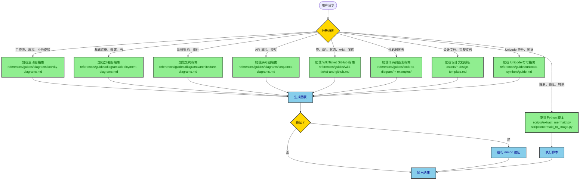
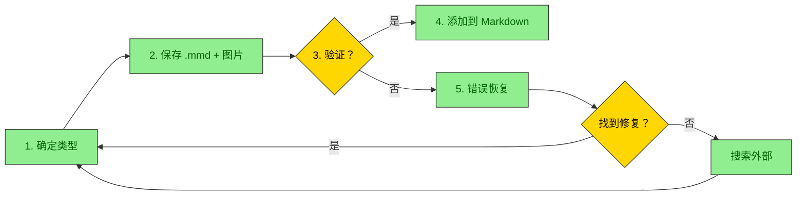
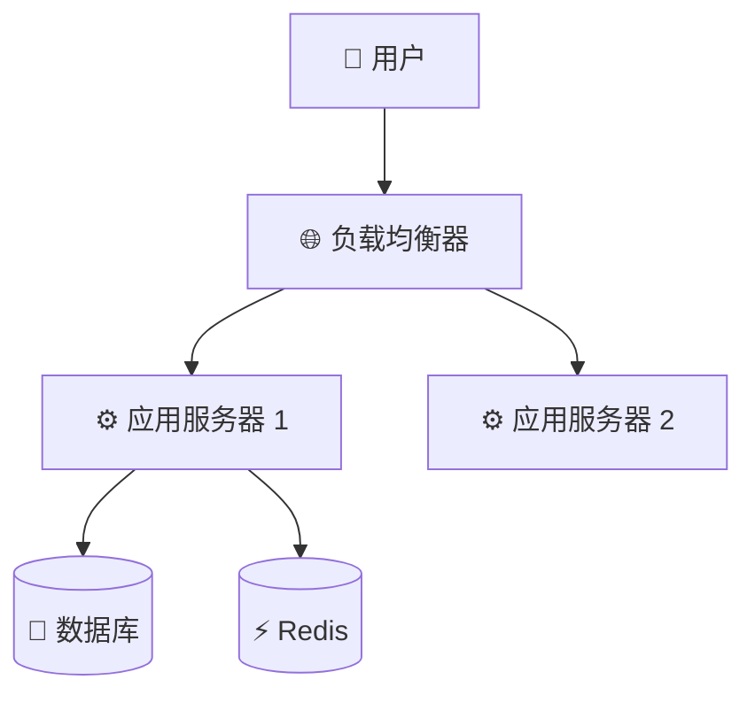
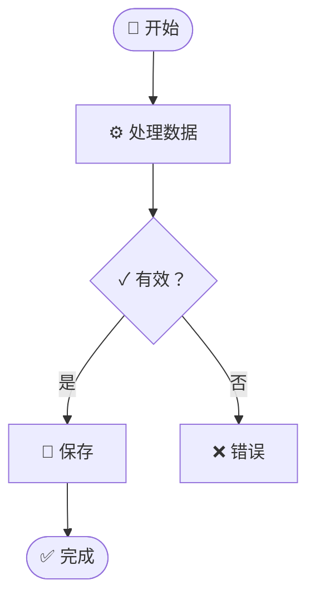
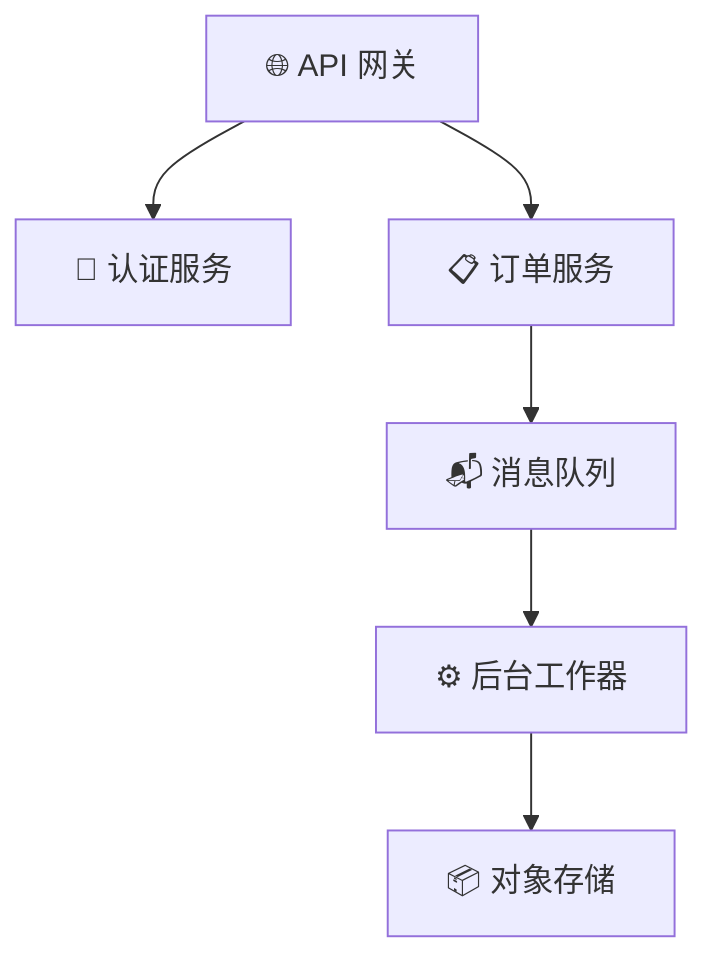

# Mermaid 架构师 - 层次结构图和文档技能

Mermaid 图表和文档系统，包含专业指南和代码到图表的转换能力。

## 目录

- [决策树](#决策树)
- [GitHub wiki, WikiTicket 和 Confluence](#github-wiki-wikiticket-and-confluence)
- [可用指南和资源](#可用指南和资源)
- [使用模式](#使用模式)
- [弹性工作流](#弹性工作流)
- [Unicode 语义符号](#unicode-语义符号)
- [Python 工具](#python-工具)
- [决策树示例](#决策树示例)
- [高对比度样式](#高对比度样式)
- [文件组织](#文件组织)
- [工作流总结](#工作流总结)
- [何时使用什么](#何时使用什么)
- [最佳实践](#最佳实践)
- [学习路径](#学习路径)

## 决策树

**该技能的工作原理：**

1. **用户发起请求** → 技能分析意图
2. **技能确定图表/文档类型** → 加载相应的指南
3. **AI 读取专业指南** → 使用模板生成图表/文档
4. **交付结果** → 包含验证和导出选项

**用户意图分析：**



## 可用指南和资源

### 图表类型指南 (`references/guides/diagrams/`)

| 指南 | 完整路径 | 用户请求时加载 | 示例 |
|------|----------|----------------|------|
| 活动图 | `references/guides/diagrams/activity-diagrams.md` | 工作流、流程、业务逻辑、用户流程、决策树 | "展示结账流程", "文档 ETL 管道", "创建审批工作流" |
| 部署图 | `references/guides/diagrams/deployment-diagrams.md` | 基础设施、云架构、K8s、无服务器、网络拓扑 | "展示 AWS 架构", "文档 GCP 部署", "创建 K8s 图表" |
| 架构图 | `references/guides/diagrams/architecture-diagrams.md` | 系统架构、组件设计、高层结构 | "展示系统组件", "文档微服务", "架构概述" |
| 序列图 | `references/guides/diagrams/sequence-diagrams.md` | API 交互、服务通信、请求/响应流程 | "展示 API 调用序列", "文档认证流程", "服务交互" |
| WikiTicket / GitHub / Confluence | `references/guides/wiki-ticket-and-github.md` | 设计文档、演练、需求、wiki 发布、Confluence 图片 | "架构文档", "代码演练", "wiki", "Confluence" |

WikiTicket 和 GitHub wiki 的默认加载此技能，包括 `classDiagram`, `erDiagram`, 和 `stateDiagram-v2`。不要将它们发送到 PlantUML。如果 GitHub 无法渲染 C4 / architecture-beta / block-beta，则回退到 `flowchart TD`。

### 代码到图表指南和示例

| 资源 | 完整路径 | 提供内容 |
|------|----------|----------|
| **主指南** | `references/guides/code-to-diagram/README.md` | 分析任何代码库并提取图表的完整工作流 |
| **Spring Boot** | `examples/spring-boot/README.md` | Controller→Service→Repository 架构、部署配置、从方法生成序列图、从业务逻辑生成活动图 |
| **FastAPI** | `examples/fastapi/README.md` | Python 异步模式、Pydantic 模型、依赖注入、云部署 |
| **React** | `examples/react/README.md` | 组件层次结构、状态管理、数据流、构建管道 |
| **Python ETL** | `examples/python-etl/README.md` | 数据管道、转换步骤、错误处理、调度 |
| **Node/Express** | `examples/node-webapp/README.md` | 中间件链、路由处理器、异步模式、部署 |
| **Java Web 应用** | `examples/java-webapp/README.md` | 传统 MVC、Servlet 容器、WAR 部署 |

### 设计文档模板

| 模板 | 完整路径 | 用于 | 加载时 |
|------|----------|------|--------|
| 架构设计 | `assets/architecture-design-template.md` | 系统级架构 | "创建架构文档", "文档系统设计" |
| API 设计 | `assets/api-design-template.md` | API 规范 | "API 设计文档", "文档 REST API" |
| 功能设计 | `assets/feature-design-template.md` | 功能规划 | "功能设计", "规划新功能" |
| 数据库设计 | `assets/database-design-template.md` | 数据库模式 | "数据库设计", "文档模式" |
| 系统设计 | `assets/system-design-template.md` | 完整系统 | "系统设计文档", "完整系统文档" |

### Unicode 符号指南

**完整路径：** `references/guides/unicode-symbols/guide.md`

**用户提到时加载：** "Unicode 符号", "图表中的 emoji", "语义图标", "添加符号"

**快速参考：**
- 📦 基础设施：☁️ 🌐 🔌 📡 🗄️
- ⚙️ 计算：⚙️ ⚡ 🔄 ♻️ 🚀 💨
- 💾 数据：💾 📦 📊 📈 🗃️ 🧊
- 📨 消息：📨 📬 📤 📥 🐰 📢
- 🔐 安全：🔐 🔑 🛡️ 🚪 👤 🎫
- 📝 监控：📝 📊 🚨 ⚠️ ✅ ❌

### Python 脚本 (`scripts/`)

| 脚本 | 用于 | 加载时 |
|------|------|--------|
| `extract_mermaid.py` | 从 Markdown 提取图表、验证语法、替换为图片 | "提取图表", "验证 mermaid", "查找所有图表" |
| `mermaid_to_image.py` | 将 .mmd 转换为 PNG/SVG、批量转换、自定义主题 | "转换为图片", "渲染图表", "创建 PNG" |
| `resilient_diagram.py` | 完整工作流：保存 .mmd、生成图片、验证、错误恢复 | "生成图表", "创建带验证的图表", "弹性图表" |

## GitHub wiki, WikiTicket 和 Confluence

加载 `references/guides/wiki-ticket-and-github.md` 用于 WikiTicket 设计文档、代码演练、需求、GitHub wiki 或 Confluence。

| 目标 | 发送内容 |
|------|----------|
| GitHub wiki / GFM | 带有 `mermaid` 分隔符的块。GitHub 渲染 class、ER、state、sequence、flowchart、C4。 |
| Confluence / Notion / Word / PDF | 也渲染 PNG 或 SVG (`scripts/resilient_diagram.py` 或 `mmdc`) 并上传图片。不要依赖 Confluence 渲染 Mermaid。 |

Salt wireframes 的 PlantUML 是可选的，用于用例、时序图、ArchiMate、nwdiag 和 WBS。这些始终作为 PNG 或 SVG 发送。

## 使用模式

常见请求模式和指南选择。参见 [何时使用什么](#何时使用什么) 获取完整映射。

| 模式 | 示例请求 | 加载指南 |
|------|----------|----------|
| 单个图表 | "创建登录流程的活动图" | 图表类型指南 + Unicode 符号 |
| 代码到图表 | "从 application.yml 生成部署图" | 框架示例 + 部署指南 |
| 设计文档 | "创建 API 设计文档" | 资产/中的模板 + 相关图表指南 |
| 提取/验证 | "从 design.md 提取图表" | 使用 `scripts/extract_mermaid.py` |
| 批量转换 | "将所有 .mmd 转换为 PNG" | 使用 `scripts/mermaid_to_image.py` |

## 弹性工作流

**关键：** 这是所有图表生成的推荐方法。它确保验证、错误恢复和一致的文件组织。

**完整指南：** `references/guides/resilient-workflow.md`

### 工作流概述



### 关键原则

**永远在图表通过验证后再将其添加到 Markdown 中。** 这可以防止文档中损坏的图表。

### 使用脚本（推荐）

```bash
# 带有完整错误恢复生成
python scripts/resilient_diagram.py \
    --code "flowchart TD; A-->B" \
    --markdown-file design_doc \
    --diagram-num 1 \
    --title "process_flow" \
    --format png \
    --json
```

**输出：** `./diagrams/` 目录中的 `.mmd` 和 `.png` 文件。

### 文件命名约定

```
./diagrams/<markdown_file>_<num>_<type>_<title>.mmd
./diagrams/<markdown_file>_<num>_<type>_<title>.png
```

**示例：** `./diagrams/api_design_01_sequence_auth_flow.png`

### 错误恢复优先级

当验证失败时，工作流自动：

1. **检查故障排除指南** - `references/guides/troubleshooting.md` (28 个记录的错误)
2. **使用 perplexity 搜索** - `perplexity_ask` MCP 用于语法问题
3. **使用 brave 搜索** - `brave_web_search` MCP 用于最新解决方案
4. **询问 gemini** - `gemini` 技能用于替代观点
5. **一般搜索** - `WebSearch` 工具作为回退

### 手动回退步骤

如果脚本不可用：

1. **从第一行确定图表类型** (flowchart、sequence 等)
2. **从 `references/guides/diagrams/` 加载参考指南**
3. **保存到** `./diagrams/<markdown_file>_<num>_<type>_<title>.mmd`
4. **验证：** `mmdc -i file.mmd -o file.png -b transparent`
5. **出错时：** 搜索 `references/guides/troubleshooting.md` 以匹配错误
6. **如果未找到：** 按上述优先级使用搜索工具
7. **添加参考：** ``

### 模式 6：弹性图表生成

**用户：** "创建一个序列图并将其添加到设计文档"

**技能操作：**
1. 确定意图：**图表生成** + **Markdown 集成**
2. 加载工作流指南：`references/guides/resilient-workflow.md`
3. 确定图表类型：**序列**
4. 加载图表指南：`references/guides/diagrams/sequence-diagrams.md`
5. 使用模板生成 Mermaid 代码
6. 执行弹性工作流：
   ```bash
   python scripts/resilient_diagram.py \
       --code "[生成的代码]" \
       --markdown-file design_doc \
       --diagram-num 1 \
       --title "api_sequence" \
       --json
   ```
7. 如果验证失败 → 应用故障排除修复 → 重试
8. 成功后 → 将 `` 添加到 Markdown

## Unicode 语义符号

始终使用 Unicode 符号来增强图表的清晰度。常见模式：

### 基础设施和部署


### 带状态的活动流程


### 微服务架构


**完整符号参考，加载：** `references/guides/unicode-symbols/guide.md`

## Python 工具

### 提取 Mermaid 图表

```bash
# 列出所有图表
python scripts/extract_mermaid.py document.md --list-only

# 提取到单独文件
python scripts/extract_mermaid.py document.md --output-dir diagrams/

# 验证所有图表
python scripts/extract_mermaid.py document.md --validate

# 替换为图片引用（用于 Confluence 上传）
python scripts/extract_mermaid.py document.md --replace-with-images \
  --image-format png --output-markdown output.md
```

### 转换为图片

```bash
# 单个转换
python scripts/mermaid_to_image.py diagram.mmd output.png

# 带自定义设置
python scripts/mermaid_to_image.py diagram.mmd output.svg \
  --theme dark --background white --width 1200

# 批量转换目录
python scripts/mermaid_to_image.py diagrams/ output/ --format png --recursive

# 从标准输入
echo "graph TD; A-->B" | python scripts/mermaid_to_image.py - output.png
```

## 决策树示例

### 示例 1：用户请求工作流图表

**输入：** "展示结账流程工作流"

**技能决策路径：**
```
1. 分析：工作流、流程 → 活动图
2. 加载指南：guides/diagrams/activity-diagrams.md
3. 查找模式：电子商务结账（指南中存在模板）
4. 使用模板 + Unicode 符号生成
5. 输出带决策点的活动图
```

**输出：** 带有 Unicode 符号的完整活动图，用于购物车、支付、订单状态。

### 示例 2：用户提供 Spring Boot 代码

**输入：** "这是我的 Spring Boot 控制器，创建图表"

**技能决策路径：**
```
1. 分析：Spring Boot、代码提供 → 代码到图表 + SPRING BOOT
2. 加载指南：
   - examples/spring-boot/README.md
   - guides/diagrams/architecture-diagrams.md (用于结构)
   - guides/diagrams/sequence-diagrams.md (用于方法调用)
   - guides/diagrams/activity-diagrams.md (用于业务逻辑)
3. 生成多个图表：
   a. 从 @RestController/@Service/@Repository 注解生成架构图
   b. 从方法调用链生成序列图
   c. 从业务逻辑流生成活动图
4. 输出所有图表并附解释
```

**输出：** 3-4 个展示 Spring Boot 应用不同视图的图表。

### 示例 3：用户想要基础设施文档

**输入：** "文档我的 GCP Cloud Run 部署与 AlloyDB"

**技能决策路径：**
```
1. 分析：基础设施、GCP、Cloud Run → 部署图
2. 加载指南：
   - guides/diagrams/deployment-diagrams.md
   - examples/spring-boot/ 或 examples/fastapi/ (如果提供代码)
3. 检查 IaC 文件 (Pulumi、Terraform、docker-compose)
4. 生成部署图，包括：
   - Cloud Run 服务及其规格
   - VPC 连接器
   - AlloyDB 集群
   - 安全 (IAM、Secret Manager)
   - 监控
5. 应用 Unicode 符号以提高清晰度
6. 输出并标注资源规格
```

**输出：** 完整的 GCP 部署图，所有资源均标注。

**所有图表必须使用高对比度颜色：**

```mermaid
graph TB
    classDef primary fill:#90EE90,stroke:#333,stroke-width:2px,color:darkgreen
    classDef secondary fill:#87CEEB,stroke:#333,stroke-width:2px,color:darkblue
    classDef database fill:#E6E6FA,stroke:#333,stroke-width:2px,color:darkblue
    classDef error fill:#FFB6C1,stroke:#DC143C,stroke-width:2px,color:black

    %% 每个classDef都必须包含color属性
```

**规则：**
- 浅色背景 → 深色文字颜色
- 深色背景 → 浅色文字颜色
- 每个classDef中必须始终指定`color:`

## 文件组织

```
design-doc-mermaid/
├── SKILL.md                          # 此文件 - 主要协调者
├── README.md                         # 用户文档
├── CLAUDE.md                         # Claude代码指令
│
├── references/                       # 参考材料
│   ├── mermaid-diagram-guide.md     # 遗留通用指南
│   └── guides/                       # 特殊化指南（按需加载）
│       ├── diagrams/
│       │   ├── activity-diagrams.md      # 工作流、流程
│       │   ├── deployment-diagrams.md    # 基础设施、云
│       │   ├── architecture-diagrams.md  # 系统架构
│       │   └── sequence-diagrams.md      # API交互
│       ├── code-to-diagram/
│       │   └── README.md                 # 代码分析的完整指南
│       ├── unicode-symbols/
│       │   └── guide.md                  # 完整符号参考
│       └── troubleshooting.md        # 常见语法错误及修复
│
├── assets/                           # 设计文档模板
│   ├── architecture-design-template.md
│   ├── api-design-template.md
│   ├── feature-design-template.md
│   ├── database-design-template.md
│   └── system-design-template.md
│
├── scripts/                          # Python工具
│   ├── extract_mermaid.py           # 提取并验证图表
│   └── mermaid_to_image.py          # 转换为PNG/SVG
│
├── examples/                         # 语言特定模式
│   ├── spring-boot/                 # Spring Boot模式
│   ├── fastapi/                     # FastAPI模式
│   ├── react/                       # React模式
│   ├── python-etl/                  # 数据管道模式
│   ├── node-webapp/                 # Express.js模式
│   └── java-webapp/                 # 传统Java模式
│
└── references/                       # 通用Mermaid参考
    └── mermaid-diagram-guide.md     # 完整Mermaid语法指南
```

## 工作流概要

1. **分析用户意图** → 确定图表类型、文档类型或所需操作
2. **加载适当指南** → 仅读取所需内容（高效利用token）
3. **应用模板和模式** → 使用指南中的示例
4. **生成输出** → 创建图表或文档
5. **验证**（可选）→ 使用脚本进行验证
6. **转换**（可选）→ 如有必要导出为图像

## 何时使用什么

| 用户请求               | 加载此项                 |
|------------------------|--------------------------|
| "activity diagram", "workflow", "process flow" | `references/guides/diagrams/activity-diagrams.md` |
| "deployment", "infrastructure", "cloud", "k8s" | `references/guides/diagrams/deployment-diagrams.md` |
| "architecture", "system design", "components" | `references/guides/diagrams/architecture-diagrams.md` + 设计模板 |
| "API", "sequence", "interactions", "flow" | `references/guides/diagrams/sequence-diagrams.md` |
| "class diagram", "ER", "state machine", "wiki", "walkthrough", "architecture doc" | `references/guides/wiki-ticket-and-github.md` + 匹配类型指南 |
| "Confluence", "upload image", "PNG", "SVG" | `scripts/resilient_diagram.py` 或 `scripts/mermaid_to_image.py` |
| "Spring Boot code" | `examples/spring-boot/` + 相关图表指南 |
| "FastAPI code", "Python API" | `examples/fastapi/` + 相关图表指南 |
| "React app", "frontend" | `examples/react/` + 架构指南 |
| "ETL", "data pipeline", "Python batch" | `examples/python-etl/` + 活动指南 |
| "symbols", "unicode", "emoji" | `references/guides/unicode-symbols/guide.md` |
| "syntax error", "diagram won't render", "troubleshoot" | `references/guides/troubleshooting.md` |
| "extract diagrams" | `scripts/extract_mermaid.py` |
| "convert to image", "PNG", "SVG" | `scripts/mermaid_to_image.py` |
| "create diagram", "generate diagram", "add diagram to markdown" | `scripts/resilient_diagram.py` + `references/guides/resilient-workflow.md` |
| "design document", "full docs" | `assets/*-design-template.md` + 图表指南 |

## 最佳实践

1. **单一职责**：一个图表 = 一个概念
2. **Unicode增强**：始终使用语义符号以提高清晰度
3. **高对比度**：在样式中始终指定`color:`属性
4. **早期验证**：使用脚本捕获语法错误
5. **模板复用**：利用现有模板和示例
6. **按需加载**：仅读取特定请求所需的指南
7. **Token效率**：使用分层加载而不是读取所有内容

## 学习路径

**对Mermaid不熟悉？** 从这里开始：
1. 阅读`references/guides/unicode-symbols/guide.md`了解符号含义
2. 阅读`references/guides/diagrams/activity-diagrams.md`了解基本模式
3. 尝试`examples/spring-boot/`或`examples/fastapi/`中的示例
4. 使用`scripts/extract_mermaid.py --validate`检查你的工作

**需要记录代码？** 按照以下步骤操作：
1. 确定你的框架 → 加载相关的`examples/{framework}/`
2. 将代码模式与图表类型匹配
3. 使用指南中的模板
4. 使用脚本进行验证

**创建设计文档？** 按照以下步骤操作：
1. 选择文档类型 → 从`assets/`加载模板
2. 填写文本部分
3. 按需加载图表指南以供每个部分使用
4. 全程使用Unicode符号
5. 保存到`docs/design/`并附加时间戳

---

**版本：** 2.0（分层架构）
**最后更新：** 2025-01-13
**维护者：** Claude代码技能
